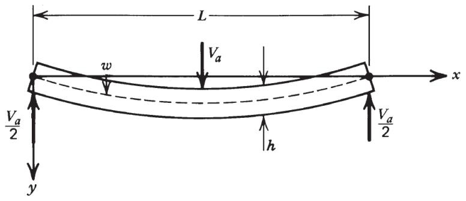
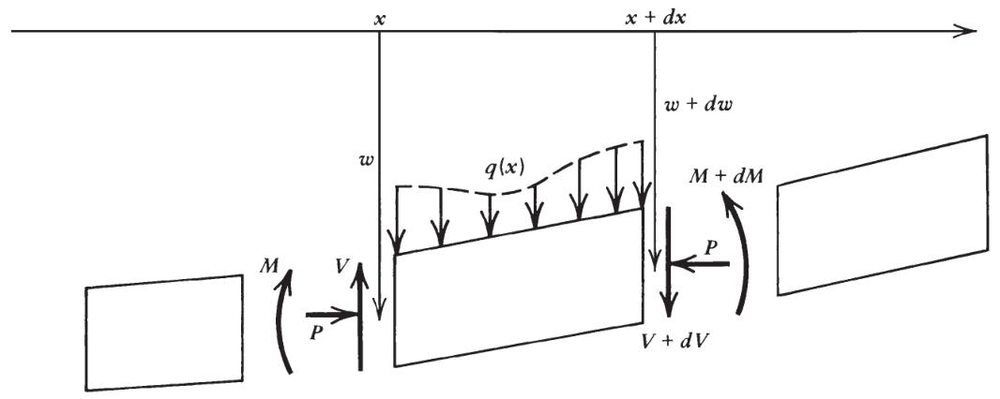
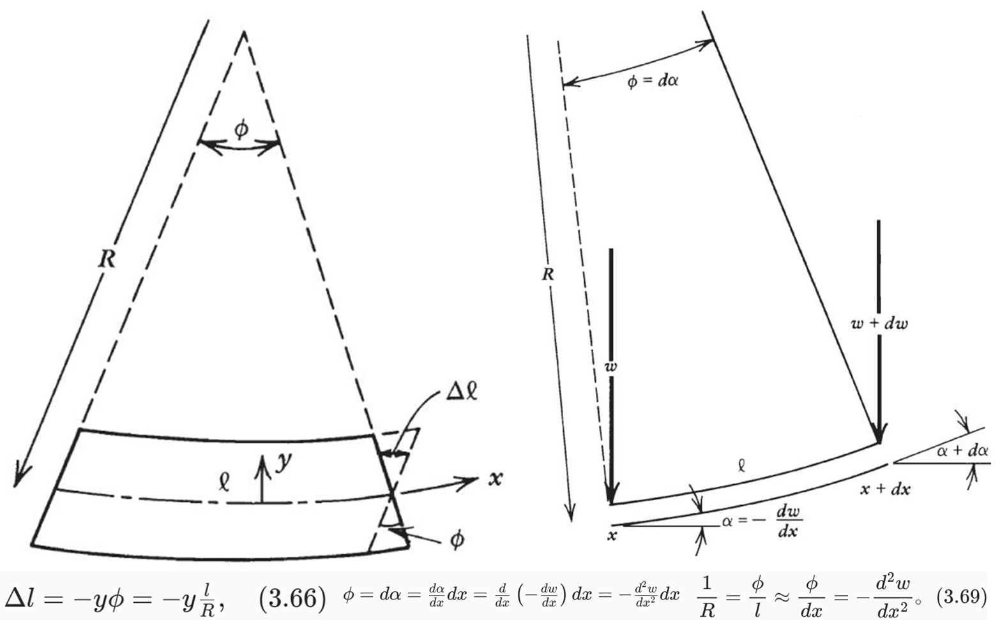
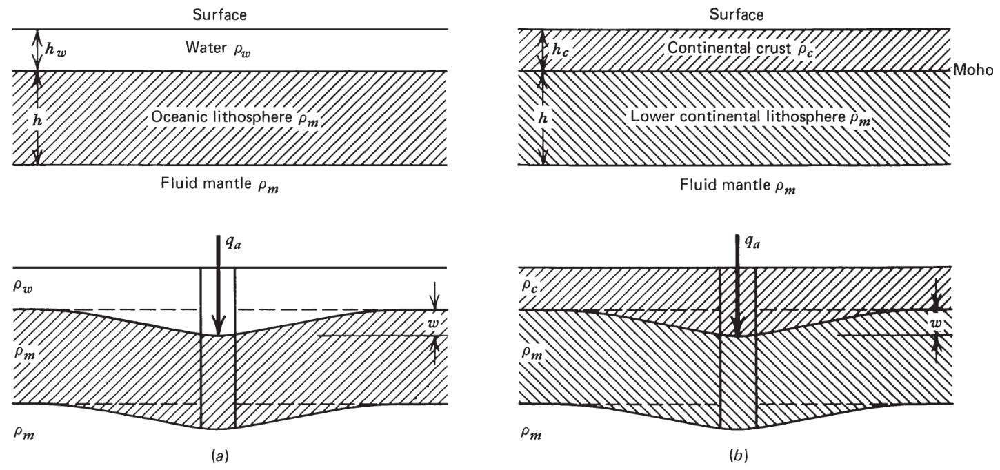
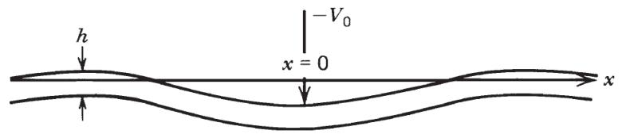
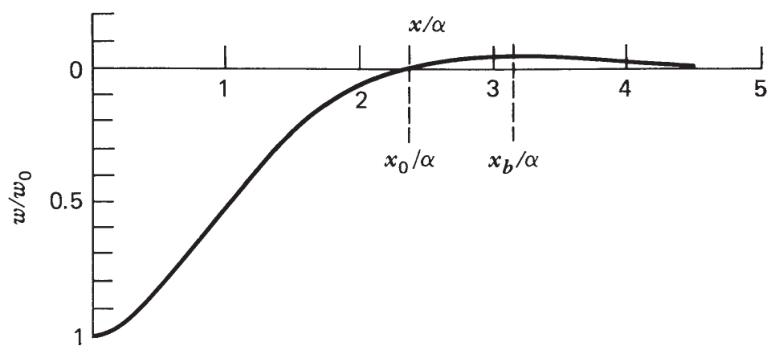

## 3.9 板材的二维弯曲或挠曲

薄而有弹性的地表板块构成了岩石圈，它漂浮在下方相对呈流体状态的地幔之上。这些板块承受着各种载荷，例如火山、海山等，在它们的重压下，岩石圈会发生弯曲。通过将观测到的岩石圈挠曲或弯曲情况与已知的地表载荷联系起来，我们可以推断出板块的弹性属性和厚度。

我们首先建立板块在受力和力矩作用下的弯曲理论。该理论可以通过将褶皱模拟为受水平压力作用的弹性板块变形，来帮助我们理解山脉带中的褶皱系列。此外，还可以运用该理论模拟火成岩侵入体上方地层的上拱现象（3.12）。

### 1. 物理模型与假设

**薄板模型**：$厚度 h \ll 长度 L$，仅在 x-y 平面弯曲（圆柱弯曲，沿 z 方向无限长）。
**小挠度假设**：挠度 $w(x) \ll L$，忽略几何非线性，曲率近似为 $1/R \approx -d^2 w/dx^2$。
**平面应力状态**：板表面无垂直应力（$\sigma_{yy} = 0$），且沿厚度方向（y 方向）的应变 $\varepsilon_{zz} = 0$（因板无限长，z 方向无变形）。

### 2. **力与力矩平衡**

考虑微元 dx 的受力（图 3.10）：
 
  
>1.在 x 和 x + dx 之间，沿 z 方向每单位长度的向下载荷为 q (x) dx
>
>2.沿 z 方向每单位长度的净剪力 V 作用在垂直于图面的板横截面上(所有剪应力积分的合力)
>
>3.沿 z 方向每单位长度的水平力 P 作用在板上(假设 P 与 x 无关)
>
>4.沿 z 方向每单位长度作用在板横截面上的净弯矩 M(正应力 σxx在截面上的积分)

**垂直力平衡**：载荷 $q(x)$ 与剪切力 $V$ 平衡
$$
dV = -q \cdot dx \rightarrow \frac{dV}{dx}=-q\quad\text{（3.57）}
$$
**力矩平衡**：弯曲力矩 M、剪切力 V 和水平力 P 的力矩平衡
$$
dM = V\cdot dx + P\cdot dw \rightarrow \frac{dM}{dx}=V+P\frac{dw}{dx}​ \quad \text{（3.59）}
$$
- 力矩 $M$和$M+dM$共同作用，在微元上产生净逆时针扭矩dM。
- 力 $V$ 和$V+dV$相隔距离dx（一个无穷小力臂），并以顺时针方向在微元上施加净扭矩Vdx。（在计算剪切力引起的力矩时，从 $x$ 到$x+dx$的 $V$ 的变化可忽略不计。）
- 水平力 P 通过其相关力臂$-dw$在微元上施加净逆时针扭矩$-Pdw$。（注意，从 x 到$x+dx$时，dw为负值。）

我们可以对公式（3.59）关于x求导，并代入公式（3.57），来消去剪切力V。由此得到：  
$$
\frac{d^{2} M}{d x^{2}}=-q+P \frac{d^{2} w}{d x^{2}} . \quad(3.60)
$$
### 3. **弯曲力矩与曲率的关系**
**纤维应力分布**：
板弯曲时，上表面压缩（$\sigma_{xx} > 0$），下表面拉伸（$\sigma_{xx} < 0$），中性面（$y=0$）无应变。

**几何关系**：距中性面 y 处的应变 
$$
\varepsilon_{xx} =-\frac{\Delta l}{l}= \frac{y}{R} = -y\frac{d^2 w}{dx^2}
$$

>小角度$\phi$（以弧度为单位）等于$1/R$ 。

**本构方程**：
平面应力下，胡克定律简化为$\sigma_{xx} = \frac{E}{1-\nu^2}\varepsilon_{xx}$（因 $\sigma_{zz} = 0$，$\varepsilon_{zz} = -\frac{\nu}{E}\sigma_{xx}$）。
- **力矩积分**：弯曲力矩 M 为纤维应力对中性面的力矩积分：$$M = \int_{-h/2}^{h/2} \sigma_{xx} ydy = \frac{E}{1-\nu^2} \int_{-h/2}^{h/2} \varepsilon_{xx} y \, dy = -\frac{E h^3}{12(1-\nu^2)} \frac{d^2 w}{dx^2}$$
- **挠曲刚度** $D = \frac{E h^3}{12(1-\nu^2)}$，则：$M = -D \frac{d^2 w}{dx^2} \quad \text{（3.73）}$

### 4.四阶挠曲方程

将 $M = -D \frac{d^2 w}{dx^2}$代入力矩平衡方程（3.59）：$$\frac{d}{dx}\left(-D \frac{d^2 w}{dx^2}\right) = V + P\frac{dw}{dx} \implies -D \frac{d^3 w}{dx^3} = V + P\frac{dw}{dx}$$
再对 x 求导，并利用垂直力平衡方程（3.57，$dV/dx = -q$）$$-D \frac{d^4 w}{dx^4} = \frac{dV}{dx} + P\frac{d^2 w}{dx^2} \implies D \frac{d^4 w}{dx^4} = q - P\frac{d^2 w}{dx^2}$$ 
最终得到**四阶挠曲微分方程（核心方程 2）**：$D \frac{d^4 w}{dx^4} + P \frac{d^2 w}{dx^2} = q(x) \quad \text{（3.74）}$

**方程物理意义**
- **载荷项 $q(x)$**：包括表面载荷（如火山质量）和静水恢复力（如海水或地壳填充下弯空间产生的向上力，见 3.13 节）。
- **水平力项 P**：若存在水平压缩 / 拉伸力（如构造应力），影响弯曲形态（屈曲分析见 3.11 节）。
- **挠曲刚度 D**：反映板的抗弯曲能力，与板厚 h 的三次方成正比（厚度增加，刚度急剧增大）。

### 5.实际应用

#### 5.1 岩石圈板块的弯曲
将弹性板挠曲理论应用于地球岩石圈，考虑载荷作用下岩石圈的挠曲变形时，引入**静水压力恢复力**（hydrostatic restoring force），分析海洋和大陆岩石圈在不同载荷下的平衡方程。

岩石圈作为弹性板漂浮在 “流体” 地幔上，受表面载荷（如火山、沉积物）作用时发生挠曲，需考虑载荷下方地幔被低密度物质（水 / 地壳）替换产生的浮力效应。有以下基本假设：
1. 岩石圈为薄弹性板，厚度为h，密度为$\rho_m$（地幔密度）。
2. 载荷引起的挠曲挠度w较小，适用线性弹性理论。
3. 垂直柱内物质守恒，低密度物质（海水 / 地壳）填充挠曲产生的空隙。

#### 海洋岩石圈的挠曲（图a）
**初始状态**：海水厚度$h_w$，密度$\rho_w$；岩石圈厚度h，密度$\rho_m$，漂浮于地幔（密度同$\rho_m$）。
**挠曲后**：岩石圈下弯w，海水填充空隙，形成新的垂直柱：
- 柱底压力（未挠曲区）：$\rho_w g h_w + \rho_m g (h + w)$
- 柱底压力（挠曲区）：$\rho_w g (h_w + w) + \rho_m g h$
- **静水恢复力**（向上）：两者压力差为$(\rho_m - \rho_w) g w$，由地幔与海水的密度差产生。
**表面载荷为$q_a(x)$**，净载荷$q = q_a - (\rho_m - \rho_w) g w$（恢复力抵消部分载荷）。
代入挠曲方程（3.74），得：
$$D \frac{d^4 w}{dx^4} + (\rho_m - \rho_w) g w = q_a(x) \quad \text{（3.103）}$$
其中$D = \frac{E h^3}{12(1-\nu^2)}$为挠曲刚度。

#### 大陆岩石圈的挠曲（图b）

**初始状态**：大陆地壳厚度$h_c$，密度$\rho_c$；岩石圈（含地壳）漂浮于地幔（密度$\rho_m$）。
**挠曲后**：岩石圈下弯w，地壳岩石填充空隙，Moho 面下弯w，形成新的垂直柱：
- 柱底压力（未挠曲区）：$\rho_c g h_c + \rho_m g (h + w)$
- 柱底压力（挠曲区）：$\rho_c g (h_c + w) + \rho_m g h$
- **静水恢复力**（向上）：压力差为$(\rho_m - \rho_c) g w$，由地幔与地壳的密度差产生。
**表面载荷为$q_a(x)$**，净载荷$q = q_a - (\rho_m - \rho_c) g w$。
代入挠曲方程得：
$$D \frac{d^4 w}{dx^4} + (\rho_m - \rho_c) g w = q_a(x) \quad \text{（3.106）}$$
与海洋情况形式相同，但密度差为$(\rho_m - \rho_c)$。

#### 5.2 线载荷引起的岩石圈挠曲变形

以夏威夷岛链为例，研究火山岛链作为线载荷引起的岩石圈挠曲变形，通过弹性板挠曲理论分析载荷 - 挠度关系，推导挠曲形态并估算岩石圈弹性参数，是海洋岩石圈弹性响应的典型应用。火山岛链（如夏威夷）由一系列火山和海山组成，形成线性载荷，导致下方岩石圈弯曲，表现为中央凹陷（如夏威夷深海）和外围前隆（forebulge）。模型具有以下简化假设：
1. **线载荷假设**：岛链载荷简化为沿直线分布的集中力 $V_0$（单位长度载荷，N/m），作用于 $x=0$ 处（图 3.29）。
2. **对称性**：载荷对称，仅需分析 $x \geq 0$ 区域，且 $x \to \infty$ 时挠度 $w \to 0$。
3. **静水恢复力**：海洋环境中，密度差 $\Delta\rho = \rho_m - \rho_w$ 产生向上恢复力（$\rho_m$ 为地幔密度，$\rho_w$ 为海水密度）。

**平衡方程**： 忽略水平力（$P=0$），挠曲方程为（3.125）：
$$D \frac{d^4 w}{dx^4} + \Delta\rho g w = 0, \quad \Delta\rho = \rho_m - \rho_w$$
##### 5.2.1 微分方程求解：线载荷下的挠曲形态

**通解形式**： 方程为四阶常系数线性齐次微分方程，特征根为复数，通解为指数衰减振荡函数：
$$w = e^{x/\alpha}(c_1 \cos\frac{x}{\alpha} + c_2 \sin\frac{x}{\alpha}) + e^{-x/\alpha}(c_3 \cos\frac{x}{\alpha} + c_4 \sin\frac{x}{\alpha}) \quad \text{3.126}$$
其中，**挠曲参数** $\alpha = \left(\frac{4D}{\Delta\rho g}\right)^{1/4}$（3.127），表征挠曲影响范围。

==怎么算出来的通解你先别管，因为我实在不会==

**通过边界条件可以解出四个常数c1、c2、c3、c4**：
- 对称性：$dw/dx=0$ 于 $x=0$（载荷中心斜率为零）。
- 远场条件：$x \to \infty$ 时 $w \to 0$，故 $c_1 = c_2 = 0$。
- 载荷平衡：通过剪切力积分确定 $c_3 = c_4$，最终特解为（3.130/3.132）：$w = w_0 e^{-x/\alpha} \left(\cos\frac{x}{\alpha} + \sin\frac{x}{\alpha}\right), \quad w_0 = \frac{V_0 \alpha^3}{8D}$

**挠曲形态特征**：
- **中央凹陷**：$x=0$ 处挠度最大（$w_0$），随距离指数衰减。
- **前隆（Forebulge）**：在 $x_b = \pi\alpha$ 处出现微小上翘（$w_b \approx -0.0432w_0$），是岩石圈弯曲的标志性特征。

##### 5.2.2岩石圈弹性参数反演

**挠曲参数 $\alpha$ 的意义**：
- 控制挠曲影响范围，与挠曲刚度 D 和密度差 $\Delta\rho$ 相关：$\alpha \propto D^{1/4}, \quad D = \frac{E h^3}{12(1-\nu^2)} \quad \text{（ 为岩石圈厚度）}$
- 通过前隆位置 $x_b = \pi\alpha$ 可直接估算 $\alpha$（如夏威夷 $x_b \approx 250$ km，得 $\alpha = 80$ km）。

**厚度估算实例**：
- **完整岩石圈模型**： 代入 $\alpha = 80$ km，$\Delta\rho = 2300$ kg/m³，$g=10$ m/s²，得 $D = 2.4 \times 10^{23}$ N・m，进一步算出 $h = 34$ km（取 $E=70$ GPa，$\nu=0.25$）。
- **断裂岩石圈模型**： 若岛链处岩石圈断裂（如火山活动弱化岩石圈），边界条件变为 $x=0$ 处无弯矩（$d^2w/dx^2=0$），解得挠度加倍（$w_0 = V_0 \alpha^3/(4D)$），估算 $h = 49$ km（图 3.31-3.32）。

##### 5.2.3地质意义与观测验证

**前隆与凹陷的成因**：
- 中央凹陷由岛链载荷直接导致，前隆是岩石圈弯曲时外围的弹性回弹，其位置和幅度是岩石圈弹性厚度的直接标志。
- 夏威夷深海（中央凹陷）和外围前隆的地形剖面与理论曲线吻合，支持弹性板模型（图 3.28, 3.30）。

**岩石圈强度影响**：
- 断裂模型中前隆幅度更大（$w_b = -0.0670w_0$ vs. 完整模型的 $w_b = -0.0432w_0$），说明岩石圈完整性显著影响挠曲形态，断裂降低刚度，增大挠度。

**现实中的应用**：
- 通过岛链挠曲分析，可推断不同区域岩石圈厚度（如海洋岩石圈约 30-50 km），为板块构造、地震带划分提供依据。
- 问题 3.19-3.20 涉及最大弯曲应力计算，结合 $M = -D d^2w/dx^2$，可评估岩石圈内部应力状态（如夏威夷最大应力约 900 MPa）。