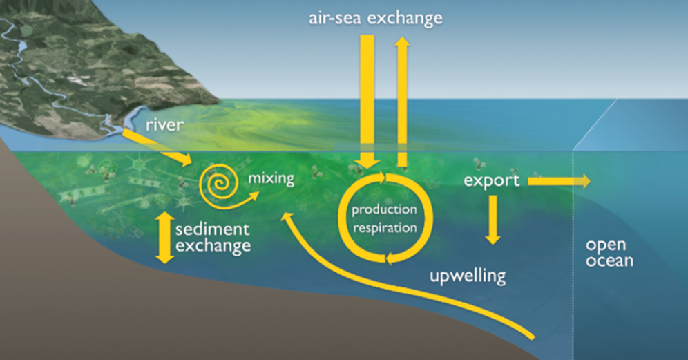
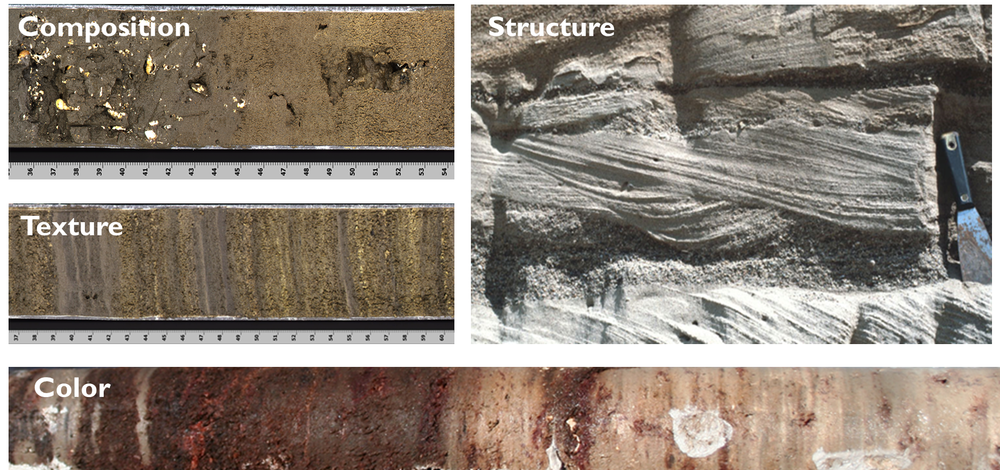
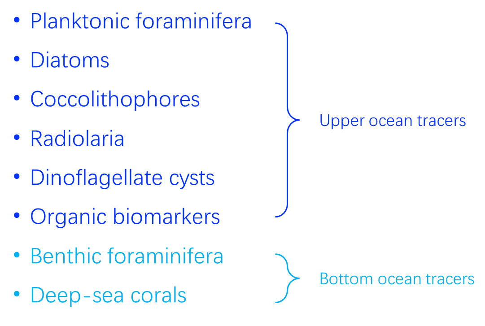
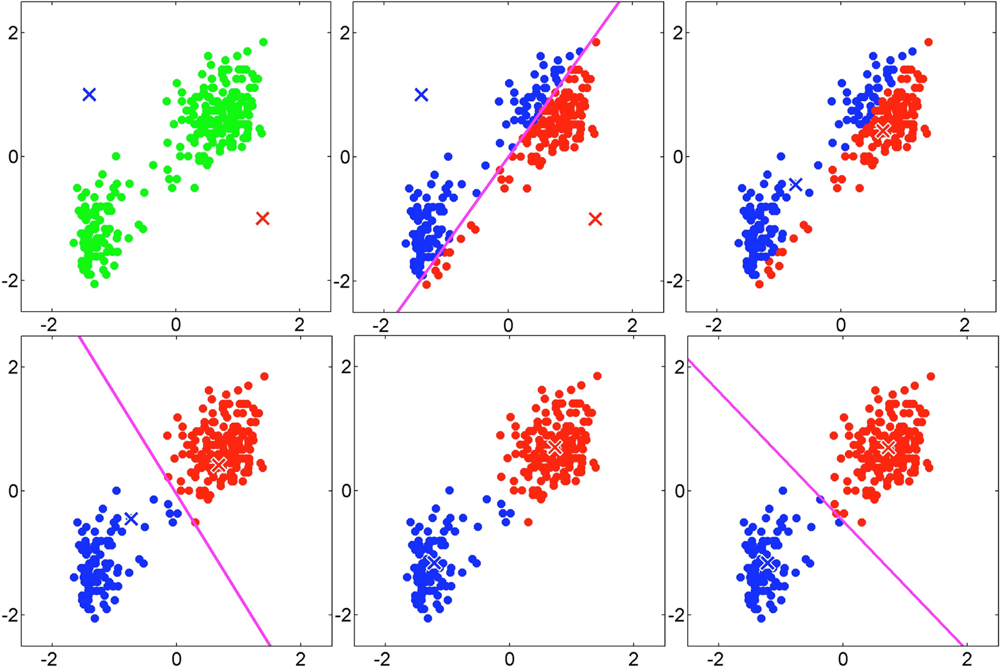
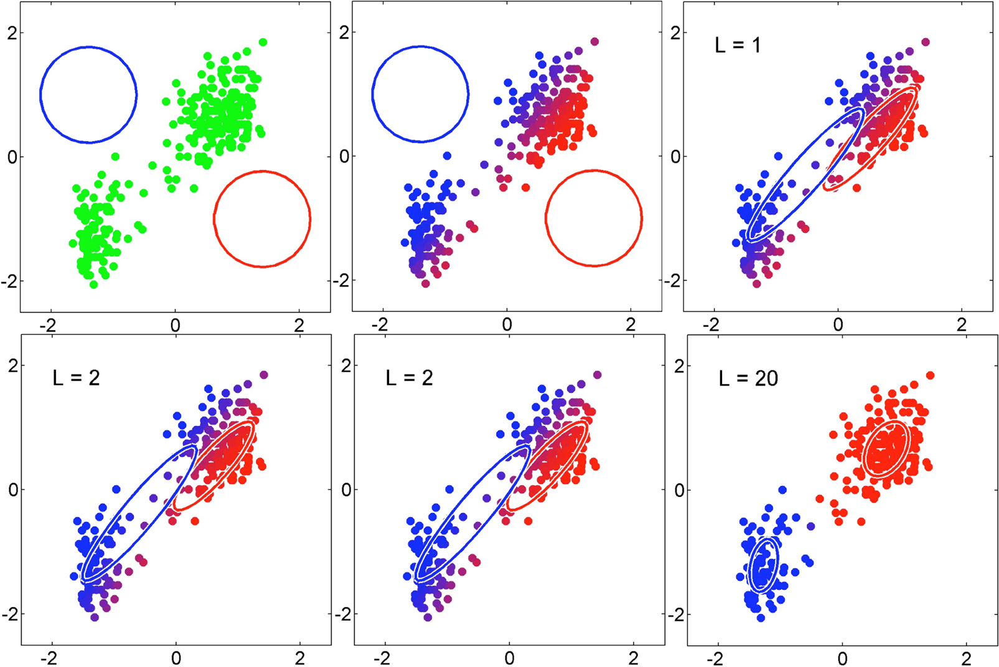
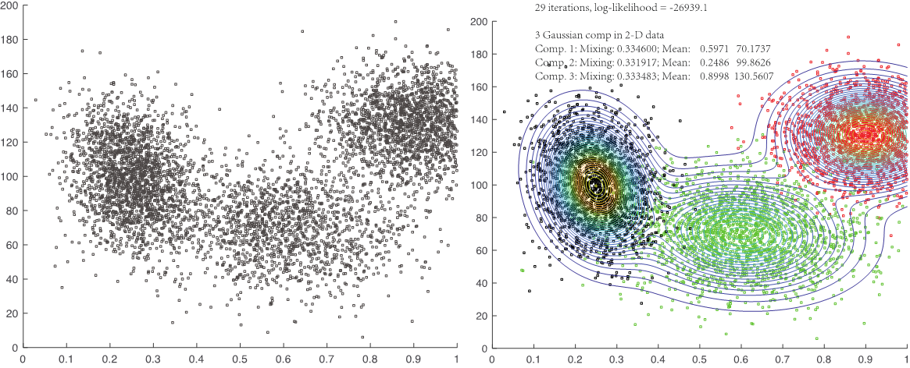

## Intro to paleoceangraphy 
•Developed during Deep-Sea Drilling Program (DSDP)/Ocean Drilling Program (ODP)/Integrated Ocean Drilling Program (IODP)/International Ocean Discovery Program (IODP) since 1970’

•To understand **climate and environmental change in the past**, i.e., internal physical, chemical, and biological processes in the ocean了解过去的气候环境变化

•Past ocean-climate system, i.e. ocean circulation, carbon cycles, sea-surface and deep-sea conditions, & sea level changes etc

•Diversified methodological approaches: multidisciplinary efforts from sedimentology, geochemistry, biology, paleomagnetism, paleontology, and numerical modelling

•Purposes: 
1) to understand recording of physical, chemical, & biological processes in oceans in the past. 
2) to provide climate modelers with updated reconstructions of selected past ocean synopses

## Sample - A geological or environmental record

•A **physical entity** (sediment, ice, assemblage of fossils, chemical or biogenic mineral, growth-rings, organic remains, etc.) that has preserved properties linked to past environmental conditions with **minimal or measurable diagenetic change**.

•It can be analyzed and correlated with climate or environmental parameters in the modern world.

•Its dating (in relative or absolute terms) and duration may provide a time series, allowing documentation of the variability of paleoenvironmental conditions based on mathematical and/or statistical tools.

## Proxy-Tracers for quantitative estimates
### Proxy的概述
•A measurable property of an environmental/geological record which, through mathematical or statistical treatment, can be related with a stated uncertainty to one or a combination of physical, chemical, or biological environmental factors during its formation.

•The use of a proxy to reconstruct past climate requires an understanding of how that proxy is related to climatic conditions.

•Some proxies, such as atmospheric gases trapped in glacial ice (e.g. carbon dioxide and methane), provide a relatively direct measurement of atmospheric chemistry at the time the ice formed and was sealed off from the atmosphere.

•Other proxies are less direct, such as stable isotope measurements (e.g. oxygen and carbon) from shells of marine organisms. These indirect proxies require calibration studies in the modern system to establish the relationship between climate processes and the proxy.

### Proxy的作用
I.Defining a chronological series. 
确定时间序列

II.Understanding processes controlling sediment accumulation and/or diagenetic changes.
了解控制沉积物堆积，成岩变化的过程。

III.Reconstructing the physical, biological, and chemical conditions of the past ocean environments, such as temperature, salinity, density, current velocity, and biological productivity, from the surface ocean, to the deep ocean, sediment-water interface and solid Earth.
重建过去海洋环境的物理、生物和化学条件，如温度、盐度、密度、流速和生物生产力，从表层海洋到深海、沉积物-水界面和固体地球。

IV.The reconstruction is done through transfer function.
通过传递函数进行重建
### Proxy的类别
I.**Physical properties** of the sediment (grain size, mineralogy, density, porosity, and magnetic properties, etc)

**II.Biological remains** preserved as calcium carbonate, silica, organic matter, and organic biomarkers

**III.Geochemical and isotopic properties** of detrital and biogenic materials.

## Marine sediments
### Marine sediments的概述
•Marine sediments and sedimentary rocks are mixtures of a number of components that are derived from different parts of the geosphere.
•The physical/biological/geochemical properties of sediments reflect the admixture of components.
•Lots of useful information vs. the difficulties to extract and separate signals.

### Marine sediments的组成
 **I.lithogenous components**, crystalline and non-crystalline phases derived from continental surfaces and seafloor crustal rocks 陆源碎屑

**II.biogenous components** and skeletal materials 生物成分和骨骼材料

**III.organic tissues** of marine and terrestrial organisms 海洋和陆地生物的有机遗体

**IV.inorganic phases** that precipitate from seawater 从海水中析出的无机相

**V.diagenetic phases** and constituents that form, or are precipitated 沉淀的成岩相

**VI.hydrogenous components** 含氢成分

**VII.cosmogenous components, meteoritic material** from space 太空来源成分
 
VIII.Pollutants 人工污染物

### Marine sediments的分类
**Composition:**
I.Terrigenous sediments
II.Biogenous sediments
III.Organic sediments
IV.Hydrogenous sediments

**Location:**
I.Costal marine sediments
II.Continental shelf sediments
III.Hemipelagic sediments
IV.Pelagic sediments

### Marine sediments的来源
==**Track source - sediment delivery to the deep ocean**==
•**Continental margin flux**: terrigenous detritus, biological
•**Pelagic flux**: biological, aeolian and ice-rafted detritus

The focus in paleoceanographic studies has been given ==**on the deep-sea**==, from continental margins to the open ocean.
The preferred sites for are found in areas of pelagic sedimentation, which are located **far away from the turbulence of the high-energy shelf and nearshore environments, and their predominantly terrigenous inputs.**

### Marine sediments的运输
![[images/image-20250519201624.png]]

## Paleoceanography methods
- Its historical development and benchmark contributions
- Its present state of the art
- Examples of modern applications or interpretations.
- **==Limitations and difficulties==**, great flexibility should be given in order to use each tracer/proxy

### Physical proxies

**Centimeter-scale measurements of physical properties**
I.Magnetic properties
II.Gamma density
III.P-Wave velocity
IV.Color reflectance
V.Natural gamma radiation etc

**Millimeter- to micrometer-scale measurements of physical properties**
I.Digital core imaging
II.Digital X-ray systems
III.Computerized coaxial tomography (CAT-scan)
IV.Micro X-ray fluorescence spectrometry
V.Magnetic resonance imaging (MRI) and nuclear magnetic resonance (NMR)
VI.Confocal macroscopy and microscopy etc

#### （1）Centimeter-scale measurements of physical properties
#### （2）Continuous centimeter-scale measurements of physical properties for core logging
•Magnetic susceptibility – magnetic minerals and magnetic properties

•Gamma density - to measure sediment density based on emitted gamma ray attenuation

•P-wave velocity - P-wave velocity in marine sediments is influenced by changes in lithology, bulk density, porosity, lithostatic pressure, degree of fracturing, degree of consolidation and/or the presence of solid gas hydrate or free gas. Often used to calculate acoustic impedance, to construct synthetic seismic profiles and to estimate the depth of seismic reflectors.

•Color reflectance - to derive information on sediment mineralogy, carbonate or organic carbon contents, geochemical proxies, stratigraphic correlation etc.

•Natural gamma radiation - allows estimation of elemental concentrations of K (potassium), U and Th using gamma emissions of their radioactive isotopes 40K, as well as the 238U and 232Th series.

#### （3）Measurements of continuous millimeter- to micrometer-scale physical properties
I.Digital core imaging - to image, quantify, and archive sedimentological changes, to capture variations in sediment color and texture before oxidization of the sediment surface takes place.

II.Digital X-ray systems

III.Computerized coaxial tomography (CAT-scan) - rapid visualization of both longitudinal and traverse sections of sediment cores, to quantify and map X-ray attenuation coefficients of the analyzed object. Images are displayed in gray scale, darker and lighter zones representing lower and higher X-ray attenuation, respectively.

IV.Micro X-ray fluorescence spectrometry – estimate elemental composition and concentration from Si to U. An intense X-ray beam is used to irradiate the sediment surface and thus enable X-ray fluorescence analysis.

V.Magnetic resonance imaging (MRI) and nuclear magnetic resonance (NMR)

VI.Confocal macroscopy and microscopy

### Biological tracers
•Biological tracers are among the most widely used in paleoceanography.

•They mostly include tracers of biological productivity and of hydrographical conditions in the upper water column, such as planktonic foraminifers, diatoms, calcareous nannofossils (coccolithophorids), dinoflagellates, and organic biomarkers.

•Also include tracers of bottom water conditions such as benthic foraminifers and deep-sea corals.

•There are other biological tracers, which are less widely used than the above-mentioned tracers, particularly radiolaria and ostracoda.

#### 1.Planktonic foraminifera - lives in ocean surface water
#### 2.Benthic foraminifera - lives in ocean bottom
#### 3.Foraminifera - some classifications
##### 3.1 Importance of foraminiferal records in paleoceanography
•The prolific production and excellent preservation of foraminiferal fossils in oceanic sediments has produced probably the **best fossil record on Earth**.

•Planktonic foraminifera are **the most common paleoceanographic proxies**, either through the properties of their fossil assemblages, or as geochemical signals.

•Planktonic foraminifera continue to **play a central role in paleoceanography**, providing the science with robust and reliable proxies.
##### 3.2 Millstones in the development of using foraminiferal fossil records
I.Murray (1897): first note the use of planktonic foraminifera as tracers of surface-water conditions, who recognized that extant species in the plankton and in sea floor sediments are distributed in global belts related to surface-water temperatures.

II.Schott (1935): pioneered the use of quantitative census counts, who discovered that fossil assemblages in deep-sea cores changed between glacial and interglacial times.

III.Pfleger (1948) and Arrhenius (1952): used planktonic foraminifera to describe Quaternary climate cycles in the first long piston cores recovered from the deep sea by the Swedish Deep Sea Expedition.

IV.Emiliani (1954a, 1954b): recognized the **chemical and isotopic signals of foraminifera**, which leads the recognition of glacial-interglacial cycles.

V.Shackleton & Opdyke (1973): using isotopic signals of foraminifera to **recognize orbital pacing of the ice-ages**.

VI.Imbrie and Kipp (1971): **develop the first sophisticated(复杂的) transfer function**.

#### 4.Diatom (硅藻)
•Diatoms are single-celled plants with shells making of **opal (==amorphous silica==)**, and they are among the many organisms that make up the marine plankton of the world's oceans.

•Diatoms are sensitive to changes in temperature, nutrient, salinity, and other physical factors, they provide a means to reconstruct changes from both fresh-water and marine sediments.

•The oldest diatoms are found in rocks **dating to the Early Jurassic**, about 190 million years ago.
#### 5.Coccolithophores (颗石藻)
==nano fossils==
•Coccolithophores or coccolithophorids, commonly known as **golden-brown algae**, are members of the group Haptophyceae belonging to the class Prymnesiophyceae or Coccolithophyceae

•The coccolithophores are **calcifying protists** that have formed a significant part of the oceanic phytoplankton since the Jurassic.

#### 6.Dinoflagellates (腰鞭毛虫)
•Dinoflagellates are a group of single-celled aquatic organisms with whip-like flagella (thread-like structures) that propel them through water.

•Most dinoflagellates live **in marine waters as plankton**, but some are found in freshwater.

•Some dinoflagellates form ==dormant cysts== (**dinocysts**) as part of their life cycle. Because of their resistant cell wall, dinocysts are preserved in sedimentary rocks as old as the middle Triassic (~235 Ma). Dinocysts in sediment archives can tell information about **salinity and nutrient status** of the water these organisms were living in.
#### 7.Corals
•Corals are marine invertebrates that typically live in colonies with many individuals.

•Corals are important reef builders that live primarily in tropical oceans and secrete calcium carbonate to form a hard skeleton.

•Because corals build sequential layers, they can be used to reconstruct changes in water chemistry and temperature on an annual to decadal scale.

•The oldest known corals are from Cambrian rocks, deposited ~540 million years ago. Some modern reefs, including the Great Barrier Reef in Australia, began their formation as long as 18 million years ago.
#### 8.Ostracodes (介形虫)
•Ostracodes are small members of the Crustacean (**shrimp**) family that live in aquatic environments and are encased by two shells.

•Their sensitivity to changes in **water temperature, salinity, oxygen level, and other parameters** makes them valuable tools to reconstruct past variations in climate and water quality.

•Their fossil record extends to **the early Ordovician** (nearly 500 million years).
#### 9.Mollusks 
•Mollusks are a diverse group of invertebrates that include clams, snails, squid etc.

•Most mollusks secrete a hard shell, and is usually well preserved in sediments. Mollusks can be found in terrestrial, freshwater, estuarine, and marine ecosystems.

•Aquatic mollusks provide information about a number of environmental parameters, such as salinity, temperature, nutrients, water depth, and substrate.

•They span over 540 million years of Earth‘s history.
### Geochemical tracers

•The chemical composition of shells of aquatic organisms is affected by the chemistry of the water where they form and live. Water chemistry, in turn, is influenced by temperature and precipitation.
水生生物外壳的化学成分——活的水体化学成分——温度和降水

•Therefore, **shell chemistry** (stable isotope and elemental composition) is one example of a chemical proxy of temperature and precipitation.
**shell chemistry**——**temperature and precipitation**

•For organisms such as corals and mollusks that secrete sequential layers, these layers can provide an archive of change over the lifespan of the organisms.
壳的分泌层——随生命周期变化的记录

•Organic biomarkers are another type of chemical proxy; these are molecular fossils derived from living organisms, and they can serve as proxies for other physical and chemical properties of their environment (e.g., temperature, pH, salinity).
生物标志物比例的变化——温度、pH 值、盐度的变化

#### 1.stable isotopes
•Isotopes are atoms of the same element, such as carbon (C) or oxygen (O), that have **different numbers of neutrons**, giving them slightly different atomic weights.

•**Ratios of stable isotopes** from the same element can be measured from samples to infer a wide range of past climate conditions.

•**The ratio of O16 to O18 in rain or snow is controlled by temperature, humidity and atmospheric circulation**. Any archive that faithfully preserves these isotopes can provide information about changes in these climatic parameters.

•Because **isotopes can provide climate information from environment** where there are archives of water or plant material, they represent a very useful proxy.
#### 2.elemental analyses
•Concentrations of chemical elements, such as iron, titanium, and phosphorus etc in sediments and other archives can be used to determine past changes in erosion, lake and ocean productivity, and land use.

•==**Erosion intensity**== is sensitive to changes in precipitation and runoff, as well as changes to the landscape such as deforestation.

•==**Productivity changes**== may reflect precipitation-related fluctuations in nutrient input. Changes in land use, such as agriculture or urbanization, can cause deposition of elements released from fertilizers, sewers, and other systems.

•Some metal (i.e., U, Mo, Cd) concentrations in sediments are sensitive to ==**redox conditions**==.
#### 3.biomarkers
•Biomarkers are **organic molecules** that are unique to a specific organism or group of organisms.

•Biomarkers can be preserved in sediments and rocks after the organism has disintegrated, and measurements of their abundance can be used as a proxy for the past distribution and abundance of the source organisms.

•Some biomarkers can be used to reconstruct past physical parameters such as temperature. Alkenones (链烯酮) are biomarkers produced by marine algae called coccolithophorids. The molecular structure of alkenones is related to the water temperature in which the algae grew.

#### 4.biogenic silica
•Biogenic silica, also known as opal (蛋白石), is important chemical found in marine and freshwater sediment. It is primarily created by diatoms, radiolarians and silicoflagellates.

•Measurements of opal in aquatic ecosystems are a proxy for biological productivity, or the amount of biomass produced in the ecosystem.

•Productivity changes also can reflect factors such as temperature, salinity, and circulation.

•Because biogenic silica is stable in sediments, it has been used to study past marine ecosystem, e.g., ocean primary productivity.
opal稳定——海洋初级生产力——反映温度、盐度和循环等因素

#### 5.Geochemical and isotopic tracers
•Oxygen and carbon isotopes of foraminifera in paleoceanography.

•The isotopic and geochemical properties of foraminifera lay down the foundations of paleoceanography. Modern interpretation of 18O data in planktonic foraminifera has evolved considerably from what was the early debate on the respective contributions of changes in ocean isotopic composition and volume, or of the ocean temperature on observed isotopic shifts between glacials and interglacials. Most recent studies of minor and trace element fractionation processes in foraminiferal calcite, have been instrumental in obtaining a better assessment of salinity vs. temperature changes.

•The concentration of various elements in sediments is modulated by paleoceanographic conditions. Widely used for the assessment of productivity, oxygen availability, redox conditions.

•Radiogenic and U-series isotopes in sediment are excellent tracers of the origin of water masses (and of transported particulate matter along continental margins) and provide robust indications of thermohaline circulation patterns.

•The **boron isotope composition of marine carbonates**, primarily controlled by the **pH of the ocean**. Determining the ocean paleo-pH allows researchers to put constraints on changes in its alkalinity and to **reconstruct atmospheric p-CO2 variations**.
碳酸盐岩中的硼同位素含量——海洋pH的变化——重建大气中二氧化碳的含量

## Transfer Function

## Data analysis
### （1）Regression
### （2）CLustering Analysis

#### 1. K-means
**聚类与分类的区别**
- 分类：类别是已知的，通过对已知类别的数据进行训练和学习，找到这些不同类的特征，再对未知类别的数据进行分类。属于监督学习。
- 聚类：事先不知道数据会分为几类，通过聚类分析将数据聚合成几个群体。聚类不需要对数据进行训练和学习。属于无监督学习。

聚类算法有很多种，K-Means 是聚类算法中的最常用的一种，算法最大的特点是简单，好理解，运算速度快，但是只能应用于连续型的数据，并且一定要在聚类前需要手工指定要分成几类。

K-Means 聚类算法的大致思想就是“物以类聚，人以群分”：
1. 首先输入 k 的值，即我们指定希望通过聚类得到 k 个分组；
2. 从数据集中随机选取 k 个数据点作为初始大佬（质心）；
3. 对集合中每一个小弟，计算与每一个大佬的距离，离哪个大佬距离近，就跟定哪个大佬；
4. 这时每一个大佬手下都聚集了一票小弟，这时候召开选举大会，每一群选出新的大佬（即通过算法选出新的质心）；
5. 如果新大佬和老大佬之间的距离小于某一个设置的阈值（表示重新计算的质心的位置变化不大，趋于稳定，或者说收敛），可以认为我们进行的聚类已经达到期望的结果，算法终止；
6. 如果新大佬和老大佬距离变化很大，需要迭代3~5步骤。

#### 2. Gaussian Mixture Model (GMM)
**高斯分布**[^1]
- 一维正态分布：$$f(x)=\frac{1}{\sigma \sqrt{2 \pi}} \exp{-\frac{(x-\mu)^2}{2 \sigma^2}}$$
- 多维正态分布
$$
\begin{align}
&P(x)=\frac{1}{\sigma \sqrt{(2 \pi^{N} det(\sum)}} \exp{(-\frac{1}{2}(x-\mu)^T {\sum}^{-1} (x-\mu))} \\\\
&{\sum} \text{为协方差矩阵},det(\sum)\text{是}{\sum}\text{行列式中值}
\end{align}
$$

**高斯混合模型**[^2]
- K-means无法将两个均值相同（聚类中心点相同）的类进行聚类，而高斯混合模型（Gaussian Mixture Model, GMM）就是为了解决这一缺点而提出的。
- GMM是通过选择成分最大化后验概率来完成聚类的，各数据点的后验概率表示属于各类的可能性，而不是判定它完全属于某个类，所以称为软聚类。其在各类尺寸不同、聚类间有相关关系的时候可能比k-means聚类更合适。
用多个高斯分布函数去近似任意形状的概率分布，所以GMM就是由多个单高斯密度分布（Gaussian）组成的，每个Gaussian叫一个"Component"，这些"Component"线性加和即为 GMM 的概率密度函数。将待聚类的数据点看成是分布的采样点，通过采样点利用类似极大似然估计的方法估计高斯分布的参数，求出参数（用EM算法求解）即得出了数据点对分类的隶属函数。

**GMM 的概率密度函数**:
$$
p_M (x)=\sum_{k=1}^{K}p(k)p(x|k)=\sum_{k=1}^{K}α_k  p(x|μ_k,Σ_k)
$$
- K：模型的个数，即Component的个数（聚类的个数）
- $\alpha_k$为属于第k个高斯的概率(也称为先验分布)，其需要满足大于零，且对一个x而言$\alpha_k$ 之和等于1
- $p(x|k)$为第k个高斯的概率密度，其均值向量为$\mu_k$， $\sum_k$为协方差矩阵

K是人工给定，其他参数都需要通过EM算法进行估计

**GMM的优缺点**
- GMM使用均值和标准差，簇可以呈现出椭圆形，优于k-means的圆形
- GMM是使用概率，故一个数据点可以属于多个簇
- 容易收敛到局部最优解
对于 K-means，通常是重复多次然后取最好的结果，但GMM 每次迭代的计算量比 K-means 要大很多，一般是先用 K-means（重复并取最优值），然后将聚类中心点（cluster_centers_）作为GMM的初始值进行训练。

### （3）Principal component analysis

PCA的工作就是从原始的空间中顺序地找一组相互正交的坐标轴，新的坐标轴的选择与数据本身是密切相关的。其中，第一个新坐标轴选择是原始数据中方差最大的方向，第二个新坐标轴选取是与第一个坐标轴正交的平面中使得方差最大的，第三个轴是与第1,2个轴正交的平面中方差最大的。依次类推，可以得到n个这样的坐标轴。通过这种方式获得的新的坐标轴，我们发现，大部分方差都包含在前面k个坐标轴中，后面的坐标轴所含的方差几乎为0。于是，我们可以忽略余下的坐标轴，只保留前面k个含有绝大部分方差的坐标轴。事实上，这相当于只保留包含绝大部分方差的维度特征，而忽略包含方差几乎为0的特征维度，实现对数据特征的降维处理。

>**我们如何得到这些包含最大差异性的主成分方向呢？**

**答案：** 事实上，通过计算数据矩阵的协方差矩阵，然后得到协方差矩阵的特征值特征向量，选择特征值最大(即方差最大)的k个特征所对应的特征向量组成的矩阵。这样就可以将数据矩阵转换到新的空间当中，实现数据特征的降维。

由于得到协方差矩阵的特征值特征向量有两种方法：特征值分解协方差矩阵、奇异值分解协方差矩阵，所以PCA算法有两种实现方法：基于特征值分解协方差矩阵实现PCA算法、基于SVD分解协方差矩阵实现PCA算法。

既然提到协方差矩阵，那么就简单介绍一下方差和协方差的关系。然后概括介绍一下特征值分解矩阵原理、奇异值分解矩阵的原理。概括介绍是因为在我之前的[《机器学习中SVD总结》](https://link.zhihu.com/?target=https%3A//mp.weixin.qq.com/s/Dv51K8JETakIKe5dPBAPVg)文章中已经详细介绍了特征值分解原理和奇异值分解原理，这里就不再重复讲解了。可以看我的

[主成分分析（PCA）的原理谁懂的？可以讲解下？ - 知乎](https://www.zhihu.com/question/516028313/answer/3284823040)
[主成分分析（PCA）原理详解 - 知乎](https://zhuanlan.zhihu.com/p/37777074)
[如何通俗易懂地讲解什么是 PCA（主成分分析）？ - 知乎](https://www.zhihu.com/question/41120789/answer/1304023183)

# 参考内容
[^1]: [正态分布（高斯分布）学习笔记 - 知乎](https://zhuanlan.zhihu.com/p/481760712)

[^2]: [聚类算法——高斯混合模型（GMM） - 知乎](https://zhuanlan.zhihu.com/p/449371229)
