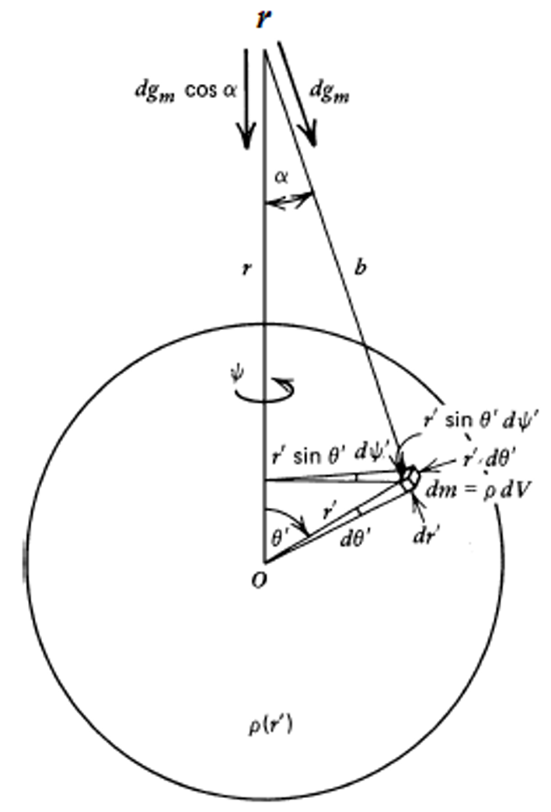
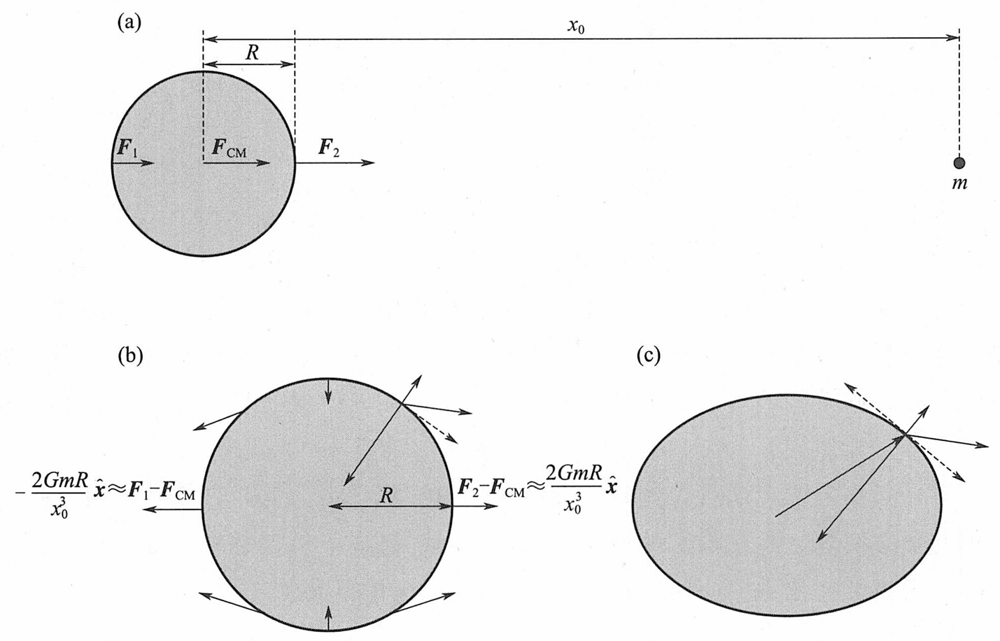

## 单体问题
### 重力势
#### 1.行星重力势的一般形式
##### 引力势的定义
**引力势$\Phi_\mathrm{g}(r)$** 定义为：
$$
\Phi_\mathrm{g}(r)\equiv-\int_{\infty}^{r}\frac{F_\mathrm{g}(r^{\prime})}{m}\mathrm{d}r^{\prime}
$$
引力加速度是引力势的梯度：
$$
\frac{\mathrm{d}^2r}{\mathrm{d}t^2}=-\nabla\Phi_\mathrm{g}(r)
$$
通常$\Phi_\mathrm{g}(r)$满足泊松方程：
$$
\nabla^2\Phi_\mathrm{g}=4\pi\rho G
$$
真空中$\rho$等于0，因此满足拉普拉斯方程：
$$
\nabla^2\Phi_\mathrm{g}=0
$$
##### 球体的引力势

定义距离球体球心$r$处受到球体$r^{'}$处引力势$\Phi_\mathrm{g}(r)$，将其展开得
$$
\begin{aligned}
 & \Phi(\mathbf{r})=-\frac{Gm^{\prime}}{|\mathbf{r}^{\prime}-\mathbf{r}|} \\
 & \Phi(\mathbf{r})=-G\int\frac{\rho(\mathbf{r}^{\prime})}{|\mathbf{r}^{\prime}-\mathbf{r}|}d^{3}\mathbf{r}^{\prime}.
\end{aligned}
$$
一般轴对称质量分布：
$$
\Phi(r,\phi,\theta)=-G\int_0^\infty\int_0^\pi\int_0^{2\pi}\frac{r^{\prime2}\rho(r^{\prime},\theta^{\prime})\sin\theta^{\prime}}{|\mathbf{r}-\mathbf{r}^{\prime}|}d\phi^{\prime}d\theta^{\prime}dr^{\prime}.
$$
因为$\Phi_\mathrm{g}(r)$在自由空间中满足拉普拉斯方程,行星外部的引力场可以展开成勒让德多项式的级数,而不是适用于任意形状的完全球谐函数展开。（详情请见[[Legendre]]）
$$
\Phi(r,\phi,\theta)=\sum_{n=0,\infty}\Phi_{n}(r)P_{n}(\cos\theta).\tag{1}
$$
#### 2.轴对称椭球体的重力势表达式

 现在让我们来计算一个质量密度 γ 和平均半径 R 一致的椭球体外部产生的重力势能。椭球体是围绕主轴或次轴旋转椭圆而产生的固体。让旋转轴与 Z 轴重合、并让球面的外部边界满足
$$
r=R_\theta(\theta)=R\left[1-\frac{2}{3}\epsilon P_2(\cos\theta)\right],
$$
其中，椭圆度 $\epsilon$的定义为$(R_e-R_p)/R$,则$R_e=R(1+\epsilon /3)$,$R_e=R(1-2\epsilon /3)$。而$P_2(\cos\theta)$是二阶勒让德多项式级数，即$P_2(x) = \frac12 (3cos{\theta}^2 - 1)$。

现在，根据公式（1），所产生的引力势为
$$
\begin{aligned}
\Phi(r,\theta) 
& =\frac{GM}{r}\sum_{n=0,\infty}J_{n}\left(\frac{R}{r}\right)^{n}P_{n}(\cos\theta) \\
& =\frac{GM}{R}\sum_{n=0,\infty}J_{n}\left(\frac{R}{r}\right)^{n+1}P_{n}(\cos\theta)\\
\end{aligned}
$$
其中，
$$
\begin{aligned}
J_n
& =-\frac{2\pi R^3}{M}\int\int\left(\frac{r}{R}\right)^{2+n}\rho(r,\theta)P_n(\cos\theta)\sin\theta d\theta\frac{dr}{R}.\\
& =-\frac{3}{2}\int_0^\pi P_n(\cos\theta)\int_0^{R_\theta(\theta)}\frac{r^{2+n}dr}{R^{3+n}}\sin\theta d\theta.\quad 代入M=({4\pi/3})\gamma R^3\\ 
& = -\frac{3}{2(3+n)}\int_0^\pi P_n(\cos\theta)\left[\frac{(R_\theta(\theta)}{R}\right]^{3+n}\sin\theta d\theta\\
& = -\frac{3}{2(3+n)}\int_0^\pi P_n(\cos\theta)\left(1-\frac{2}{3}\epsilon P_2(\cos\theta)\right)^{3+n}\sin\theta d\theta \quad 当\epsilon很小时,(1-x)^{n}=1-nx\\ 
& \simeq-\frac{3}{2\left(3+n\right)}\int_0^\pi P_n(\cos\theta)\left[P_0(\cos\theta)-\frac{2}{3}\left(3+n\right)\epsilon P_2(\cos\theta)\right]\sin\theta d\theta
\end{aligned}
$$
因此，由勒让德多项式的正交归一性知,在一阶的情况下，不为$0$的$J_n$为：
$$
J_0=-1\quad;\quad J_2=\frac{2}{5}\epsilon
$$
因此重力势可以写为：
$$
\begin{aligned}
\Phi(r,\theta)
& = -\frac{GM}{r}+J_2 \frac{GMR^{2}}{r^{3}}P_{2}(\cos\theta)+\mathcal{O}(\epsilon^{2}).\\
& = -\frac{GM}{r}+\frac{2}{5}\epsilon\frac{GMR^{2}}{r^{3}}P_{2}(\cos\theta)+\mathcal{O}(\epsilon^{2})
\end{aligned}
$$
#### 3.行星旋转的离心势一般形式
##### 非惯性参考系——旋转参考系
$$
\frac{d\mathbf{r}}{dt}=\frac{d\mathbf{r}}{dt^{\prime}}+\mathbf{\Omega}\times\mathbf{r} \quad or \quad \frac{d}{dt}=\frac{d}{dt^{\prime}}+\mathbf{\Omega}\times
$$
$$
\mathbf{v}=\mathbf{v}^{\prime}+\mathbf{\Omega}\times\mathbf{r},
$$
$$
\begin{aligned}
\mathbf{a}
& =\left(\frac{d}{dt^{\prime}}+\mathbf{\Omega}\times\right)\left(\mathbf{v}^{\prime}+\mathbf{\Omega}\times\mathbf{r}\right)\\
&=\mathbf{a}^{\prime}+\mathbf{\Omega}\times(\mathbf{\Omega}\times\mathbf{r})+2\mathbf{\Omega}\times\mathbf{v}^{\prime} \quad 其中\mathbf{a}^{\prime}=d^{2}\mathbf{r}/dt^{\prime2}
\end{aligned}
$$
##### 行星的旋转压平
考虑一个由不可压缩流体组成的自重力天体的平衡构型，该天体围绕通过其质量中心的某个固定轴线稳定而均匀地旋转。假设天体外部边界为椭球面。假设 $M$ 是天体总质量，$R$ 是天体平均半径，$ε$是天体的椭圆度，$Ω$ 是天体角旋转速度。最假设物体的旋转轴与其对称轴重合，沿 Z 轴运行。

 让我们转换到一个非惯性参照系，该参照系与身体绕 Z 轴共转，因此身体看起来是静止的。根据第 5.3 节，现在的问题类似于非旋转体的问题，只是加速度可以写成 g = gg + gc，其中 gg = -∇Φ(r,θ) 是重力加速度，gc 是离心加速度，Φ 是重力势能。离心加速度的大小为 r sinθΩ2，其方向远离旋转轴（见第 5.2 节）。(参见第 5.2 节。）这里，r 和 θ 是球面坐标，其原点是物体的几何中心，对称轴与旋转轴重合。
 因此离心加速度为

### 转动惯量和分层模型
一旦我们从J2的测量得到转动惯量C(或者平均值I),我们可 以用2层模型来估计核幔边界
$$
\begin{align}
I\equiv\frac{C+A+B}{3}
&=\frac{1}{3}\int dV^{\prime}\rho(r^{\prime})(x^2+y^2+x^2+z^2+y^2+z^2) \\
&=\frac{1}{3}\int dV^{\prime}\rho(r^{\prime})2r^{\prime2} \\
&=\frac{1}{3}\int_0^R4\pi r^{\prime2}dr^{\prime}\rho(r^{\prime})2r^{\prime2} \\
&=\frac{2}{3}\int_0^R4\pi r^{\prime4}dr^{\prime}\rho(r^{\prime})
\end{align}
$$

## 潮汐作用
### 1.潮汐力和潮汐隆起
#### 潮汐力
考虑一个半径为$R$的近球形天体，其中心位于坐标原点，受到$r_0$处一个质量为$m$的质点的引力，$r_0 \gg R$。在$r=(x,y,z)$处，**单位质量所受的潮汐力(即比潮汐力)** 是质点$m$在$r$处的拉力和在原点处拉力之差，即
$$
F_T(r)=\frac{Gm}{\mid r_0-r\mid^3}(r_0-r)-\frac{Gm}{r_0^3}r_0
$$
对于位于天体中心到质点连线(取这条连线为x轴)上的点,上式可以简化为：
$$
F_T(r)=\frac{Gm}{(x_0-x)^2}-\frac{Gm}{{x_0}^2}\approx\frac{2xGm}{{x_0}^3}
$$
$$
\text{一阶泰勒展开化简：}\frac{1}{(x_0-x)^2}=\frac{1}{{x_0}^2}\frac{1}{1-{(\frac{x}{x_0}})^2}=\frac{1}{{x_0}^2}(1+\frac{x}{x_0})
$$
由上述知，**最低阶的潮汐力与受力体中心的距离成正比，与摄动天体距离的立方成反比** 。天体+x部分受到的潮汐力指向+x方向，-x部分受到的潮汐力指向一 x方向。

#### 潮汐隆起

由于潮汐力的作用，x轴以外物质沿x轴方向潮汐拉伸。如果天 体是可变形的，它会在x方向上拉长。月球和地球相互之间的引力会导致**潮汐隆起**，沿着两个天体中心连线上升。近侧的凸起是受另一个天体引力较大的直接结果，而远侧凸起则是由于远侧所受引力小于自身中心所受引力所致。**天体不同位置的离心加速度差也对潮汐隆起的大小有影响**。

月球的自转和绕地球的公转同步，因此月球总是以同一面面向地球，并总在那个方向上拉长，这种现象称为**潮汐锁定** 。然而，地球的自转速度远远快于地月轨道周期。因此，地球指向月球的部分总在变化，并被潮汐力拉伸。与地球的固体部分相比，水更容易对这些变化的力做出反应，从而导致在海岸线看到的水位潮汐变化。由于地球自转和月球轨道运动的综合影响，月球大约每25小时经过一次地球给定的位置,因此每天几乎有两个潮汐周期，我们看到的潮汐主要是半日潮。太阳也会在地球上引发半日潮，周期为12小时，幅度略低于月球潮汐的一半。当月球、地球和太阳大致一线时，潮汐的幅度达到最大值，这种情况每个月会出现两次，即月相为新月或满月时。当月球接近近地点和地球接近近日点时(后者发生在1月初),潮汐也会更大。

#### 潮汐影响天体结构

强烈的潮汐能显著地影响天体的物理结构。一般来说，行星对距离自身最近的卫星所施加的潮汐力，是太阳系天体感受到的最强潮汐力(除了小行星和彗星掠日或掠行星的情况以外)。在行星附近，潮汐非常强烈，它们可以撕裂一个流体(或聚集力弱的固体)天体。在这样一个区域，大卫星是不稳定的，即使是小卫星可以通过物质强度和摩擦结合在 一起，也因潮汐而无法增长。这个区域的边界称为**洛希极限** 。在洛希极限的内部，固体物质仍然以小天体的形式存在，我们看到的是环而不是大卫星。

### 2.潮汐力矩
潮汐耗散导致卫星和行星旋转速率和轨道的长期变化。虽然在没有外部力矩的情况 下，一对相互旋转天体的总角动量守恒，但角动量可以通过潮汐力矩在旋转和轨道运动之间传递。刚体旋转角动量由下式给出：
$$
L=I\omega_{\mathrm{rot}}
$$
式中，$I$是天体的惯性张量，$\mathrm{rot}$是天体的旋转角速度。旋转的动能为
$$
E_{\mathrm{rot}}=\frac{1}{2}\boldsymbol{\omega}_{\mathrm{rot}}^{\mathrm{T}}\boldsymbol{I\omega}_{\mathrm{rot}}=\frac{1}{2}\boldsymbol{\omega}_{\mathrm{rot}}^{\mathrm{T}}\boldsymbol{L}
$$
惯性张量的各分量为

### 3.潮汐锁定
**前导半球(leading hemisphere)** 和**后随半球(trailing hemisphere)** ,被潮汐锁定的星球始终有一面面对它所围 绕旋转的大星球，一面背对它所围绕旋转的大星球；因此也始终有一个面面对它自身轨道运动的方向，一个面背对它自身轨道运动的方向。面对它自身轨道运动方向的称为前导半球，背对自身轨道运动方向的称为后随半球

### 4.潮汐加热
潮汐力矩除了传递角动量,还可以传递能量。能量传输率是角动量传 输率的n倍。从式(2-19)和式(2-23)的导数与a的比值可以看出，对于一条扩大的 圆轨道，其机械能变化与轨道角动量变化之比由dE/dL=n给出。因此，由行星潮汐隆起 产生的力矩不会(直接)改变卫星轨道的偏心率。 

潮汐力随时间的变化可以导致行星体内部加热。从卫星上看，当行星在天空中移动 时，具有非同步旋转的卫星潮汐隆起位置会发生变化。在偏心轨道上同步旋转的卫星经受 两类潮汐力变化。潮汐隆起的幅度随卫星与行星的距离而变化，隆起的方向也因卫星以恒 定速率(大小等于其平均轨道角速度)自转而变化，而瞬时轨道角速度则根据开普勒第二 定律而变化。由于天体不是完全刚性的，潮汐力的变化改变了卫星的形状；由于天体也不 是完全的流体，所以卫星在形状变化时会以热量的形式耗散能量。因此，在偏心轨道上或 与其轨道周期不同步旋转的天体上，潮汐变化引起的内应力会导致某些天体产生显著的潮汐加热，尤其是在木卫一上。如果没有其他力存在，由木星在木卫一上引起的潮汐变化导 致的耗散将使木卫一轨道偏心率减小。木卫一的轨道将会接近圆形，即给定角动量[式 (2-23)]的最低能量状态(最小半长轴),耗散的轨道能量被转换成热能。由于木卫一 的轨道周期小于木星的自转周期，因此木卫一在木星上引起的潮汐隆起将木星的一些自转 动能转移到木卫一的轨道上，导致木卫一向外螺旋远离木星[式(2-53)]。如上所述， 这些力矩并不直接影响木卫一轨道的偏心率。然而，木卫一和木卫二之间存在2:1的平 均运动共振锁定(表1-4和2.3.2.1节)。木卫一将它从木星得到的一些轨道能量和角动 量传递给木卫二，并且由于木卫一的轨道周期小于木卫二的轨道周期，这种传递增加了木 卫一的偏心率(习题2.29)。这种强迫偏心保持了较高的潮汐耗散率，因此木卫一有较大 的内部加热，这种加热表现为活跃的火山作用(5.5.5.1节)。

## 二体问题
### 月球的轨道

#### 1.地-月二体框架下的月球轨道（开普勒轨道）
对一个只有2个行星（卫星）的系统，它们的相对运动 轨迹只用牛顿引力和初始相对运动就可以描述。
$$
\mathbf{f}=-\frac{GMm}{r^{3}}\mathbf{r}.\quad\quad
$$

在二体问题框架下，月球轨道满足：
1. **角动量守恒**：
   $$\mathbf{h} = \mathbf{r} \times \mathbf{v} = \text{常矢量}$$
   分解为极坐标形式：
   $$h = r^2\dot{\theta}$$

2. ​**运动方程分解**：
   -  速度$\mathbf{v}$和加速度$\mathbf{a}$:（注意$\vec{r}=r(t)\vec{e_r}\;,\;\vec{\theta}=\theta(t)\vec{e_{\theta}}$）
    $$
     \begin{align}
     \mathbf{v}
     &=\frac{d\mathbf{r}}{dt}=\dot r\mathbf{e}_{r}+r \dot{\mathbf{e}}_{r}\\
     &=\dot{r}\mathbf{e}_{r}+r\dot{\theta}\mathbf{e}_{\theta}.\\
     \mathbf{a}
     &=\frac{d\mathbf{v}}{dt}=\frac{d^{2}\mathbf{r}}{dt^{2}}=\ddot{r}\mathbf{e}_{r}+\dot{r}\dot{\mathbf{e}}_{r}+(\dot{r}\dot{\theta}+r\ddot{\theta})\mathbf{e}_{\theta}+r\dot{\theta}\dot{\mathbf{e}}_{\theta}.\\
     &=(\ddot{r}-r\dot{\theta}^{2})\mathbf{e}_{r}+(r\ddot{\theta}+2\dot{r}\dot{\theta})\mathbf{e}_{\theta}=-\frac{GM}{r^{2}}\mathbf{e}_{r}.
     \end{align}
     $$
   -  径向分量：
     $$\ddot{r} - r\dot{\theta}^2 = -\frac{GM}{r^2}\tag{1}$$
   - 横向分量：
     $$\frac{1}{r}\frac{d}{dt}(r^2\dot{\theta}) = 0\tag{2}$$

3. ​**开普勒定律**：
   - **第一定律（椭圆轨道）**：
	微分方程（1）有一个通解，即
	$$r(\theta)=\frac{r_c}{1+e\cos\theta}$$
	 其中半通径$r_c=\frac{h^2}{GM}=a(1-e^2)$(有时$r_c$记作$p$) , $e$是离心率。
	 
	 如果考虑椭圆轨道的朝向，则
    $$r(\theta) = \frac{r_c}{1+e\cos(\theta-\omega)}$$
    其中$\omega$ 为近地点幅角 , 当$\theta = \omega$时，卫星处于近地点。可以将$\theta-\omega$记作真近点角$\nu$(从近地点起算的角度。
	 
	 如果想更好地描述椭圆轨道，可以引入更多的参量，参考[轨道六根数](./oribital_elements)
   - **第二定律（面积定律）**：
    $$\frac{dA}{dt} = \frac{1}{2}r^2\dot{\theta} = \frac{h}{2} = \text{常量}$$
    因为$h = r^2\dot{\theta}=0$，所以$h$是常数
   - **第三定律**：
    $$
    \begin{align}
    T= &\frac{A}{dA/dt}=\frac{\pi ab}{h/2}=\frac{2\pi a^{2}(1-e^{2})^{1/2}}{h}=\frac{2\pi a^{3/2}r_{c}^{1/2}}{h} \\
    \end{align}
    $$
    代入后化简得：
	 $$T^2 = \frac{4\pi^2}{G(M+m)}a^3$$

#### 2. 在一个轨道周期内的潮汐耗散

任何应力和应变有相差的变形都会有能量耗散。潮汐耗散的能量计算：
1. ​**能量耗散率**：
   $$\dot{E} = \frac{1}{2}\int_V \sigma_{ij}\dot{\epsilon}_{ij} dV$$
   其中 $\sigma$ 为应力张量，$\epsilon$ 为应变张量

2. ​**相位延迟模型**：
   $$\sigma = \mu\epsilon e^{i\delta},\quad \delta = \arctan(1/Q)$$
   单周期能量耗散：
   $$\Delta E = \frac{21}{2}\frac{k_2 R^5}{Q}\left(\frac{GM'}{a^3}\right)^2$$

3. ​**潮汐耗散系数**：
   $$Q^{-1} = \frac{1}{2\pi E_{\text{tide}}}\oint \dot{E} dt$$

#### 3.月球几何天平动和物理天平动(libration)

**3.1经度天平动**： 
$$\Delta\lambda \approx \pm6^\circ\ \text{（由轨道偏心率引起）}$$**3.2纬度天平动**：
$$\Delta\beta \approx \pm7^\circ\ \text{（由轨道倾角引起）}$$
**3.3物理天平动**：
$$\ddot{\theta} + \frac{3GM}{r^3}\frac{(C-A)}{C}\theta = 0$$
其中 $C$ 为极转动惯量，$A$ 为赤道转动惯量

**3.4章动方程**：
$$\frac{d\mathbf{L}}{dt} = \mathbf{\Gamma}_{\text{tide}} + \mathbf{\Gamma}_{\text{spin}}$$

#### 4. 月球的长期轨道—长期扰动理论（secular perturbation）

1. ​**拉格朗日行星方程**：
   $$\begin{aligned}
   \frac{da}{dt} &= \frac{2}{n\sqrt{1-e^2}}\left(R_e\sin f + R_h\frac{1+e\cos f}{e}\right) \\
   \frac{de}{dt} &= \frac{\sqrt{1-e^2}}{na}\left[R_e\sin f + R_h\left(\cos f + \frac{e+\cos f}{1+e\cos f}\right)\right]
   \end{aligned}$$
   其中 $R_e$ 和 $R_h$ 为扰动加速度分量

2. ​**轨道参数演化**：
   - 半长轴变化：
     $$\frac{da}{dt} = -\frac{21}{2}k_2\frac{GM'^2R^5}{Qa^{11/2}}$$
   - 偏心率演化：
     $$\frac{de}{dt} = \frac{57}{8}k_2\frac{GM'^2R^5}{Qa^{13/2}}e$$

3. ​**共振效应**：
   当满足条件：
   $$\frac{n'}{n} = \frac{p}{q} \quad (p,q\in\mathbb{Z})$$
   会导致轨道参数的剧烈变化（如evection共振）

4. ​**长期演化方程**：
   $$\frac{d\omega}{dt} = \frac{3n}{4(1-e^2)^2}\left[\frac{J_2R^2}{a^2} + \frac{5}{2}\frac{M'}{M}\left(\frac{a}{a'}\right)^3\right]$$