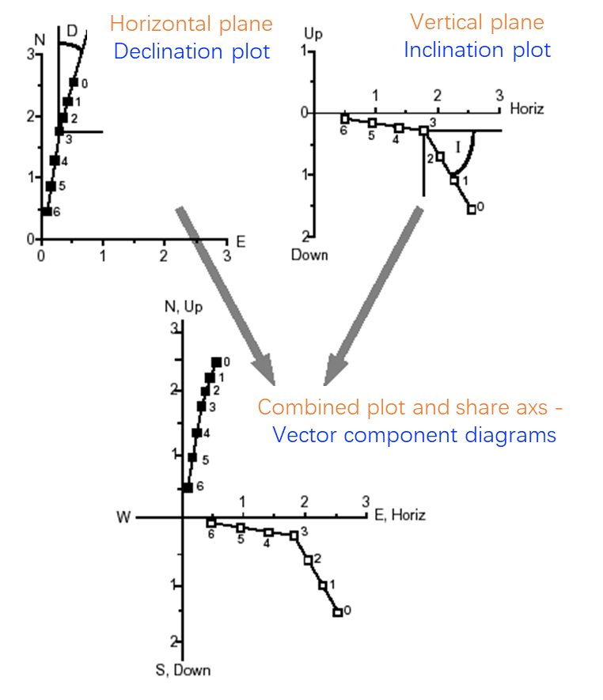

# 物理磁学、岩石磁学与磁性矿物学(Physics of magnetism, rock magnetism and magnetic mineralogy)
## 物理磁学基础
**磁学基本概念**：磁感应强度（B）、磁场强度（H）、宏观磁化强度（M）。
在磁性材料外部，M=0，故B=H。磁力场或磁场H定义为单位正磁荷在该区域所受的力。磁能是磁矩与磁场对齐的能量，磁化强度描述材料在磁场中的磁化程度。

## 岩石的磁性类型
### 非固有磁化
- **抗磁性（Diamagnetism）**：M=χH，χ<0。由电子轨道运动引起，外场使电子沿场方向作拉莫尔进动，非常微弱，与外场相反，常见于所有材料，如H₂O、SiO₂、CaCO₃、斜长石等。
- **顺磁性（Paramagnetism）**：M=χH，0<χ<<1。由未成对电子引起，常见于过渡金属，如橄榄石、角闪石、黑云母、石榴子石、钛铁矿、黏土、菱铁矿、黄铁矿等。在常温下无永久磁性。

### 固有磁化（永久磁化）
- **反铁磁性（Antiferromagnetism）**：大多数磁性造岩矿物具有两个磁性亚格子，其磁化方向相反且大小相等，相互抵消。
- **铁磁性（Ferrimagnetism）**：两个磁性亚格子方向相反但大小不等，存在净剩余磁化。铁磁性矿物是古地磁学中最重要的矿物，如磁铁矿（Fe₃O₄）、磁赤铁矿（γ-Fe₂O₃）、钛磁铁矿（Fe₃₋ₓTixO₄）、钛磁赤铁矿（Fe₂₋yTiyO₃）、格雷戈瓦石（Fe₃S₄）、单斜辉铁矿（Fe₇S₈）等。

## 常见磁性矿物

| 矿物名称  | 成分                                     | 磁性   |
| ----- | -------------------------------------- | ---- |
| 金属铁   | $\alpha-\text{Fe}$                     | 铁磁性  |
| 磁铁矿   | $\text{Fe}_2\text{O}_3$                | 铁磁性  |
| 磁赤铁矿  | $\gamma-\text{Fe}_2\text{O}_3$         | 铁磁性  |
| 钛磁铁矿  | $\text{Fe}_x\text{Ti}_{3-x}\text{O}_4$ | 铁磁性  |
| 格雷戈瓦石 | $\text{Fe}_3\text{O}_4$                | 铁磁性  |
| 单斜辉铁矿 | $\text{Fe}_7\text{O}_8$                | 铁磁性  |
| 赤铁矿   | $\alpha-\text{Fe}_2\text{O}_3$         | 反铁磁性 |
| 针铁矿   | $\text{FeOOH}$                         | 反铁磁性 |
| 菱铁矿   | $\text{Fe}\text{CO}_3$                 | 顺磁性  |

# 古地磁学(Paleomagnetism)
## 一、古地磁学基础概念

古地磁学是研究岩石中保存的古地磁场信息的学科，这些信息通常是在岩石形成时获得的。古地磁学在板块构造研究中具有重要意义，可用于定量描述板块运动。

## 二、岩石的天然剩余磁化类型

- **热剩余磁化（TRM）**：火成岩在冷却至居里温度以下时获得。
- **沉积剩余磁化（DRM）**：沉积岩在沉积过程中获得，受颗粒定向和生物扰动影响。
- **化学剩余磁化（CRM）**：在沉积物中磁性矿物生长过程中获得。
- **次生磁化**：包括黏滞剩余磁化（VRM）、热黏滞剩余磁化（TVRM）、等温剩余磁化（IRM）、钻探诱导剩余磁化（DIRM）等，会干扰天然剩余磁化的解释。

## 三、古地磁稳定性
古地磁记录的稳定性取决于剩余磁化的弛豫时间，弛豫时间与温度密切相关。高温会加速磁化强度的衰减。阻塞温度（TB）是弛豫时间等于观测时间尺度的温度，阻塞温度越高，剩余磁化在地质环境中的稳定性越好。

### 磁化弛豫时间与温度的关系

古地磁记录的稳定性关键取决于剩余磁化的弛豫时间，而弛豫时间与温度呈显著相关性。在**较高温度下，磁化强度的衰减进程会明显加速**。这种关系的根本原因在于磁性颗粒内部的磁矩重新定向机制，它受到热能的显著影响。当温度升高时，热运动更加剧烈，磁矩更容易克服能量障碍，从而改变其方向，导致磁化强度逐渐减弱。

### 阻塞温度的公式与解释

阻塞温度（TB）是弛豫时间等于观测时间尺度的临界温度。具体而言，当温度达到TB时，磁化强度在地质时间尺度上开始变得不稳定，会逐渐发生衰减。阻塞温度越高，剩余磁化在地质环境中的稳定性就越好，能够在更长时间内保留古地磁场的信息。

根据奈尔理论，单畴颗粒的弛豫时间（τ）可由以下公式描述：

$$
\begin{align}
\tau &=\frac{f}{k_BT}\times e^{\frac{E_B}{k_BT}} \\
\tau &=\tau_0\cdot exp\left(\frac{\mu_0VM_sH_k}{2kT}\right)
\end{align}
$$

其中：
-$τ$：弛豫时间，即磁化强度从一种不太有利的能量状态转变为更有利于能量状态所需的时间。
-$f$：频率因子，对于铁磁性颗粒，通常约为10⁸ s⁻¹。
-$k_B$：玻尔兹曼常数，其值为1.380649×10⁻²³ J/K。
-$T$：绝对温度（单位为开尔文，K）。
-$E_B$：能量障碍，即磁矩从一个稳定状态转向另一个稳定状态所需要克服的能量壁垒。
当τ等于观测时间尺度（例如在实验室中通常取1秒）时，所对应的温度即为阻塞温度TB。

**公式中不同因子的解释**：

1.**频率因子（$f$）**：它代表磁矩尝试跨越能量障碍的尝试频率。较高的f值意味着磁矩在单位时间内有更多的机会尝试改变方向，从而可能加快弛豫过程。对于不同的磁性材料，f值可能会有所不同，但对于铁磁性颗粒，通常在10⁸ s⁻¹的数量级。

2.**玻尔兹曼常数（$k_B$）**：这是物理学中的一个基本常数，用于将热力学温度与能量联系起来。在该公式中，k_B T代表热能，随着温度的升高，热能增加，使得磁矩更容易克服能量障碍，从而导致弛豫时间缩短。

3.**能量障碍（$E_B$）**：它是维持磁矩在特定方向的能量壁垒。$E_B$越大，磁矩要改变方向所需的能量就越高，因此弛豫时间也就越长。$E_B$与磁性颗粒的尺寸、形状、磁晶各向异性等因素密切相关。例如，较大的颗粒通常具有较高的能量障碍，因为需要更大的能量来协调更多磁矩的重新定向。

4.**温度（T）**：温度是影响弛豫时间的关键因素。从公式可以看出，温度出现在指数项的分母中，因此温度的升高会显著降低弛豫时间。这意味着在较高温度下，磁化强度会迅速衰减，而在较低温度下，磁化强度则能够保持更长时间的稳定。

### 实际应用与意义

在古地磁学研究中，确定岩石中磁性矿物的阻塞温度至关重要。通过热退磁实验，可以逐步升高温度对样品进行退磁，并记录每个温度步骤下的剩余磁化方向和强度。当温度达到TB时，该温度下的磁化成分开始失去稳定性，其磁化方向会发生显著变化或强度急剧下降。这有助于识别和分离不同阻塞温度的磁化成分，从而确定哪些磁化成分是在岩石形成时获得的古地磁场信息，哪些可能是后期热事件或其他过程导致的次生磁化。

例如，在分析一块含有多种磁性矿物的火成岩样品时，研究人员可以通过热退磁曲线确定每种矿物的阻塞温度。如果发现某个磁化成分的阻塞温度高于样品所经历的最高地质温度（如区域变质温度或火成岩冷却温度），那么可以认为该磁化成分自岩石形成以来一直保持稳定，所记录的古地磁场方向是可靠的。相反，如果磁化成分的阻塞温度低于样品经历的温度，则该磁化可能在地质历史中发生了改变，需要进一步分析其成因和可靠性。

总之，阻塞温度是评估古地磁记录稳定性的一个关键参数，其定量公式和相关理论为理解磁化保存机制以及正确解释古地磁数据提供了坚实的物理基础。

## 四、古地磁方法(Paleomagnetic methods)
### 采样方法
**陆地采样**：需采集足够厚的岩层，以平均地磁场的长期变化。
**海洋钻探采样**：从钻探岩芯中取向样品。

### 磁性清洁技术（部分退磁技术）

 **热退磁**：热退磁是基于磁性颗粒的阻塞温度特性。当磁性颗粒被加热到其阻塞温度以上时，其磁矩会变得能够自由重新定向。如果在零磁场中加热和冷却，磁矩会在热能的作用下随机化，从而去除不稳定的磁化成分。将样品加热到高温（T1），然后冷却到室温。 然后将样品加热到 T2>T1 的温度，并再次冷却到 RT。 如此循环往复，温度越来越高，直到磁剩磁消失（样品完全退磁）。
 
 **交变场退磁**：交变场退磁利用交变磁场对磁性颗粒的磁矩进行反复磁化和去磁化。当交变磁场的强度足够大时，它能够克服磁性颗粒内部的能量障碍，使磁矩在磁场方向上反复摆动，从而逐渐随机化低稳定性磁化成分的磁矩方向。其原理是对样品施加弱磁场，使稳定性最低的成分磁化随机化。 通过连续施加更高的磁场并测量每一步剩余的剩磁，目的是消除次级叠印并分离出主要方向。
 
### 退磁数据分析
#### 退磁过程与磁化矢量变化

在古地磁学研究中，退磁数据分析是关键步骤，旨在分离岩石样品中的不同磁化成分，以获取可靠的古地磁场信息。通过退磁过程，可以逐步去除岩石中不稳定的磁化成分，最终保留稳定的剩余磁化，这一过程主要通过矢量分量图来表示磁化矢量的变化。

在退磁过程中，每个退磁步骤后，都会测量样品的剩余磁化强度及其方向，得到一个磁化矢量，该矢量包含三个分量：水平分量（倾角）、垂直分量（偏角）和强度。随着退磁的进行，磁化矢量会逐渐变化，不稳定的磁化成分会先被去除，而稳定的磁化成分则会保留下来。
#### 矢量分量图的绘制与分析

将每个退磁步骤得到的磁化矢量的水平分量和垂直分量绘制在同一个坐标系中，形成矢量分量图。横轴通常表示水平分量（如偏角），纵轴表示垂直分量（如倾角）。具有主分量和次分量的磁化矢量可分别用 (a) 水平（偏角）分量和 (b) 垂直（倾角）分量来描述，磁化强度（强度）表示矢量从直角坐标系原点延伸的距离。通过观察矢量在图中的变化轨迹，可以分析不同磁化成分的特性。

如果样品中存在主次两个磁化成分，矢量分量图上会显示出两个不同的线性段。初始阶段，矢量变化可能较为复杂，随着退磁程度加深，矢量会趋于稳定，指向一个相对固定的方向，这通常代表了样品的主磁化方向，即古地磁场的方向。通过测量这些稳定段的矢量方向，可以确定古地磁场的倾角和偏角等参数。

#### 成分重叠程度的评估

矢量分量图还能帮助评估不同磁化成分的重叠程度。当两个磁化成分的方向较为接近时，它们的矢量轨迹可能会有较多的重叠，导致图中的轨迹弯曲，且两个成分的区分变得困难。在极端情况下，如果两个成分完全重叠，就无法通过矢量分量图分离出主磁化方向，也就无法获得有用的古地磁数据。

因此，在实际操作中，研究人员需要根据矢量分量图的特征，判断退磁效果和磁化成分的分离情况，选择合适的退磁步骤和方法，以确保最终获得的古地磁数据准确可靠。这一过程需要综合考虑样品的磁性特征、退磁技术的适用性以及数据的统计学意义等因素。

## 五、野外测试以确定古代磁化

在古地磁学研究中，进行野外测试是验证所测量磁化是否为古代磁化的重要环节。这些测试有助于确保所获得的古地磁数据的可靠性和准确性，从而能够正确地解释地球历史上的磁场变化和板块运动。以下是几种主要的野外测试方法及其在不同地质构造中的应用。
- **褶皱测试**：判断磁化是否在褶皱之前获得。
- **砾岩测试**：判断磁化是否为原生。
- **烘焙接触测试**：判断磁化是否受热事件影响。
- **极性反转测试**：判断是否获得稳定的主磁化方向。

### 褶皱测试（Fold Test）

#### 原理

褶皱测试基于这样一个原理：如果一个地质单元在褶皱作用之前就被磁化，那么在虚拟地将该单元展平（即逆向模拟褶皱过程）后，古地磁方向数据会显示出更大的聚集性。相反，如果磁化发生在褶皱作用期间或之后，那么在褶皱作用之前的原始未变形状态下的数据会更加分散，而展平后的数据则会显示出更大的一致性。

#### 操作步骤

1. **采样**：在褶皱的不同部位（如褶皱的峰部和 trough 部位）沿着地层的走向和倾向采集一系列样品，确保样品的方位和倾角被准确记录。
2. **实验室分析**：对采集的样品进行古地磁测量，获取每个样品的磁化方向数据。
3. **数据处理**：使用数学模型和软件，根据褶皱的几何形态，对数据进行逆向褶皱变换，即将数据恢复到褶皱作用前的假设状态。
4. **结果评估**：比较变换前后的数据聚集性。如果展平后的数据比原始数据更加聚集，说明磁化发生在褶皱作用之前，即为古代磁化；如果聚集性没有显著变化或变得更分散，说明磁化可能发生在褶皱作用之后，可能受到后期构造事件的影响。

### 砾岩测试（Conglomerate Test）

#### 原理

砾岩是由不同大小的砾石和细粒基质组成的沉积岩。如果一个地质单元包含同生成的砾岩，那么这些砾石在沉积时会随机取向，因为它们在搬运和沉积过程中会受到水流或其他动力的作用而旋转和翻滚。如果整个单元具有原生的古地磁信号，那么这些砾石的磁化方向应该与基质的磁化方向一致；反之，如果磁化是后期获得的，砾石的磁化方向会因为其随机取向而显示出无规律的分布。

#### 操作步骤

1. **识别砾岩层**：在研究区域内找到含有同生成砾岩的地质单元，确保砾岩中的砾石是来自同一沉积事件，没有后期扰动。
2. **样品采集**：从砾岩层中采集多个样品，包括砾石和周围的基质。记录每个样品的位置、砾石的大小和形状等信息。
3. **实验室分析**：测量样品的古地磁方向，分别分析砾石和基质的磁化方向。
4. **数据分析**：比较砾石和基质的磁化方向一致性。如果两者方向一致，说明磁化是原生的；如果砾石的磁化方向是随机的，而基质具有统一的方向，则可能表明基质在沉积后经历了再磁化，而砾石由于其较大的惯性未能跟随磁场变化。

### 烘烤边测试（Baked Contact Test）

#### 原理

烘烤接触测试利用了热事件对磁化的影响。当地层受到局部加热（如岩浆侵入、火成岩体的烘烤作用）时，加热区域的岩石可能会经历热退磁或再磁化。如果古地磁信号在加热事件之后形成，那么烘烤接触带附近的岩石应该具有与未受热影响区域不同的磁化方向。通过比较加热区域和未加热区域的磁化方向，可以判断磁化是否受到热事件的影响。

#### 操作步骤

1. **确定烘烤接触带**：在研究区找到存在明显热接触的地质构造，如火成岩体与周围沉积岩的接触带，确定热影响的范围和程度。
2. **样品采集**：在烘烤接触带及其两侧的未受影响区域采集样品，确保样品沿着热梯度方向有规律的分布，记录样品的位置和与接触带的距离。
3. **实验室分析**：对样品进行古地磁测量，获取磁化方向和强度数据。
4. **数据对比**：比较烘烤接触带内外的磁化方向和强度差异。如果接触带内外的磁化方向一致，说明磁化发生在热事件之前，是古代的；如果方向发生系统性变化，可能表明磁化受到热事件的干扰。

### 极性反转测试（Reversals Test）

#### 原理

地球磁场在地质历史上经历了多次极性反转，即磁场的北极和南极互换位置。如果一组样品跨越了足够长的时间区间，并且包含了多个极性时期，那么这些样品的古地磁数据应该显示出相应的极性变化。极性反转测试通过分析样品中正、反极性的分布情况，验证所获得的磁化方向是否与已知的地球磁场反转事件相符，从而判断磁化的稳定性和古代性。

#### 操作步骤

1. **样品采集**：在具有连续沉积或喷发序列的地质单元中采集足够多的样品，确保样品覆盖的时间跨度能够包含多个磁场极性事件。例如，在海洋沉积物或火山岩序列中进行系统采样。
2. **实验室分析**：对所有样品进行古地磁测量，确定每个样品的磁化方向是正常极性还是反极性。
3. **数据统计与对比**：统计正、反极性样品的比例和分布模式，与国际地磁极性时间尺度（Geomagnetic Polarity Time Scale，GPTS）进行对比。如果样品的极性分布与 GPTS 中相应时期的极性序列一致，说明磁化方向是稳定的古代信号；如果存在不一致，可能需要进一步分析是否存在后期磁化叠加或其他干扰因素。

# 古地磁学的板块构造定量应用(Paleomagnetism applied to quantitative plate tectonics)

# Magnetic anomly

### FLux-gate magnetometer

### Methods to survey the magnetic fields
### Date correction for magnetic anomalies

date ionosphere

Altitude latitude —— gradient
### Calculation of magenetic  anomalies
从一对磁极开始
 the magnetic potential of a pair of magnetic poles

#### Magnetic anomly of a vertical prism - inclined moment
### calcualtion of simple magnetic anomalies
（1）very long vertical cylinder
（2）vertically magnetized sphere
（3）
（4）ELonge bodies
（5）Rectangular bodies
## Part II - applications

### the Vine-Mathews-Morley hypothesis . 1963

### constructing the geomagnetic polarity timescales

### Estimate rate of past sea floor spreading

### marine magnetic anomaly for regional tectonic studies
海底热液喷口会产生demagnetization
可以检测dead vents

[海洋磁异常的来源和地磁极性时间尺度 - ScienceDirect --- Source of Oceanic Magnetic Anomalies and the Geomagnetic Polarity Timescale - ScienceDirect](https://www.sciencedirect.com/science/article/abs/pii/B9780444527486000973)

https://en.wikipedia.org/wiki/Magnetic_anomaly

