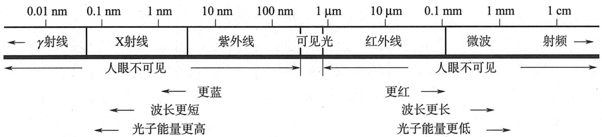
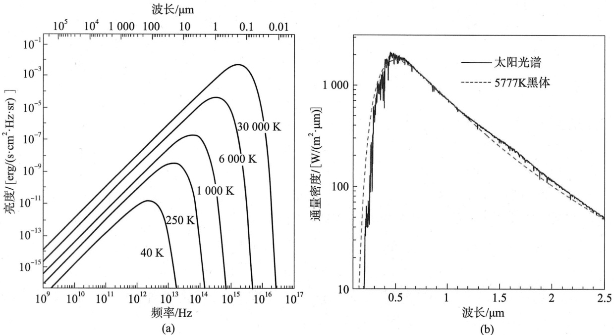
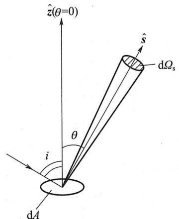
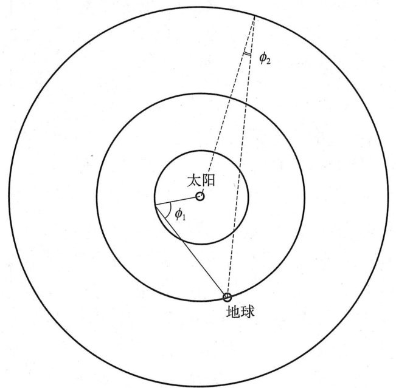
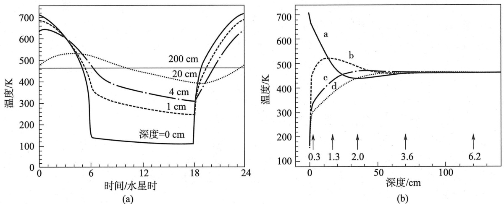
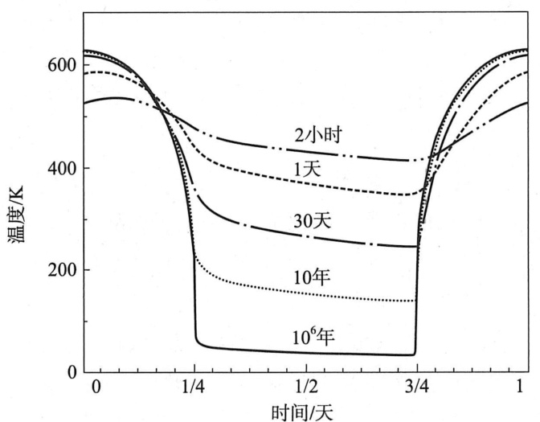
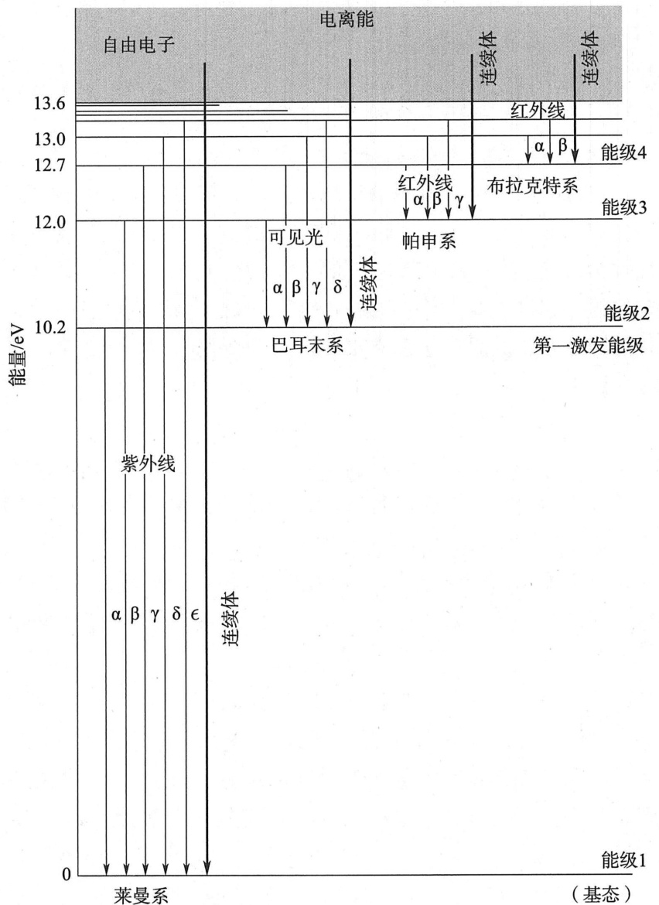
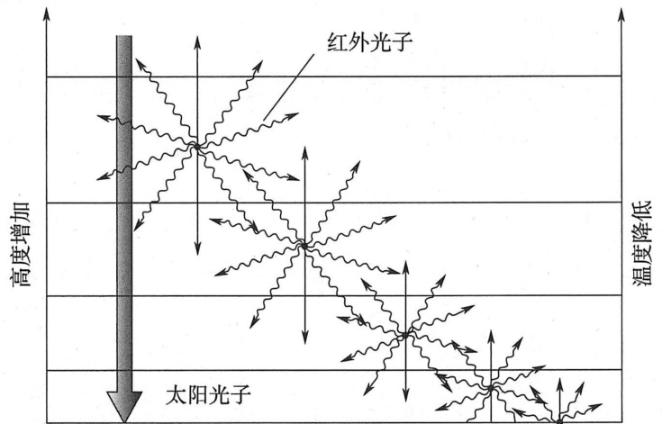
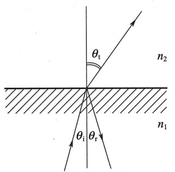

# 第3章太阳加热与能量传输  

热力学三定律：  

1）你无法获胜。   
2）你无法实现收支平衡。   
3）你无法退出。  

匿名  

## 引言

温度是行星物质最为基本的属性之一，在日常生活中屡见不鲜，比如季节、烹饪等。温度在化学和热力学最基本的概念中也很常见，例如， $\mathrm{H}_{2}\mathrm{O}$ 在 $273\!\sim\!373\,\mathrm{~K~}$ （标准大气压下）为液体，温度更高时为气体，冷却之后则为固体；硅酸盐大体上在更高的温度范围内具有类似的状态变化，甲烷在更低的温度下凝结和冻结。大多数物质加热后会膨胀，气体体积膨胀得最多；液态汞的热膨胀系数使其在17世纪至20世纪成为大多数温度计的“有效成分”。

由特定原子混合组成的平衡态分子成分一般取决于温度（以及压强），混合物达到化学平衡所需要的时间一般随着温度的升高而快速缩短。温度和气压的梯度引起了大气层的风（以及地球上的洋流）和对流活动，从而在行星大气及行星内部使流体物质混合。地球的固态地壳被地慢中的对流所拖曳，因此导致了大陆漂移。温度甚至可以影响天体的运行轨迹和旋转状态，如雅可夫斯基和YORP效应。  

温度 $T$ 是衡量分子、原子和离子的随机运动能量的指标。对于理想气体，能量 $E$ 可以表示为  

$$
E={\frac{3}{2}}N k T
$$  
式中， $N$ 为粒子数量， $k$ 为玻尔兹曼常数。天体（给定区域内）的温度由一系列混合过程所确定。大多数行星本体的主要能量来源为太阳辐射，主要的损失机制为向空间的再辐射。本章将总结太阳加热和能量传输的机制。在接下来的章节将基于此讨论行星的大气、表面及其内部。  

## 能量平衡和温度  

行星本体主要通过吸收来自太阳的辐射而被加热，同时通过向宇宙空间辐射而损失能量。对于天体表面上的某个点，它仅在白天能被太阳照亮，但白天和夜晚却都在发生辐射。单位面积上的入射能量取决于与太阳的距离和当地的太阳高度角。因此，大部分的区域在日出之前保持最冷的状态，在当地中午稍后一段时间则处于最热的状态，并且在自转倾角 $\psi<54^{\circ}$ （或 $\psi{>}126^{\circ}$ ）时，极区比赤道地区要冷。  

长期以来，大部分行星的本体向宇宙空间辐射的总能量与其从太阳吸收的总能量几乎相同；否则，行星将被加热或者冷却（木星、土星和海王星等巨行星却不遵循这个规律，这些天体辐射出的能量比吸收的能量要大得多，这是由于其内部正在冷却或正在向中心压缩）。尽管长期的全球均衡成为一个常态，但是空间和时间的波动却很大。能量的存储从白天到黑夜，从近日点到远日点，从夏天到冬天，还能够从星球上的一个区域传输到另一个区域。本章首先在3.1.1节中讨论基本定律，然后在3.1.2节中讨论影响全球能量平衡的因素。  

### 热辐射  

电磁辐射包括多种波长的光子，如图3－1所示。电磁波在真空中传播时，频率 $\nu$ 与波长入相关  
$$
\lambda\nu=c
$$
式中， $c$ 为真空中的光速，为 $2.\ 998\!\times\!10^{10}\,\mathrm{cm/s}$ 

  
图3-1电磁频谱（改编自Hartmann1989)  

#### 普朗克辐射定律
大部分物体能发出频谱连续的电磁波辐射。这种热辐射能够由“黑体”辐射理论近似等效。黑体定义为一种能够吸收落于其上的所有辐射（包括所有的频率和入射角度等），而不对辐射进行反射或散射的物体。在相同的频率下，**物体辐射发射的能力与其辐射吸收的能力相同**。**黑体辐射由普朗克辐射定律（Planck'sLaw）描述**  
$$
B_{\nu}(T)\!=\!\frac{2h\nu^{3}}{c^{2}}\,\frac{1}{\mathrm{e}^{h\nu/k T}-1}
\tag{1}
$$
式子中$B_{v}\,(T)$ 为比强度或亮度$[\mathrm{erg/(cm}^2\cdot\mathrm{s}\cdot\mathrm{Hz}\cdot\mathrm{sr)}]$ , $h$ 为普朗克常数。

图2(a)给出温度范围从 $40\!\sim\!30\,\,000\,\,\mathrm{K}$ 不同黑体的亮度作为频率的函数曲线。注意对于像太阳的天体，表面温度为 $5\,\,777\,\mathrm{~K~}$ ，亮度曲线的峰值在可见光波段［图2(b)]，而行星（约$40\!\sim\!700\!\,\mathrm{~K~}$ ）的亮度曲线峰值在红外波段。太阳系大多数天体在谱段峰值附近的亮度均可由黑体曲线很好地近似。  

  
图2（a)从 $40\,\mathrm{~K~}$ 至 30 000K不同的温度下的黑体辐射曲线 $B_{v}\,(\,T)$ ， $6~000~\mathrm{K}$ 的曲线代表太阳光谱。（b）波长范围为 $0.\,1\!\sim\!2.\,5~\,\mu\mathrm{m}$ 的太阳光谱，叠加了一条5777K的黑体光谱。（太阳数据来自Colina et al. 1996)。  

普朗克辐射定律的两个极限推导如下：  
1）瑞利-金斯定律（Rayleigh-Jeans law)：当 $h\nu\ll k T$ 时（例如行星本体的典型温度和射电波长)  
$$
\begin{align}
& B_{\nu}\left(T\right)\!
\approx\!\frac{2h\nu^{3}}{c^{2}}\,\frac{1}{\frac{h\nu}{k T}}
\approx{\frac{2\nu^{2}}{c^{2}}}k T \tag{2}\\
& 因为 \; (\mathrm{e}^{h\nu/k T}-1\approx\frac{h\nu}{k T})
\end{align}
$$

2）维恩定律（Wienlaw）：当 $h\nu\gg k T$ 时  
$$
B_{\nu}\left(T\right)\approx{\frac{2h\nu^{3}}{c^{2}}}\mathrm{e}^{-h\nu/k T}
\tag{3}
$$
式子(2)和式子(3)更容易应用于实际场景

以上都是频率形式下的普朗克辐射定律，那么如何转换成波长形式下的普朗克辐射定律？要注意的是这里并不能直接将$c=\lambda \nu$的关系式代入式子中，因为我们需要保证黑体辐射整体能量不变，即：
$$
\int B_{\nu} \cdot d\nu = \int B_{\lambda} \cdot d\lambda
$$
因此
$$
\begin{align}
B_{\lambda}(T) &= B_{\nu}\cdot \mid \frac{d\nu}{d\lambda} \mid \\
& = \frac{2hc^{2}}{\lambda^{5}} \frac{1}{e^{hc/k\lambda T} -1}
\end{align}
$$

#### 维恩位移定律
将式子(1)导数取为0，可得到在亮度 $B_{\upsilon}\left(T\right)$ 出现峰值的频率 $\nu_{\text{max}}$ ,从而得到维恩位移定律： 
$$
\begin{align}
\frac{\partial B_{\nu}}{\partial \nu} 
& = \frac{2 h}{c^{2}}\cdot 3\nu^{2}\cdot\frac{1}{\mathrm{e}^{h\nu/kT}-1}+\frac{2h\nu^{3}}{c^{2}}\cdot\left(-\frac{1}{(\mathrm{e}^{h\nu/kT}-1)^{2}}\cdot\frac{h}{kT}\mathrm{e}^{h\nu/kT}\right) \\
& = \frac{6h\nu^2}{c^2}\cdot\frac{1}{\mathrm{e}^{h\nu/kT}-1}-\frac{2h^2\nu^3}{c^2kT}\cdot\frac{\mathrm{e}^{h\nu/kT}}{(\mathrm{e}^{h\nu/kT}-1)^2} \\
& = 0 \\
\end{align}
$$

化简得:
$$
3 = \frac{h \nu^{2}}{kT} \cdot \frac{\mathrm{e}^{h\nu/kT}}{\mathrm{e}^{h\nu/kT}-1} 
$$
但是这是一个超越方程，不能直接解出来，但是可以近似得：
$$
\nu_{\textrm{max}}\,{=}\,5.\,88\times10^{10}\,T \quad  单位为\mathrm{Hz}
$$
将维恩位移定律得频率形式转换成波长形式
$$
B_{\lambda}=\overline{{B}}_{\nu}\left|\frac{\mathrm{d}\nu}{\mathrm{d}\lambda}\right|
$$令 $\partial B_{\lambda}/\partial\lambda=0$ ，黑体频谱峰值的波长为  
$$
\lambda_{\mathrm{\max}}=\frac{0.\ 29}{T}
$$
$\lambda_{\mathrm{\max}}$ 的单位为cm。注意： $\lambda_{\textrm{max}}\!=\!0.\;57c/\nu_{\textrm{max}}$ ，由于实际上 $\boldsymbol{B}_{\lambda}\ne\boldsymbol{B}_{\nu}$ ，以波长表达的测量亮度峰值较以频率表达的亮度峰值更靠向蓝色。  

#### 能流密度
天体辐射的通量密度 $\mathcal{F}_{\nu}$  $\left[erg/ (\mathrm{cm}^{2}\cdot\mathrm{s}\cdot\mathrm{Hz}) 或 \mathrm{Jy}\right]$如下  
$$
\mathcal{F}_{\nu}=\Omega_{\mathrm{{s}}}B_{\nu}\left(T\right)
$$
式中， $\Omega_{s}$ 为天体朝向的立体角。在一个具有均匀亮度 $B_{v}$ 的球体表面（例如，位于其中心的黑体辐射点源所引起的），通量密度为  
$$
\mathcal{F}_{\nu}=\pi B_{\nu}\left(T\right)
$$
通量 $\mathcal{F}$ $\left[ erg/ \mathrm{cm}^{2}\cdot\mathrm{s})\right]$ 定义为将全部频率的通量密度进行积分  
$$
\mathcal{F}\equiv\int_{0}^{\infty}\,\mathcal{F},\mathrm{d}\nu=\pi\int_{0}^{\infty}B_{\nu}\left(T\right)\mathrm{d}\nu=\sigma T^{4}
$$
$\sigma$ 为斯特藩-玻尔兹曼常数?（Stefan-Boltzmannconstant）。这种关系称为斯特藩-玻尔兹曼定律。需要注意的是，通量在某些文献中被定义为频率的函数，即通量密度（例如，Chamberlain and Hunten1987， Chandrasekhar 1960)。  

### 温度  

通过测量某个天体一小段辐射（普朗克）曲线，可以确定这个黑体的温度。但这种方式通常不适用，因为大部分天体不是完美的黑体，其所展示出的频谱特性使得温度测量变得复杂。

通常将观测到的通量密度 $\mathcal{F}_{\nu}$ 与亮温 $T_{\mathrm{~b~}}$ 联系起来，亮温 $T_{\mathrm{b}}$ 是在这个特定频率下具有相同亮度的黑体的温度［即用 $T_{\mathrm{b}}$ 代替式(1)中的 $T$] 。相反地，如果可以确定一个天体的所有频率上积分的总通量，则与发射出相同能量或通量 $\mathcal{F}$ 的黑体所对应的温度称为有效温度 $T$  
$$
T_{\mathrm{e}}\equiv\big(\frac{\mathcal{F}}{\sigma}\big)^{1/4}
$$

天体所发射出的大部分辐射的频率范围可以通过维恩位移定律来估计。对于温度为 $150\!\sim\!300\,\mathrm{~K~}$（内太阳系）的天体，通常是中红外波长（$10\!\sim\!20{~\mu\mathrm{m}}$) ，对于外太阳系 $40\!\sim\!50\,\mathrm{~K~}$ 的天体，通常是远红外波长($60\!\sim\!70~\mu\mathrm{m}$)  

#### 反照率和发射率  

当天体被太阳照亮时，它会将一部分能量反射回太空（这使得天体可见），同时剩余的能量被吸收。原则上，可以确定在每个频率上有多少人射辐射被反射到太空；入射能量与反射、散射能量之和的比率称为单色反照率 $A_{\nu}$ （monochromatic albedo）。通过频率积分，天体反射或散射的总辐射与来自太阳的总人射光之比称为球面反照率 $A_{\textrm{b}}$ (Bondalbedo）。天体吸收的能量或通量决定了其温度，在3.1.2.2节将对其进行讨论。关于反照率，重要的是要考虑单位表面单元如何散射光。太阳光从行星上被散射出去，被望远镜所接收。四个相关的角： $i$ 为人射光与行星表面法线的夹角； $\theta$ 为望远镜接收到的反射光线（即沿视线的光线）与表面法线的夹角（图3-3）； $\phi$ 为从天体上看的相位角或反射角（图3-4)；散射角 $\phi_{\mathrm{\,sc}}$ ，定义为光子在散射时的方向变化。散射角和相位角相互关联  
$$
\phi\equiv180^{\circ}-\phi_{\mathrm{\,sc}}
$$ 
相位积分 $q_{\mathrm{ph}}$ 包含散射角的相位相关性  
$$
q_{\mathrm{\,ph}}\equiv2\int_{\mathrm{~0~}}^{\pi}\frac{\mathcal{F}(\phi\,)}{\mathcal{F}(\phi=0^{\circ})}\mathrm{sin}\phi\,\mathrm{d}\phi
$$
对于日心距小于1AU的行星（水星、金星）和月球，可以从地球上对相位积分进行测量，因为反射角 $\phi$ 在 $0^{\circ}$ 到 $180^{\circ}$ 之间变化。从地球上观测到的外行星相位角接近于 $0^{\circ}$ 。利用观测到的从天体中心到边缘的变化数据可以在地球上恢复有关相位积分的附加信息，但只有借助于探测器数据才能确定完整的相位积分。  

  
图3-3面元dA的几何示意图：是面法线， $\hat{\mathbf{s}}$ 是沿视线光线， $\theta$ 是光线与面法线的夹角  

定义球面反照率  
$$
A_{\textrm{b}}\!=\!A_{\textrm{0}}q_{\textrm{p h}}
$$
$A_{0}$ 表示几何反照率或正面反射率  

  

图4被太阳照射的天体对光的散射，以及地球接收到的辐射。对于纯后向散射辐射，相位角 $\phi\!=\!0^{\circ}$ 而对于纯前向散射光，相位角 $\phi\!=\!180^{\circ}$ 。散射角 $\phi_{\mathrm{{sc}}}=180^{\circ}-\phi$ 。有两颗行星：一颗在地球轨道内，相位角为 $\phi_{1}$ ；另一颗在地球轨道外，相位角为 $\phi_{2}$  
$$
A_{0}=\frac{r_{\odot\mathrm{AU}}^{2}\,\mathcal{F}(\phi=0^{\circ})}{\mathcal{F}_{\odot}}
$$
式中， $\mathcal{F}(\phi=0^{\circ})$ 是相位角 $\phi\!=\!0^{\circ}$ 时从天体反射的通量。日心距 $r_{\odot\mathrm{\AU}}$ 用AU表示，太阳常数$\mathcal{F}_{\odot}$ 定义为 $r_{\odot\mathrm{\,AU}}\,{=}1$ 时的太阳通量  

$$
\mathcal{F}_{\odot}=\frac{\mathcal{L}_{\odot}}{4\pi r_{\odot}^{2}}\,{=}1.\,37\times10^{6}\,{\mathrm{erg}}/({\mathrm{cm}}^{2}\,\cdot\,{\mathrm{s}})
$$
式中， $r_{\odot}$ 为日心距（ $\;\;\mathbf{cm}\;,$ ， $\mathcal{L}_{\odot}$ 为太阳光度。 $\mathcal{F}\odot/r_{\odot\mathrm{\,AU}}^{2}$ 等于以 AU表示的日心距 $r_{\odot\mathrm{\AU}}$ 处的人射太阳通量。  

几何反照率可以被认为是天体反射的辐射量与平坦的朗伯?表面（Lambertiansurface）反射的辐射量之比，而平坦的朗伯表面是对全部波长漫反射的完美反射体。通常，从行星观测中确定一个称为 $I/\mathcal{F}$ 的量，其中 $I$ 是频率为 $\nu$ 的反射强度， $\pi\,{\mathcal{F}}$ 是频率为 $\nu$ 时的人射太阳通量密度。根据这个定义，当在垂直人射下观察时，平坦朗伯表面的 $I/\mathcal{F}=$ 1，因此当在相位角 $\phi\!=\!0^{\circ}$ 时观察， $I/\mathcal{F}$ 等于频率 $\nu$ 下的几何反照率。  

如基尔霍夫?定律（Kirchhoff's law）所述，在相同的观察条件下，光滑的非散射球体在频率 $\nu$ 处的反射率 $A_{\ast}$ 和发射率 $\epsilon_{\nu}$ 是互补的  

$$
1-A_{\nu}=\epsilon_{\nu}
$$  

如果存在散射，当在 $4\pi$ 立体弧度上取平均时，反射率和发射率之和恒等于1（能量守恒），但从特定角度观察时却不一定。  

#### 平衡温度  

如果人射的太阳辐射 (太阳常数) ${\mathcal{F}}_{\mathrm{in}}$ 和向外再辐射的 $\mathcal{F}_{\mathrm{out}}$ 平均而言是平衡的，那么可以计算出天体的温度。这个温度称为平衡温度。如果天体的温度完全由人射的太阳光通量决定，那么平衡温度等于有效温度。两个数值之间的任何差异都包含了有关该天体的有价值的信息。例如，木星、土星和海王星的有效温度超过其平衡温度，这意味着这些天体拥有内部热源（4.2节和6.1.5节）。金星的表面温度远高于该行星的平衡温度，这是该行星大气中剧烈的温室效应的结果（4.2节）。金星的有效温度由该行星寒冷的高层大气发出的辐射所主导。金星的有效温度与平衡温度相等，意味着金星的内部热源可以忽略不计。接下来用近似方程，讨论半径为 $R$ 的快速旋转球形天体的太阳常数和再辐射的平均效应。本节末尾将提供更精确的方程，用于更详细的建模。  

（球形）天体的日照半球接收到的来自太阳的辐射  

$$
\mathcal{P}_{\mathrm{in}}=\left(1-A_{\mathrm{~b~}}\right)\frac{\mathcal{L}_{\odot}}{4\pi r_{\odot}^{2}}\pi R^{2}
$$  

$\pi R^{2}$ 表示拦截太阳光子的投影表面积。快速旋转的行星从其整个表面（即 $4\pi R^{2}$ 区域)进行能量再辐射  

$$
\mathcal{P}_{\mathrm{out}}=4\pi R^{2}\ \epsilon\,\sigma T^{4}
$$  

注意，人射的太阳辐射主要为光学波长（图3－2)，而行星的热辐射则主要为红外波长。发射率 $\epsilon_{\nu}$ 在红外波长处通常接近0.9，但在射电波长处却和1差得很远。根据太阳辐射和再辐射之间的平衡， $\mathcal{P}_{\mathrm{in}}=\mathcal{P}_{\mathrm{out}}$ ，可以计算出平衡温度 $T_{\mathrm{eq}}$  

$$
T_{\mathrm{eq}}=\left[\frac{\mathcal{F}_{\odot}}{r_{\odot\,\mathrm{AU}}^{2}}\,\frac{(1-A_{\,\mathrm{b}}\,)}{4\,\epsilon\,\sigma}\right]^{1/4}
$$  

尽管这个简单的推导有许多缺点，但式（3－21）中的行星盘平均平衡温度给出了行星表面之下温度的有用信息。如果e接近于1，则平衡温度与次表层某一深度的实际（物理）温度相当。此处一般在地表以下 $1\,\textrm{m}$ 或更深，位于昼夜和季节温度变化剧烈的地层之下。这些层可以通过射频探测，在这些长波波段观测到的亮温可以直接与平衡温度进行比较。在式（3－21）的推导中，忽略了纬度和经度对太阳辐射分布的影响。这些影响的大小取决于行星的自转速度、倾角和轨道。纬度和经度的影响很大，例如，在那些没有大气且自转速度很慢，具有很小的轴向倾角，和/或绕太阳运行的轨道偏心率非常大的行星上。  

在平衡温度的另一个极限中，可以思考一个缓慢自转天体的日下点。在这种情况下，式（3-19）中的表面积 $\pi R^{2}$ 和式（3-20）中的 $4\pi R^{2}$ 都应替换为一个单位面积dA。结果表明，慢自转天体的日下点平衡温度是快自转天体的圆盘平均平衡温度的 $\sqrt{2}$ 倍。用这种方法计算的日下点温度与实测的无大气天体的日下点表面温度具有较好的符合度。  

对于更详细的建模，应考虑行星表面位置 $(\alpha\,,\,\,\delta)$ 处每单位表面积dA人射的太阳通量  

$$
\frac{\mathcal{F}_{\mathrm{in}}}{\mathrm{d}A}\!=\!\!\int_{0}^{\infty}(-A_{\nu})\,\frac{(\mathcal{F}_{\odot}\,)_{\nu}}{4\pi r_{\odot\mathrm{AU}}^{2}}\times\cos\left[\alpha_{\odot}\left(t\right)-\alpha\,\right]\cos\left[\delta\odot\left(t\right)-\delta\,\right]\mathrm{d}\nu
$$  

式中， $(\alpha_{\odot}\,,\,\,\delta_{\odot})$ 是太阳的坐标， $A$ 是频率 $\nu$ 处的反射率。表面单元 $\mathrm{d}A$ 根据斯特藩-玻尔兹曼定律发出辐射  

$$
\mathcal{F}_{\mathrm{out}}=\epsilon\,\sigma\,T^{4}\,\mathrm{d}A
$$  

发射率 $\epsilon_{\nu}$ 取决于波长；对于与所考虑的波长相比体积较大的天体，发射率通常从十分之几到1不等。对于远小于波长 $(R\lesssim0.\,1\lambda$ ）的天体，则无法有效辐射。  

## 能量传输  

天体的温度结构由能量传输效率决定。能量传输有三种主要机制：传导、辐射和质量运动。通常，这三种机制中有一种主导并决定了任何给定区域的热分布。固体中的能量传输通常以传导为主，而辐射通常在空间和稀薄气体中占主导地位。质量运动在流体和稠密气体中非常重要，可以通过一种称为平流的过程来传递能量和其他特性。行星最重要的平流过程是对流，是由浮力而产生的垂直运动。在大气科学中，平流一词通常（主要）用于水平传输。  

所有这三种能量传输机制在日常生活中均有经验，例如，在炉子上烧水时，整个锅包括把手（特别是金属）通过传导被加热，而锅里的水主要是通过上下运动的“对流”加热。这些运动以气泡的形式可见，气泡因为比周围的水轻而上升。热量从太阳传输到行星、卫星等，要通过辐射。尽管在这些例子中，占主导地位的传输机制是显而易见的，但这并不总是很容易确定；在行星内部的某些部分，能量传输主要由对流运动所主导，而在其他部分，传导是最为有效的。在一颗行星的大气层中，这三种机制通常都会遇到，尽管在一定的高度范围内，某一种特定的机制通常占主导地位。几乎所有进出行星本体的能量都是通过辐射传递的（木卫一是一个例外，木卫一通过潮汐耗散从其轨道接收到大量能量，见2.6.3节和5.5.5.1节）。本节将讨论这三种主要的能量传输机制，并在假设特定的热传输机制占主导地位的情况下，推导出表面或大气中的温度廓线方程。  

### 传导  

传导，即主要通过分子间的碰撞来传输能量的过程，在固体中相当重要，在稀薄的大气上部（热层上部）也很重要。在后一种情况下，平均自由程很长，原子交换位置的速度很快，因此热导率很大。这种高热导率往往会平衡这部分大气的温度。  

太阳光在白天加热行星的表面，热量主要通过传导从表面向下传输。热流的流动速度，即热通量 $Q$ [erg/ $\mathrm{{\small~\left(cm^{2}~\cdot~s\right)~}}]$ ，由温度梯度 $\nabla T$ 和热导率 $K_{\mathrm{~T~}}$ 决定  

$$
{\boldsymbol{Q}}=-K_{\textrm{T}}{\boldsymbol{\nabla}}{\boldsymbol{T}}
$$  

热导率是衡量材料导热的物理能力。热容是将物质的温度提高 $1\,\mathrm{~K~}$ 所需的热量。将分  

子或摩尔热容 $C_{\mathrm{P}}$ 定义为在不改变压强 $(C_{\mathrm{P}}$ ： $\mathrm{d}P=0)$ ）或体积 $(C_{\vee}$ $\mathrm{d}V\!=\!0.$ ）的情况下，将$1~\mathrm{mol}$ 物质的温度提高1K所需的热量 $\boldsymbol{Q}$ 。比热 $c_{\mathrm{~P~}}$ （或 $c_{\textup{v}}$ ）是在不改变压强（或体积）的情况下，将 $_{\mathrm{~1~g~}}$ 物质的温度升高1K所需的能量。  

$$
m_{\textrm{g m}}c_{\textrm{P}}\equiv C_{\textrm{P}}\equiv\left({\frac{\mathrm{d}Q}{\mathrm{d}T}}\right)_{\textrm{P}}
$$  

$$
m_{\textrm{g m}}c_{\textrm{V}}\equiv C_{\mathrm{v}}\equiv\left({\frac{\mathrm{d}Q}{\mathrm{d}T}}\right)_{\mathrm{v}}
$$  

式中， $m_{\mathrm{\,gm}}$ 是克摩尔。次表层获得热量的速率由下式给出  

$$
\rho c_{\textrm{P}}{\frac{\partial T}{\partial t}}\,{=}\,{-}{\frac{\partial Q}{\partial z}}
$$  

式中， $\rho$ 为物质的密度。式（3－24）和式（3－27）共同推导出热扩散方程  

$$
k_{\textrm{d}}{\frac{\partial^{2}\,T}{\partial t^{\,2}}}\!=\!{\frac{\partial T}{\partial t}}
$$  

和热扩散系数  

$$
k_{\textrm{d}}\!=\!\frac{K_{\textrm{T}}}{\rho c_{\textrm{P}}}
$$  

6.1.5.2节的式（6-37）使用了式 $(3-27)\ \sim\ (3-29)$ ，来估算天体中温度梯度随时间 $t$ 发生显著变化的一段深度。  

昼夜温度变化的幅度和相位，以及地壳中关于深度的温度梯度，很大程度上取决于热惯量  

$$
\gamma_{\mathfrak{r}}\equiv\sqrt{K_{\mathrm{T}}\rho c_{\mathfrak{P}}}
$$  

热惯量可以衡量表面储存能量的能力。物质的热趋肤深度为  

$$
L_{\mathrm{T}}\equiv\sqrt{\frac{2K_{\mathrm{T}}}{\omega_{\mathrm{\scriptsize~rot}}\rho c_{\mathrm{\tiny~P}}}}
$$  

式中， $\omega_{\textrm{r o t}}$ 为天体自转角速度。昼夜温度变化幅度最大值发生在地表，次表层昼夜温度变化幅度呈指数衰减。热趋肤深度为变化幅度衰减到地表 $1/e$ 所对应的深度。此外，由于热量向下传递需要时间，次表层的日加热模式存在相位滞后。地表的温度在中午或之后不久达到峰值，而次表层则在下午晚些时候达到峰值温度。在夜间，表面冷却，变得比次表层更冷。然后热量从底层向上传输。然而，由于传导率是温度的函数[式 $(6\mathrm{~-~}33)\,\sim\,(6\mathrm{~-~}$ 36）]，因此表面在夜间起到了隔热材料的作用，防止次表层过于迅速地冷却。图3－5说明了这种影响，它显示了水星上温度随深度和当地时间的变化。图3－6显示了在围绕太阳日心距为0.4AU的圆形轨道上，一个假想的大型岩石天体的表面温度随当地时间的变化。图中给出了从2小时到 $10^{6}$ 年不同自转周期下的温度曲线。这张图清楚地表明，峰值温度主要由日心距决定，而夜间半球的温度取决于行星的自转速率（和热惯量）。注意$P_{\mathrm{rot}}\,{=}\,2~\mathrm{h}$ 时，峰值温度从当地中午开始的时间延迟。这种延迟是由快速的自转速率和相对  

较高的热惯量共同作用的结果。  

  
图3－5（a）水星的赤道温度结构是当地正午后不同深度的日下点经度（即“热”经度）的函数；（b)同一地区一天中四个不同时间的垂直温度剖面：a）中午；b）黄昏；c）午夜；d）黎明。在不同的射电波长下探测不同的深度，如图底部的箭头所示（波长单位为 $\mathrm{cm}$ )。(Mitchell1993)  

  
图3-6以日心距0.4AU、倾角 $0^{\circ}$ 的圆形轨道绕太阳运行的固态连贯岩石天体的表面温度。曲线显示的是自转周期为2小时、1天、30天、10年和 $10^{6}$ 年的天体。假设以下参数进行计算： $A_{\mathrm{b}}\,=\,0.\,1$ $\epsilon_{\mathrm{ir}}=$ 0.9, $\rho=2.8~\mathrm{g/cm^{3}}$ ， $\gamma_{\mathrm{r}}=36.\;9~\mathrm{mcal}/(\mathrm{cm}^{2}\bullet\mathrm{K}\bullet\mathrm{s}^{1/2})$ ， $\epsilon_{\mathrm{r}}=6.5$ ，且 $\tan\!\Delta=0.\,02$ 。 $\epsilon_{\mathrm{r}}$ 和tan $\Delta$ 在3.4节定义。[图片来源：大卫·L.米切尔（DavidL.Mitchell）］  

注意，热惯量（3－30）取决于 $K_{\mathrm{~T~}}c_{\mathrm{~P~}}$ 的乘积，热趋肤深度（3－31）取决于 $K_{\mathrm{~T~}}/c_{\mathrm{~P~}}$ 的比率以及天体的旋转角速度 $\omega_{\mathrm{\rot}}$ 。火星和月球上的典型热趋肤深度约为 $4~\mathrm{cm}$ ，水星上约为$15~\mathrm{{cm}}$ 。当热导率较低时，温度波动的振幅较大，但不会深人穿透地壳。如果热导率较高，则表面附近的温度变化较小，但会穿透次表层到更深处。尽管次表层的昼夜变化幅度可能很小，但对于具有明显自转轴倾角的行星，如地球和火星，季节性影响仍然很大。在水星日间加热具有重要作用的深度以下，温度随着经度具有一个有趣的变化。由于水星自转和公转轨道之间的 $3:2$ 共振，以及水星较大的轨道偏心率，日均太阳常数随经度变化显著（同样也随纬度变化）。沿水星赤道靠近经度 $\lambda={0}^{\circ}$ 和 $180^{\circ}$ 的区域（当水星位于近日点时的日下点经度）接收到的阳光平均约为经度 ${90}^{\circ}$ 和 ${270}^{\circ}$ 区域的2.5倍。夜间地表温度约为$100\,\mathrm{~K~}$ ，与经度无关，但水星赤道附近的峰值（中午）地表温度在 $\lambda={0}^{\circ}$ 和 $180^{\circ}$ 时为$700\,\mathrm{~K~}$ ，渐变至 $\lambda\!=\!90^{\circ}$ 和 $270^{\circ}$ 时的 $570\,\mathrm{~K~}$ 。这种不均匀的加热模式产生了次表层温度的纵向变化，在温度的昼夜变化可以忽略的深度下，在经度 $0^{\circ}$ 和 $180^{\circ}$ ( $T$ 大约 $470\,\mathrm{~K~}$ ）处的温度要高于 ${90}^{\circ}$ 和 $270^{\circ}$ 处（ $T$ 大约 $350\,\mathrm{~K~})$ 。这种效应能够在射电波长约 $3\,\mathrm{\cm}$ 处观察得最为充分，此处日间加热循环的波动最小（图5－50）。  

### 对流  

在稠密的大气、行星熔融的内部和原行星盘中，大尺度的流体运动，通常是最有效的热量传输方式，特别是对流。对流是由于温差在流体中造成的密度梯度而引起的运动。考虑一颗行星大气层中的一个小气团，它比周围环境稍微温暖一点。为了重新建立压力平衡，气团开始膨胀，因此其密度降低到低于周围环境的密度。这会导致气团上升。由于周围的气压随着高度的增加而减小，上升的气团膨胀并冷却。如果环境温度随高度迅速下降，这一气团的温度将保持高于周围环境，因此继续上升，向上输送热量。这个过程就是一个对流的例子。为了发生对流，温度必须随着气压的降低（在行星环境中向外部）而以足够快的速度降低，以使气团保持浮力。  

能量传输以对流为主的大气温度结构遵循绝热递减率［式（3－34）］。地球对流层（也就是我们居住的大气层中大部分云层形成的区域）的温度梯度，通常接近一条绝热线(3.2.2.3节）。由于这个递减率的推导是从流体静力平衡方程和热力学第一定律出发的，所以在下两小节中将讨论这两个概念。大气结构，即绝热递减率，随后在3.2.2.3节中推导。  

#### 流体静力平衡  

行星大气的和行星内部的温度、压强和密度之间的关系是由重力和大气压力之间的平衡决定的，这种平衡称为流体静力平衡。考虑厚度为 $\Delta z$ 且密度为 $\rho$ 的“板”状物质。 $\mathcal{z}$ 坐标定义向外为正（压强降低）。由于重量作用，这块板在其下方的板上产生力。每单位面积上，这个力形成一个压强。因此，穿过板的压强变化 $\Delta P$ ，就是高度为 $\Delta z$ 和密度 $\rho$ 的圆柱体的重量  

$$
\Delta P=-\,g_{\mathfrak{p}}\rho\,\Delta z
$$  

总的来说，密度和重力加速度 $g_{\textsf{p}}$ 都随高度变化，流体静力平衡方程的微分形式为  

$$
\frac{\mathrm{d}P}{\mathrm{d}z}\!=\!-\,g_{\mathfrak{p}}(z)\rho(z)
$$  

行星大气中温度、压强和密度（状态方程）之间的关系通常用理想气体定律（也可称为完美气体定律）来近似  

$$
P=N k T={\frac{\rho R_{\mathrm{\gas}}\,T}{\mu_{\mathrm{\ga}}}}={\frac{\rho k\,T}{\mu_{\mathrm{\ga}}m_{\mathrm{\gmu}}}}
$$  

式中， $N$ 是粒子数密度（ $\mathrm{cm}^{-3}$ )， $R_{\mathrm{\it{gas}}}$ 是理想气体常数 $(R_{\mathrm{gas}}=N_{\mathrm{A}}k$ ， $N_{\mathrm{A}}$ 为阿伏加德罗数）， $\mu$ a是平均分子质量（以原子质量单位表示）， $m_{\mathrm{{amu}}}\approx1.~67\times10^{-24}\,\mathrm{{g}}$ 是一个原子质量单位的质量，略小于一个氢原子的质量。  

#### 热力学第一定律  

热力学第一定律是能量守恒的表达式  

$$
\mathrm{d}Q=\mathrm{d}U+P\,\mathrm{d}V
$$  

式中， $\mathrm{d}Q$ 为系统从周围环境吸收的热量， $\mathrm{d}U$ 为内能的变化（势能加动能之和）， $P\,\mathrm{d}V$ 是系统对环境所做的功，如系统的膨胀； $P$ 是压强， $\mathrm{d}V$ 是体积 $V$ 的变化。热摩尔热容 $C_{\mathrm{P}}$ 和$C_{\mathrm{v}}$ 在上式（3－25)、（3-26）中定义，并变为  

$$
C_{\mathrm{v}}=\!\left({\frac{\partial U}{\partial T}}\right)_{\mathrm{v}}
$$  

$$
C_{\mathrm{P}}=\left({\frac{\partial U}{\partial T}}\right)_{\mathrm{P}}+P\,\left({\frac{\partial V}{\partial T}}\right)_{\mathrm{P}}
$$  

下面假设 $V$ 是比体积，包含 $_{\mathrm{~1~g~}}$ 分子。微分理想气体定律给出  

$$
\mathrm{d}V\!=\!\frac{k}{\mu_{\mathrm{\scriptsize~a}}m_{\mathrm{\scriptsize~amu}}P}\mathrm{d}T-\frac{k T}{\mu_{\mathrm{\scriptsize~a}}m_{\mathrm{\scriptsize~amu}}P^{2}}\mathrm{d}P
$$  

在理想气体中，两个热容［erg／（ $\bmod{\cdot}\mathrm{~K~}$ 」或比热 $\left[\mathbf{erg}/\mathbf{\epsilon}\left(\mathbf{g}\cdot\mathbf{K}\right)\right.$ ］之差由下式给出  

$$
C_{\mathrm{P}}-C_{\mathrm{v}}\,{=}\,R_{\mathrm{\gas}}
$$  

$$
m_{\textrm{g m}}(c_{\textrm{P}}-c_{\textrm{V}})\mathop{=}R_{\textrm{g a s}}
$$  

用 $R_{\mathrm{{gas}}}$ 表示理想气体常数， $m_{\mathrm{\,gm}}$ 表示克摩尔的质量，见式（3－25）、（3－26）。如果在理想气体中，一个空气团绝热运动，即空气团和周围环境之间没有热量交换（ $.\mathrm{d}Q\!=\!0.$ )，则热力学第一定律要求（习题3.15）  

$$
c_{\,\mathrm{v}}\,\mathrm{d}T=-\,P\,\mathrm{d}V
$$  

$$
c_{\textup{P}}\mathrm{d}T={\frac{1}{\rho}}\mathrm{d}P
$$  

对式（3－42）积分得出干燥绝热气体的下列关系式  

$$
P\rho^{-\gamma}=\#^{\gamma}\#\mathbb{X}
$$  

这里定义为比热比（ratio of the specific heat)， $\gamma\equiv c_{\mathrm{{P}}}/c_{\mathrm{{v}}}\,{=}\,C_{\mathrm{{P}}}/C_{\mathrm{{v}}}$ 。对于单原子、双原子和多原子气体，的典型值分别为5/3、7/5 和 $4/3$  

#### 绝热递减率  

对于对流稍微不稳定的大气，我们可以利用上面的热力学关系和流体静力平衡方程（3－32）、（3－33）来获得其温度结构，或干绝热递减率（dryadiabaticlapserate，习题3.16)  

$$
\frac{\mathrm{d}T}{\mathrm{d}z}\,{=}\,-\frac{g_{\mathrm{\scriptsize{\scriptsize{\p}}}}}{c_{\mathrm{\scriptsize{{p}}}}}\,{=}\,-\frac{\gamma\,-1}{\gamma}\,\frac{g_{\mathrm{\scriptsize{\scriptsize{p}}}}\mu_{\mathrm{\scriptsize{\scriptsize{a}}}}m_{\mathrm{\scriptsize{amu}}}}{k}
$$  

地球上的干绝热递减率大约为 $10~\mathrm{K/km}$ 。4.4.1节表明，凝结潜热的作用降低了潮湿大气成云区的绝热梯度。  

当温度梯度或递减率是超绝热（superadiabatic，大于绝热递减率）时，对流在能量传输方面非常有效。因此，在行星大气或流体内部，通过对流进行的能量传输能够有效地为温度随深度增加而升高的速率设置上限。当对流被平均分子质量的梯度或流动阻碍边界（如固体表面）抑制时，才可能存在实质性的超绝热梯度。  

### 辐射  

行星大气中的某些区域，气体的光学深度既不太大也不太小，这些区域中热量传输通常由辐射主导。通常在行星的对流层上部和平流层是这种情况（4.2节）。辐射效率主要取决于所涉及物质的发射和吸收特性。为了建立辐射传输方程，人们需要熟悉原子和分子中的原子结构和能量转换，以及辐射“词汇”，如比强度、通量密度和平均强度。在3.2.3.4节建立辐射传输方程之前，在3.2.3.1节总结了几个基本的定义；在3.2.3.2节～3.2.3.3节介绍了原子和分子结构、能量跃迁以及爱因斯坦系数的基本背景。在3.3节导出了处于辐射平衡的大气的热结构和温室效应；在3.4节总结了固体的辐射传输方程。  

#### 定义  

光子的能量和动量由下式给出  

$$
E=h\nu
$$  

$$
\pmb{p}=\frac{E}{c}\hat{s}
$$  

式中， $h$ 是普朗克常数， $c$ 是光速， $\nu$ 是频率， $\hat{\pmb{s}}$ 是指向传播方向的单位矢量。  

在时间 $\mathrm{d}t$ 和频率范围 $\mathrm{d}\nu$ 内，穿过立体角为 $\mathrm{d}\Omega_{\mathrm{s}}$ 的面元 $\hat{\mathbf{s}}\bullet\mathrm{d}A=\mathrm{d}A\,\mathrm{cos}\theta$ 的能量由下式给出，其中 $\theta$ 是曲面法线 $\hat{z}$ 与传播方向之间的夹角（见图3－3)  

$$
\mathrm{d}E=I_{\mathit{\nu}}\cos\theta\,\mathrm{d}t\,\mathrm{d}A\,\mathrm{d}\Omega_{\mathit{\nu}}\mathrm{d}\nu
$$  

式中， $\boldsymbol{I}_{\nu}$ 为比强度（specific intensity），单位为 é $\mathsf{r g\Delta s^{-1}\Delta c m^{-2}\Delta s r^{-1}\Delta H z^{-1}}$ 。在黑体发射的频率 $\nu$ 下辐射的比强度为  

$$
I_{\nu}=B_{\nu}\,(T)
$$  

用球面角（sr，即 $\mathrm{rad}^{2}$ ）表示的立体角 $\mathrm{d}\Omega_{\mathrm{s}}$ ，其定义是在一个球体上的积分  

$$
\oint\!\mathrm{d}\Omega_{\mathrm{\,s}}=\!\int_{0}^{2\pi}\!\!\int_{0}^{\pi}\!\sin\!\theta\,\mathrm{d}\theta\,\mathrm{d}\phi=4\pi\,\mathrm{~sr~}
$$  

平均强度 $\textit{J}_{\nu}$ ，或者辐射场的零阶矩，等于（利用变换 $\mu_{\theta}\equiv\mathrm{co}s\theta$  

$$
\boldsymbol{J}_{\nu}\equiv\frac{\oint\!\boldsymbol{I}_{\nu}\,\mathrm{d}\boldsymbol{\Omega}_{s}}{\oint\!\mathrm{d}\Omega_{s}}=\frac{1}{2}\int_{-1}^{1}\boldsymbol{I}_{\nu}\,\mathrm{d}\mu_{\theta}
$$  

辐射能量密度 $_{u}$ 是在频率 $\nu$ 下单位体积的辐射能量。因为在真空中，光子以光速传播，所以  

$$
u_{\nu}=\frac{1}{c}\oint I_{\nu}\,\mathrm{d}\Omega_{\mathrm{s}}=\frac{4\pi}{c}J\,,
$$  

通过对所有立体角积分，可以得到 $\hat{z}$ 方向频率 $\nu$ 的净通量密度 $\mathcal{F}_{\nu}$  

$$
\mathcal{F}_{\nu}=\oint I_{\nu}\,\mathrm{d}\Omega_{\sqrt{\nu}}\,\!\oint I_{\nu}\,\mathrm{cos}\theta\,\mathrm{d}\Omega_{\mathrm{s}}
$$  

注意对于各向同性辐射场，净通量密度 $\mathcal{F}_{\nu}=0$ ，因为 $\oint\!\cos\theta\,\mathrm{d}\Omega_{\mathrm{s}}=0$ 。将变量更改为$\mu_{\theta}\equiv\cos\theta$ ，并对 $\phi$ 进行积分，式（3－53）变为  

$$
{\mathcal{F}}_{\nu}=2\pi\int_{-1}^{1}I_{\nu}\mu_{\theta}\,\mathrm{d}\mu_{\theta}
$$  

动量通量，沿着一条射线 $\hat{\bf s}$ 方向的路径，在所有频率上积分，等于 $\mathrm{d}\,\mathcal{F}\,/c$ 。辐射压是动量通量在 $\hat{z}$ 方向上的分量  

$$
\phi_{\mathrm{\,r}}=\frac{\mathcal{F}\,\mathrm{cos}\theta}{c}=\frac{2\pi}{c}\int_{-1}^{1}I_{\ast}\mu_{\theta}\mathrm{\Omega}^{2}\,\mathrm{d}\mu_{\theta}
$$  

在各向同性辐射场中， $I_{\nu}(\mu_{\theta})\equiv I_{\nu}$ ，辐射压等于  

$$
\phi_{\mathrm{r}}=\frac{4\pi}{3c}I_{\nu}
$$  

#### 能量跃迁  

原子或分子对光子的发射和吸收涉及能量状态的变化。每个原子由一个原子核（质子加中子）组成，原子核周围环绕着一团电子云。在半经典玻尔理论中，电子围绕原子核运行，使得离心力与库仑力平衡  

$$
\frac{m_{\textrm{e}}v^{2}}{r}\!=\!\frac{Z q^{2}}{r^{2}}
$$  

式中， $_m$ e和 $_v$ 分别是电子的质量和速度， $^r$ 是电子轨道的半径（假定为圆形）， $Z$ 是原子序数， $q$ 是电荷。电子在轨道上的角动量为  

$$
m_{\mathrm{{e}}}v r=n\hbar
$$  

半径为  

$$
r={\frac{n^{2}\,\hbar^{\,2}}{m_{\,\mathrm{{e}}}Z q^{\,2}}}
$$  

式中， $_n$ 为一个整数，是主量子数（principal quantum number），且 $\hbar\equiv h/2\pi$ 。氢原子$Z=1.$ ）的最低能态半径( $\lambda\!=\!1)$ 称为玻尔?半径（Bohr radius）： $r_{\mathrm{Bohr}}\!=\!\hbar^{2}/m_{e}q^{2}$ 。主量子数  

是径向量子数和角量子数之和： $n\!=\!n_{r}+k$ 。这些量子数定义了电子轨道的半长轴 $\boldsymbol{a}$ 和半短轴 $b$ ： $a/b=n/k$ 。轨道 $n$ 的能量由下式给出  

$$
E_{n}=-{\frac{Z q^{2}}{r}}+{\frac{Z q^{2}}{2r}}\!=\!-{\frac{Z q^{2}}{2r}}\!\approx\!-{\frac{\mathcal{R}Z^{2}}{n^{2}}}
$$  

式中，氢原子的里德伯①常数（Rydberg constant) $\mathcal{R}\equiv\mu_{\mathrm{~r~}}e^{4}/h^{2}$ 。约化质量 $\mu$ ：在式（2-8）中定义，其中对应的 $m_{1}$ 和 $m_{2}$ 分别表示电子和原子核的质量。各种跃迁的频率可使用式（3－46)、（3－47）和（3－60）计算。图3－7给出了氢原子能级的例子。基态和更高能级之间的跃迁称为莱曼?系，其中莱曼 $\alpha$ 是1级和2级之间的跃迁，莱曼 $\beta$ 是1级和3级之间的跃迁，以此类推。巴耳末③系、帕申系和布拉克特系分别表示2级、3级和4级与更高级别之间的跃迁。如果电子没有束缚，原子会被电离。对于基态的氢，光子的能量 $\geq\!13.6\,\mathrm{~eV}$ 或波长小于 $91,\,2\,\mathrm{\nm}$ （莱曼极限，Lyman limit）可能使原子发生光致电离(photoionize，习题3.17）。  

泡利@不相容原理（Pauli's exclusion principle）指出，每个电子轨道由一组唯一的量子数指定，因此能级 $n$ 的子能级总数，即 $n$ 能级的统计权重或简并度，由下式给出  

$$
g_{\scriptscriptstyle\!\;n}=2n^{\,2}
$$  

分子的能级比孤立原子的能级要多，因为原子核相对于彼此的旋转和振动需要能量。这种多样性导致了许多分子线。对于原子和分子结构的完整讨论，读者可以参考Herzberg(1944)。  

能级之间的跃迁可能导致光子的吸收或发射，能量 $\Delta E_{u l}$ 等于 $u$ 和 $l$ 两个能级之间的能量差。但是，跃迁只能在特定能级之间进行：它们遵循特定的选择规则。电子轨道之间的能量差以及与跃迁相关的光子频率随着 $n$ 的增加而减小（图3-7）。尽管在紫外或光学波长下可以观察到涉及基态的电子跃迁（ $.n=1.$ )，但高能级的跃迁（ $\langle n>1\rangle$ 、原子光谱中（超）精细结构以及分子旋转和旋转一振动跃迁都发生在红外或射电波长下，因为能级之间的间隔要小得多。因为每个原子/分子都有自己独特的一组能量跃迁，所以可以通过测量吸收/发射光谱来识别大气或表面中的特定物质。根据海森堡测不准原理，光子能够以与 $\Delta E_{u l}$ 稍有不同的能量被吸收/发射，产生有限宽度的曲线 $\varPhi_{\nu}$ ，在4.3.2节更详细地讨论。  

  
图3-7氢的能级和最低能级之间的一系列跃迁。（改编自PasachoffandKutner1978)  

#### 爱因斯坦系数  

原子/分子气体如何保持其电子激发能级的分布（又称布居）与辐射场的平衡？原子可以吸收光子，使其处于更高的能量状态，如果处于激发状态，它可以自然地发射光子。  

此外，当振子根据其相对于驱动力的相位吸收或发射能量时，辐射场可使处于高能量状态的原子转变为低能量状态，这一过程称为受激发射（stimulatedemission）。  

单位时间发射或吸收光子的概率可用爱因斯坦系数 $A$ 和 $B$ 表示。系数 $\boldsymbol{A}_{u l}$ 是单位时间内从高能级 $_{u}$ 到低能级 $l$ 的自发辐射的概率； $B_{\it l u}J$ ，是单位时间内吸收的概率， $B_{u l}J$ 是单位时间内受激发射的概率。所有概率都以频率表示。由于谱线线形 $\varPhi_{\ast}$ ，的宽度有限，对于上述概率的平均强度 $\textit{J}_{\nu}$ ，应对曲线进行积分： $\int\boldsymbol{J}_{\nu}\boldsymbol{\Phi}_{\nu}\,\mathrm{d}\nu$ 。  

在热力学平衡（thermodynamic equilibrium）状态下，下列公式是有效的。  

1）辐射场服从  

$$
I_{\nu}=J_{\nu}=B_{\nu}\left(T\right)
$$  

2）吸收率和发射率是平衡的  

$$
N_{l}B_{l u}J_{\nu}=N_{u}A_{u l}+N_{u}B_{u l}J_{\nu}
$$  

3）能量态 $_i$ 的原子数密度 $N_{i}$ 由气体的温度决定  

$$
N_{i}\,\propto\,g_{\,i}\,\mathrm{e}^{-E_{i}/k T}
$$  

$\textit{g}_{i}$ 为能级 $_i$ 的统计权重。 $N_{l}/N_{u}$ 的比值由玻尔兹曼方程（Boltzmann's equation）给出  

$$
\frac{N_{l}}{N_{u}}\!=\!\frac{g_{l}}{g_{u}}\mathrm{e}^{\Delta E_{u l}/k T}
$$  

上能级和下能级之间的能量差由式 $\Delta E_{u l}=E_{u}-E_{l}$ 给出。在低温下，大多数原子处于基态，而在更高的温度下，更高的能级被填充。玻尔兹曼定律的更一般形式为  

$$
N_{i}=\frac{N g_{i}}{Z_{\textrm{p}}}\mathrm{e}^{-E_{i}/k T}
$$  

$N$ 是原子总数， $Z_{\mathfrak{p}}$ 是配分函数  

$$
Z_{\mathrm{p}}=\sum_{j}g_{j}\,\mathrm{e}^{-E_{j}/k T}
$$  

普朗克辐射定律式（3－3）可由上述公式和爱因斯坦关系导出  

$$
g_{\iota}B_{\iota\*}=g_{\*}B_{\*u}
$$  

$$
A_{l u}={\frac{2h\nu^{3}}{c^{2}}}B_{u l}
$$  

与式（3-62)、（3-63)、（3-64）和式（3-65)、（3-66)、（3-67）相比，爱因斯坦关系不依赖于温度，因此无论介质是否处于热力学平衡，爱因斯坦关系均为有效。  

质量吸收和发射系数 $\kappa_{\nu}$ 和 $j$ [单位为erg/ $(\mathbf{g}\bullet\textrm{s}\bullet\textrm{s r}\bullet\textrm{H}\mathbf{z})$ ］变成  

$$
\kappa_{\nu}\rho=\frac{\Delta E_{u l}}{4\pi}(N_{l}B_{l u}-N_{u}B_{u l})\,\Phi,
$$  

$$
j_{\nu\rho}=\!\frac{\Delta E_{u l}}{4\pi}N_{u}A_{u l}\Phi_{\nu}
$$  

这里 $\varPhi_{\nu}$ 是谱线线形。注意，在式（3－70）中，与受激发射相加的是负的吸收系数。  

#### 辐射传输方程  

当大气中能量传输的主要机制是光子的吸收和再发射时，温度-压强分布曲线以辐射  

能量传输方程为主。气体云内的吸收和发射强度的变化 $\mathrm{d}I_{\nu}$ 等于发射和吸收辐射之间的光强差，由下式给出  

$$
\mathrm{d}I_{\nu}=j_{\nu\rho}\,\mathrm{d}s-I_{\nu}\alpha_{\nu\rho}\,\mathrm{d}s
$$  

在式（3-72）中， $j_{\;\cdot}$ ，是散射和/或热激发引起的发射系数， $j_{\nu}=j_{\nu}$ (散射） $+\,j_{\,\nu}$ （热激发)； $\alpha$ ，为质量消光系数，吸收（包括受激发射）和散射都有助于消光， $\alpha_{\ast}=\kappa_{\ast}+\sigma_{\ast}$ ，这里 $\kappa$ 以及 $\sigma_{\nu}$ 分别是质量吸收系数和质量散射系数。  

以表示行星表面法线方向， $\hat{\bf s}$ 和 $\hat{z}$ 之间的角度为 $\theta$ （图3-3)，得到 $\mathrm{d}s=\sec\theta\,\mathrm{d}z$ 。利用 $\mu_{\theta}\equiv\mathrm{cos}\theta$ ，式（3-72）变为  

$$
\mu_{\,\theta}\ \frac{\mathrm{d}I_{\,\nu}}{\mathrm{d}\tau_{\nu}}=-\,I_{\,\nu}+S,
$$  

式中，光学深度 $\tau_{\nu}$ 定义为消光系数的积分（沿 $\mathcal{z}$ 方向）  

$$
\tau_{\nu}=\int_{z_{1}}^{z_{2}}\alpha_{\nu}(z)\rho(z)\,\mathrm{d}z
$$  

源函数 $S_{\nu}$ ，定义为  

$$
S_{\nu}=\stackrel{j_{\nu}}{\alpha_{\nu}}
$$  

式（3－73）的形式解为（对于 $\mu_{\theta}\!=\!1;$  

$$
I_{\nu}\left(\tau_{\nu}\right)=I_{\nu}\left(0\right)\,\mathrm{e}^{-\tau_{\nu}}+\int_{0}^{\tau_{\nu}}S_{\nu}\left(\tau_{\phantom{\prime}\nu}^{\prime}\right)\,\mathrm{e}^{-\left(\tau_{\nu}-\tau_{\nu}^{\prime}\right)}\;\mathrm{d}\tau^{\prime}
$$  

式中， $I_{\nu}$ （0）是通过吸收介质传播时衰减的“背景”辐射。在行星大气的辐射传输计算中，观察探测器进人大气层时通常定义光学深度不断增加，即在大气层的顶部 $\tau_{\nu}=0$ 。式（3-76）则变为  

$$
I_{\nu}\left(0\right)=I_{\nu}\left(\tau_{\nu}\right)\,\mathrm{e}^{-\tau_{\nu}}+\int_{0}^{\tau_{\nu}}S_{\nu}\left(\tau_{\nu}^{\prime}\right)\,\mathrm{e}^{-\tau^{\prime}}\mathrm{d}\tau^{\prime}
$$  

对于更一般的情况，光学深度应该被替换为倾斜光学深度，即 $\tau/\mu_{\theta}$ 。如果 $S_{\nu}$ 已知，可以求解式（3－75）得到辐射场。实际情形通常会更复杂，因为 $S$ ，取决于强度 $\boldsymbol{I}_{\nu}$ （例如通过散射）和/或介质温度，介质温度也部分取决于 $\boldsymbol{I}_{\nu}$ 。如果 $S_{\nu}$ 不随光学深度变化，式（3－75）简化为  

$$
I_{\nu}\left(\tau_{\nu}\right)=S_{\nu}+\mathrm{e}^{-\tau_{\nu}}\ [I_{\nu}\left(0\right)-S_{\nu}]
$$  

如果 $\tau_{\nu}\gg1$ ，那么 $I_{\nu}=S_{\nu}$ ，即发射强度完全由源函数决定。如果 $\tau_{\nu}\ll1$ ，那么 $I_{\nu}\to$ $I_{\nu}\left(0\right)$ ，即辐射强度由人射辐射定义。  

本小节的其余部分将通过四个“经典”案例研究辐射传输方程，更明确地说是研究源函数 $S_{\nu}$ 。这些例子有助于阐明辐射传输理论。  

1）假设沿着视线方向有一团非发射的气体云，因此 $j_{\nu}=0$ 。假设云的后面有一个辐射源。根据式（3－77)，人射光 $I_{\nu}\left(0\right)$ 强度减小，结果得到的观测强度为  

$$
I_{\nu}\left(\tau_{\nu}\right)=I_{\nu}\left(0\right)\,\mathrm{e}^{-\tau_{\nu}}
$$  

这种关系被称为朗伯指数吸收定律，也被称为比尔の定律（Beer's law）。如果气体云在光学上很薄 $(\tau_{\nu}\ll1)$ ，式（3-79）可近似为： $I_{\nu}\left(\tau_{\nu}\right)=I_{\nu}\left(0\right)\left(1-\tau_{\nu}\right)$ 。如果云层在光学上很厚 $(\tau_{\nu}\gg1)$ ，辐射降低到接近零。  

2）假设物质处于局部热力学平衡（local thermodynamic equilibrium，LTE），散射系数 $\sigma_{\nu}=0$ ，且 $\kappa_{\,\nu}=\alpha_{\,\nu}$ 。如果物质与辐射场处于平衡状态，则发射的能量必须等于吸收的能量，如基尔霍夫定律所述  

$$
j_{\nu}=\kappa_{\nu}B_{\nu}\left(T\right)
$$  

式中，普朗克函数 $B_{\nu}(T)$ ，描述了热力学平衡中的辐射场。在这种情况下，源函数由下式给出  

$$
S_{\nu}=B_{\nu}\left(T\right)
$$  

原子/分子的能级根据玻尔兹曼方程（3－65）、（3－66）、（3－67）给出分布。  

3）在这个例子中， $j_{\ast}$ 仅源于散射： ${\mathrm{\Omega}}_{j_{\nu}}\mathop{=}\sigma_{\nu}I_{\nu}$ 。我们接收到阳光是反射到我们所在方向的阳光（图3－4）。一般来说，散射将辐射从一个特定的方向去除，并将其重定向或引人另一个方向。如果光子只与粒子发生一次相遇，这个过程称为单散射（single scattering）;多重散射是指多次相遇。散射辐射的角分布由散射相函数 $\mathcal{P}(\cos\phi_{\mathrm{\,sc}})$ 给出，这取决于散射角 $\phi_{\mathrm{{\scriptsize~sc}}}$ 。相位函数是归一化的，因此在球面上进行积分  

$$
\frac{1}{4\pi}\!\int\mathcal{P}(\cos\!\phi_{\mathrm{\tiny~sc}})\;\mathrm{d}\Omega_{\mathrm{\tiny~s}}\!=\!\frac{\sigma_{\nu}}{\alpha_{\nu}}\equiv\varpi,
$$  

$\varpi_{\nu}$ 是单散射反照率，代表辐射中由于散射而损失的部分。如果质量吸收系数 $\kappa$ 等于零，单散射反照率等于1。源函数可以写为  

$$
S_{\nu}=\frac{1}{4\pi}\!\int\!I_{\nu}\,{\mathcal{P}}(\cos\phi_{\mathrm{\,sc}})\;\mathrm{d}\Omega_{\mathrm{\,s}}
$$  

通常的散射相位函数如下。  

·各向同性散射  

$$
\mathcal{P}(\cos\phi_{\mathrm{\,sc}})\!=\!\varpi_{\nu}
$$  

在这种情况下，源函数变为： $S_{\nu}=\varpi_{\nu}J_{\nu}$ 。  

·瑞利散射相位函数  

$$
\mathcal{P}(\cos\phi_{\mathrm{\,sc}})\!=\!\frac{3}{4}(1+\cos^{2}\phi_{\mathrm{\,sc}})
$$  

它代表了比光的波长小得多的粒子的散射，例如空气分子对太阳光的散射。  

·一阶各向异性散射  

$$
\mathcal{P}(\cos\phi_{\mathrm{\tiny~sc}})\!=\!\varpi_{\nu}\left(1+q_{\mathrm{\tiny~ph}}\cos\phi_{\mathrm{\tiny~sc}}\right)
$$  

式中， $-1\leqslant q_{\mathrm{{ph}}}\leqslant1$ 。龙当 $q_{\mathrm{ph}}=0$ 时，散射是各向同性的；如果 $q_{\mathrm{ph}}<0$ ，则辐射为后向散射，如果 $q_{\mathrm{\scriptsize~ph}}>0$ ，则辐射为前向散射。如果粒子大小相似或略大于散射光的波长，则辐  

射主要为前向散射。  

·亨耶-格林斯坦 $\textcircled{1}$ 相函数  

$$
\mathcal{P}(\cos\phi_{\mathrm{\,sc}})\!=\!\frac{\varpi\nu\left(1-g_{\mathrm{\,hg}}^{2}\right)}{\left(1+g_{\mathrm{\,hg}}^{2}-2g_{\mathrm{\,hg}}\cos\phi_{\mathrm{\,sc}}\right)^{\,2/3}}
$$  

式中，不对称参数 $\ensuremath{g_{\mathrm{\scriptsize~hg}}}$ 表示 $\cos\phi_{\mathrm{\,sc}}$ 的期望值： $g_{\mathrm{\tiny~hg}}\equiv<\mathrm{cos}\phi_{\mathrm{\tiny~sc}}>.$ 。对于各向同性散射，$g_{\mathrm{hg}}=0$ ；对于前向（后向）散射， $g_{\mathrm{\tiny~hg}}>0(<0)$ 。这种单参数相函数对非球形小粒子的散射具有很好的经验拟合，在行星科学中有着广泛的应用。米氏散射是从麦克斯韦?方程组（见VandeHulst1957）中导出的球形粒子散射的解析理论，也经常被使用。  

4）在局部热力学平衡和各向同性散射情况下，源函数 $S_{\nu}$ 变成（习题3.20）  

$$
S_{\nu}=\varpi_{\nu}J_{\nu}+(1-\varpi_{\nu}\,)\,B_{\nu}\,(T)
$$  

式中， $1-\varpi_{\nu}=\kappa_{\nu}/\alpha_{\nu}$ ，为被介质吸收的辐射部分。  

习题3.20至习题3.23中包含与大气中辐射传输相关的练习。例如，在习题3.22中，要求学生计算不同频率下火星的假想亮温。温度取决于行星大气层的光学深度；如果光学深度接近零或无穷大，问题本质上简化为上述情形1）。如果光学深度更接近于1，则来自行星盘和大气的辐射会对所观测到的强度有所贡献。  

## 大气辐射平衡  

对流层顶上方的区域行星平流层的能量传输（4.2节），通常以辐射为主。如果总辐射通量与高度无关，则大气处于辐射平衡（radiative equilibrium）状态。本节将推导处于辐射平衡的大气的热分布曲线。  

### 热分布  

如果总通量 $\mathcal{F}\!=\!\int\mathcal{F}_{\nu}\,\mathrm{d}\nu$ 随深度保持不变，则称大气处于辐射平衡状态，即  

$$
\frac{\operatorname{d}\mathcal{F}}{\operatorname{d}z}\!=\!0
$$  

这种大气中的温度结构可以从扩散方程（diffusion equation）得到，扩散方程是高度$\mathcal{Z}$ 处辐射通量的表达式。接下来将推导出一个近似于局部热力学平衡的、在光学上较厚的大气扩散方程： $I_{\nu}\approx S_{\nu}\approx B_{\nu}(T)$ 。假设大气处于单色辐射平衡状态，即  

$$
\operatorname{d}\mathcal{F}_{\nu}/\operatorname{d}\!z=0
$$  

将式（3－73）在球体上进行积分，得到［习题3.24（a）]  

$$
\frac{\mathop{}\!{\mathrm d}\,\mathcal{F}_{\nu}}{\mathop{}\!{\mathrm d}\tau_{\nu}}\mathop{=}\!{4\pi}\,(B_{\nu}-J_{\nu})
$$  

式中， $\mathcal{F}_{\nu}$ 是分层大气中穿过其中一层的通量密度。 $\mathcal{F}_{\nu}$ 和平均强度 $J$ ，均在3.2.3.1节中定义。将式（3-73）乘以 $\mu_{\theta}$ ，并在一个球体上积分，得到 $J$ 和 $\mathcal{F}_{\nu}$ 的如下关系［习题3.24（b）]  

$$
\frac{4\pi}{3}\,\frac{{\mathrm d}J_{\nu}}{{\mathrm d}\tau_{\nu}}\!=\!-\mathcal{F}_{\nu}
$$  

将式（3-91）中设置（ $\textrm{d}\mathcal{F}_{\nu}/\mathrm{d}\tau_{\nu}=0$ ，利用式（3－92）得到  

$$
\frac{\mathrm{d}B_{\nu}}{\mathrm{d}\tau_{\nu}}\,{=}\,{-}\,\frac{3}{4\pi}\,\mathcal{F},
$$  

对频率积分产生总辐射通量，或辐射扩散方程（radiative diffusion equation)  

$$
\mathcal{F}(z)=-\frac{4\pi}{3}\,\frac{\partial T}{\partial z}\int_{\circ}^{\infty}\frac{1}{\alpha_{\nu}}\,\frac{\partial B_{\nu}\left(T\right)}{\partial T}\mathrm{d}\nu
$$  

式（3－94）可以通过使用平均吸收系数来简化，例如罗斯兰 $\circledcirc$ 平均吸收系数 $\alpha_{\mathrm{~R~}}$ (Rosseland mean absorption coefficient)  

$$
\frac{1}{\alpha_{\mathrm{\tiny~R}}}\equiv\frac{\displaystyle\int_{0}^{\infty}\frac{1}{\alpha_{\nu}}\,\frac{\partial B_{\nu}}{\partial T}\mathrm{d}\nu}{\displaystyle\int_{0}^{\infty}\frac{\partial B_{\nu}}{\partial T}\mathrm{d}\nu}
$$  

通过这种简化把辐射扩散方程写成  

$$
\mathcal{F}(z)=-\frac{16}{3}\,\frac{\sigma T^{3}}{\alpha_{\mathrm{R}}\rho}\,\frac{\partial T}{\partial z}
$$  

注意，如果温度梯度 $\mathrm{d}T/\mathrm{d}z$ 为负（即温度随高度降低），则通量在大气中向上移动。  

应用式（3－12）和式（3－96），大气温度分布曲线  

$$
\frac{\mathrm{d}T}{\mathrm{d}z}\,{=}\,-\frac{3}{16}\,\frac{\alpha_{\,\mathrm{R}}\rho}{T^{3}}T_{\mathrm{~e~}}^{4}
$$  

如果大气同时处于流体静力平衡和辐射平衡，并且它的状态方程由理想气体定律给出，那么其温度-压强关系为  

$$
\frac{\mathrm{d}T}{\mathrm{d}P}\!\approx\!-\,\frac{3}{16}\,\frac{T}{g_{\,\mathrm{p}}}\left(\frac{T_{\,\mathrm{e}}}{T}\right)^{4}\!\alpha_{\mathrm{R}}
$$  

式（3－97）和式（3－98）是近似的，因为都使用了平均吸收系数。 $T$ 和 $B_{\nu}(T)$ ，以及许多吸收气体的丰度，在行星大气中随深度而变化。求解温度结构的最佳方法是求解所有频率下的传输式（3－73)，并且要求通量 $\mathcal{F}$ 随深度为恒定的，如式（3－89）。  

### 温室效应  

如果一颗行星被光学厚度在红外波段很厚的大气所覆盖，那么它的表面温度会大大高于其平衡温度，这种情况被称为温室效应（greenhouseeffect）。太阳光在光学波长处具有峰值强度［图3－2、式（3-6）、式（3-7）和式（3-8）表示温度约 $5~700~\mathrm{K}$ 的黑体]，其进人在可见光波段相对透明的大气，对行星表面进行加热。温暖的行星表面在红外波段辐射其热量。这种辐射不会立即逃逸到行星际空间，而是被大气分子吸收，特别是 $\mathrm{{CO}_{2}}$ $\mathrm{H}_{2}\mathrm{O}$ 和 $\mathrm{{CH}_{4}}$ 。当这些分子退激发时，红外波长的光子向随机方向发射。这一过程的净影响是大气（和行星表面）温度升高，直到太阳能输入和出射行星的通量达到平衡（图3一8)。本小节计算处于辐射平衡的大气中的温室效应。由于我们关心的是红外波长的大气加热，此时行星本身就是能量源，因此，大气是从下面加热的，从而忽略了太阳光对大气气体的直接照射。  

  
地面  

图3－8含有温室气体的大气辐射透射和散射的示意图。短波阳光穿过大气层，将能量传递到地表。相比之下，地表以更长的波长对能量进行再辐射，大部分辐射能量被大气中的温室气体向下辐射回去①。（Lunine2005)  

对于这种分析，使用双流近似（two－stream approximation）非常方便  

$$
I_{\nu}=I_{\nu}^{+}+I_{\nu}^{-}
$$  

这里 ${I_{\nu}}^{+}$ 和 ${I_{\nu}}^{-}$ 分别为频率 $\nu$ 下的向上和向下的辐射。通过一层的净通量密度变为  

$$
\mathcal{F}(z)=\pi(I_{\nu}^{+}-I_{\nu}^{-})
$$  

考虑大气为单色辐射平衡 $(\mathrm{{d}}\mathcal{F}_{\nu}/\mathrm{{d}}z\,{=}0)$ ）和局部热力学平衡，并被从下方加热（即在大气层顶部 $I_{\nu}^{-}\equiv0.$ )。地面向上的辐射强度 $I_{\nu\mathrm{g}}^{+}$ 可以借助式（3-99)、（3-100）和（3-91)（习题3.25）表示为  

$$
I_{\nu\mathrm{g}}^{+}\equiv B_{\nu}\left(T_{\mathrm{g}}\right)\!=\!B_{\nu}\left(T_{1}\right)+\frac{1}{2\pi}\,\mathcal{F},
$$  

式中， $T_{1}$ 是地面以上的大气温度。在大气层顶部向下和向上的强度为  

$$
I_{\,\nu0}^{-}\equiv0\,{=}\,B_{\nu}\,(T_{\,0}\,)\,{-}\,\frac{1}{2\pi}\,\mathcal{F},
$$  

$$
I_{\nu0}^{-}=B_{\nu}\left(T_{0}\right)+\frac{1}{2\pi}\,\mathcal{F}_{\nu}=2B_{\nu}\left(T_{0}\right)
$$  

式中， $T_{0}$ 是上边界的温度，通常称为热表温度（skin temperature）。因此，大气顶部向上的强度是温度 $\boldsymbol{T}_{0}$ 下的不透明黑体发射强度的两倍。通过在 $\tau$ 下求解式（3-93），并使用式（3-102）  

$$
B_{\nu}\left(\tau\right)\!=\!B_{\nu}\left(T_{0}\right)\left(1+\frac{3}{2}\tau_{\nu}\right)
$$  

可以得到亮度，也就是温度。通过斯特藩-玻尔兹曼定律，式（3－11）对频率进行积分并进行温度转换，得出  

$$
T^{4}\left(\tau\right)=T_{\scriptscriptstyle0}{\bf\tau}^{4}\biggl(1+\frac{3}{2}\tau\biggr)
$$  

天体的总辐射通量可通过式（3－103）对频率进行积分得到。该通量转化为有效温度$T$  

$$
T_{\mathrm{~e~}}^{4}\,{=}\,2T_{0}^{4}
$$  

如果天体的温度完全由人射的太阳通量决定，则有效温度和平衡温度相等，即 $T_{\mathrm{~e~}}{=}$ $T_{\mathrm{eq}}$ 。在大气层顶部，光学深度为0，温度 $T_{\mathrm{0}}\approx0.\,84\,T_{\mathrm{e}}$ 。通过结合式（3－105）和式(3－106），可以看到温度 $T(\tau)$ 等于光学深度 $\tau(z)\!=\!2/3$ 处的有效温度 $T_{\mathrm{e}}$ 。因此，从大气有效深度（其中 $\tau\!=\!2/3!$ ）能接收到连续辐射（习题3.26）。  

地面或表面温度 $T_{\mathrm{g}}$ 可由式（3-101）得出  

$$
T_{\mathrm{~g~}}^{4}\,{=}\,T_{1}^{4}+\frac{1}{2}T_{\mathrm{~e~}}^{4}
$$  

注意有一个不连续性：表面温度 $T_{\mathrm{\Delta_{g}}}$ 高于其上的大气温度 $T_{1}$ 。在真实的行星大气中，传导减少了这种差异。式（3-107）可利用式（3－104）和式（3-106）重写为  

$$
T_{\mathrm{~g~}}^{4}\!=\!T_{\mathrm{~e~}}^{4}\!\left(1+\frac{3}{4}\tau_{\mathrm{~g~}}\right)
$$  

这里 $\tau_{g}$ 是地面的光学深度。式（3－108）表明，如果大气在红外波段的不透明度较高，辐射大气中的表面温度可能非常高。  

金星的温室效应尤其强烈，金星表面温度达到 $733\,\mathrm{~K~}$ ，远高于约 $240\,\mathrm{~K~}$ 的平衡温度。这种温室效应在土卫六和地球上也很明显，火星也有较小程度的温室效应。  

然而，土卫六上的温室效应加热有一部分被平流层中小雾霾粒子的冷却所抵消，这些雾霾粒子阻挡了阳光中的短波，但对土卫六的长波热辐射则是透明的，这个过程被称为反温室效应。地球上在巨大的火山爆发后可以观察到类似的影响，如1991年菲律宾的皮纳图博火山爆发，向平流层注人了大量的火山灰。  

对假设处于辐射平衡的大气进行的计算可能产生超绝热递减率（例如在行星的对流层中)。在这种情况下，发生对流并驱使大气结构成为绝热层，假设辐射-对流平衡（radiative－convective equilibrium），则可以更好地计算温度结构，其中对流层提供与辐射平衡下产生的数量相同的向上辐射通量，而对流层的温度结构是绝热的。与辐射平衡计算结果相比，由此计算出的温度在地表附近略低，而在高海拔地区则略高。  

冰状物质允许阳光穿透地表以下几厘米或更深的地方，但对热红外辐射的再辐射则是大部分不透明的。因此，次表层区域可能会变得比预示的平衡温度更高。与大气捕获热红外辐射类似，这个过程被称为固态温室效应（solid-state greenhouse effect）。这一过程在诸如伽利略卫星和彗星等冰状天体上可能很重要。  

## 表面辐射传输  

行星的平衡温度可以由人射太阳辐射和向外辐射之间的平衡来确定，见式(3－19)和式（3－20）。热量主要通过传导向下传递（3.2.1节），并且如果已知物质的反照率、发射率、热惯量和热趋肤深度，则可以确定地壳层中的热结构。行星的亮温，即在特定波长下发射相同能量的黑体的温度，可以通过对穿过地壳层的辐射传输方程（3－73）进行积分来计算。质量吸收系数 $\kappa_{\nu}$ 通常表示为  

$$
\kappa_{\nu}=\frac{2\pi\sqrt{\epsilon_{\mathrm{r}}}\tan\!\Delta}{\rho\lambda}
$$  

式中， $\epsilon_{\mathrm{r}}$ 是复介电常数的实部。物质的损耗角正切 tan $\Delta$ （loss tangent）为介电常数的虚部与实部之比。注意，介电常数通常与波长有关。根据经验确定，损耗角正切随物质密度近似线性增加。对于月球，波长在几毫米到 $20~\mathrm{{cm}}$ 之间时， $\tan\!\Delta/\rho\approx0.\;007\sim0.\;01$  

物质的电趋肤深度 $L$ e（electrical skin depth）等于到达单位光学深度的深度  

$$
L_{\mathrm{\scriptsize~e}}=\frac{\lambda}{2\pi\sqrt{\epsilon_{\mathrm{\scriptsize~t}}}\tan\Delta}
$$  

电趋肤深度通常为10个波长的数量级。因此，在红外波段可以探测到表层，而在射电波段可以探测到地壳下几米深。因此，射电观测可以对温度昼夜变化的全部区域进行采样，通过对太阳加热和向外辐射进行模拟，然后利用模拟数据与射电数据的比较，可以限定地壳上部几米处的热学和电学特性。例如，通过这些方法，人们注意到水星的表面基本没有玄武岩（5.5.2节）。  

在3.2.1节讨论了当热量通过传导向下穿过地壳时，行星的次表层如何在白天被加热。次表层的辐射向上传输，并通过地表传输到太空中。如果 $\theta_{\mathrm{i}}$ 是相对于表面法线的角度，在该角度处，来自表面下方的辐射撞击到表面上（图3－9），可以使用斯涅尔 $\textcircled{1}$ 折射定律（Snell'slawofrefraction）来关联 $\theta_{\mathrm{i}}$ 和透射角或发射角（朝向观察者） $\theta_{\mathrm{t}}$ ，以及反射图3-9折射率 $n_{\mathrm{2}}<n_{\mathrm{1}}$ 的两种介质界面辐射的折射和反射几何关系。相对于表面法线测量， $\theta_{\mathrm{i}}$ 和 $\theta_{r}$ 分别为人射角和反射角； $\theta_{r}$ ：是光线通过介质传输（折射）的角度  

  

分量的传播方向 $\theta_{\mathrm{r}}$  

$$
\theta_{\mathrm{{i}}}=\theta_{\mathrm{{r}}}
$$  

$$
\frac{\sin\!\theta_{\mathrm{t}}}{\sin\!\theta_{\mathrm{i}}}\equiv n=\!\frac{n_{1}}{n_{2}}\!=\!\sqrt{\frac{\epsilon_{\mathrm{r1}}}{\epsilon_{\mathrm{r2}}}}
$$  

$n_{1}$ 和 $n_{2}$ 是折射率， $\epsilon_{r1}$ 和 $\epsilon_{\mathrm{r2}}$ 分别为两种介质的介电常数的实部。对于从行星表面以下进人太空的辐射 $(n_{2}=1)$ ，有 $n\!=\!n_{1}\!=\!\sqrt{\epsilon_{r}}$ ，且 $\sin\theta_{\mathrm{r}}>\sin\theta_{\mathrm{i}}$ 。通过地表向太空传输的地下辐射等于 $1-R_{0}$ ， $_{p}(\theta_{\mathrm{t}})$ ，其中，地壳-真空界面处的菲涅耳反射系数 $R_{0}$ $_\rho(\theta_{\mathrm{t}})$ ，它是频率$\nu$ 下反射波与人射波能量之比。  

假设表面完全光滑，则发出热辐射的每个偏振的极化方向的菲涅耳反射系数如下 $\textcircled{1}$  

$$
R_{\mathrm{~\parallel~}}\!=\!\frac{\tan^{2}{(\theta_{\mathrm{i}}-\theta_{\mathrm{t}})}}{\tan^{2}{(\theta_{\mathrm{i}}+\theta_{\mathrm{t}})}}
$$  

$$
R_{\perp}\!\!=\!\frac{\sin^{2}\left(\theta_{\mathrm{i}}-\theta_{\mathrm{t}}\right)}{\sin^{2}\left(\theta_{\mathrm{i}}+\theta_{\mathrm{t}}\right)}
$$  

式中， $R_{\mathrm{~\rightmoon~}}$ 和 $R_{\perp}$ 分别表示在人射面内和垂直于人射面的方向的线极化。假设次表面辐射是非极化的，则频率 $\nu$ 处的发射率 $\epsilon_{\nu}\left(\theta_{\mathfrak{t}}\right)$ 为  

$$
\epsilon_{\nu}\left(\theta_{\mathfrak{t}}\right)=1-\frac{1}{2}R_{\perp}\,\mathrm{~}(\theta_{\mathfrak{t}})-\frac{1}{2}R_{\parallel}\,\left(\theta_{\mathfrak{t}}\right)
$$  

利用辐射传输方程，假设源函数 $S_{\nu}$ 由普朗克函数 $B_{\nu}(T)$ 给出，极化 $\boldsymbol{\phi}$ 在频率 $\nu$ 上的亮温可以表示为  

$$
T_{B_{p}}\left(\theta_{\mathfrak{t}}\right)=[1-R_{0,p\,\left(\theta_{\mathfrak{t}}\right)}\,]\int_{0}^{\infty}\frac{\rho_{\mathfrak{s}}\left(z\right)\alpha_{\mathfrak{s}}\left(z\right)T_{\mathfrak{b}}\left(z\right)\mathrm{e}^{-\tau_{\mathfrak{b}}\left(z\right)/\sqrt{1-\mathsf{f}_{\mathfrak{t}}\left(z\right)-1}\sin^{2\beta_{\mathfrak{i}}}}}{\sqrt{1-\mathsf{t}_{\mathfrak{t}}\left(z\right)^{-1}\sin^{2}\!\theta_{\mathfrak{i}}}}\mathrm{d}z
$$  

$T_{b}\left(z\right)$ 表示深度 $\mathcal{Z}$ 处的次表层亮温  

$$
T_{\mathfrak{b}}(z)\mathop{=}\frac{h\nu/k}{\mathrm{e}^{h\nu/k T(z)}-1}
$$  

$T\left(z\right)$ 为深度 $\mathcal{Z}$ 处的物理温度。虽然来自行星次表层的热辐射通常是非极化的，但出射辐射是极化的。极化向行星边缘的方向剧烈增强，并且当视角大于约 ${70}^{\circ}$ ，出现一种称为菲涅耳临边变暗的效应（Fresnellimbdarkening）。表面的粗糙度会降低极化和临边变暗效应。  

从自由空间人射表面的波在垂直人射方向的菲涅耳系数为（习题3.29)  

$$
R_{\mathrm{0}}=\biggl(\frac{1-\sqrt{\epsilon_{\mathrm{r}}}}{1+\sqrt{\epsilon_{\mathrm{r}}}}\biggr)^{2}
$$  

自由空间中的反射波在布儒斯特 $\textcircled{1}$ 入射角（Brewster angle of incidence） $(R_{\parallel}=0)$ 处，垂直于人射面的平面内呈线极化，即  

$$
\tan\!\theta_{\mathrm{i}}=n=\sqrt{\epsilon_{\mathrm{r}}}
$$  

如果人射平面波在人射平面内呈线极化，则在布儒斯特角处不会反射任何波。  

## 延伸阅读  

光谱学方面的参考书：  

Bernath, P.F. , 2005. Spectra of Atoms and Molecules. Oxford University Press, Oxford.439pp.  

Herzberg, G., 1944. Atomic Spectra and Atomic Structure. Dover Publications, New York.257pp.  

Townes, C. H., and A.L. Schawlow, 1955. Microwave Spectroscopy. McGraw Hill, New York. 698pp.  

详细讨论辐射传热的参考书：  

Chandrasekhar, S. , 1960. Radiative Transfer. Dover, New York. 392pp.  

Rybicki, G.B., and A.P. Lightman, 1979. Radiative Processes in Astrophysics. John Wiley and Sons, New York. 382pp.  

Shu, F. H., 1991. The Physics of Astrophysics. Vol. I: Radiation. University Science Books, Mill Valley, CA. 429pp.  

Thomas, G.E., and K. Stamnes, 1999. Atmospheric and Space Science Series: Radiative Transfer in the Atmosphere and Ocean. Cambridge University Press, Cambridge.517pp.  

关于光散射的经典著作：  

Van de Hulst, H. C. , 1957. Light Scattering by Small Particles, Wiley, New York.  