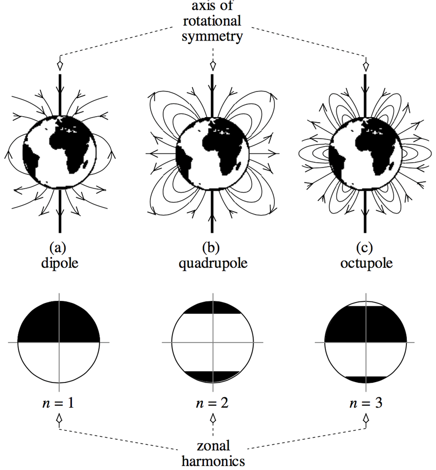
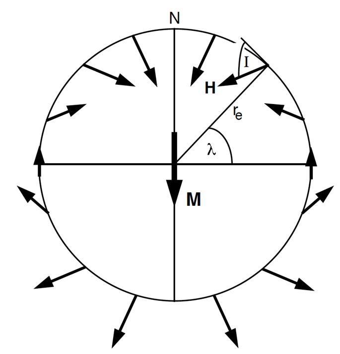
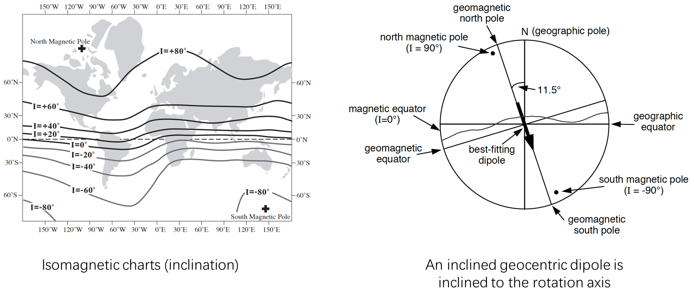
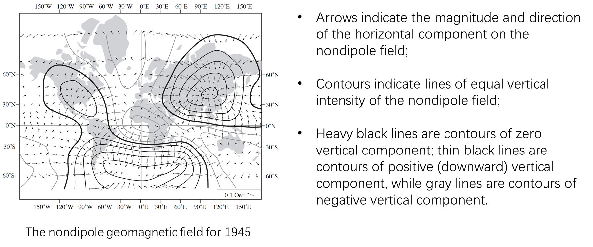
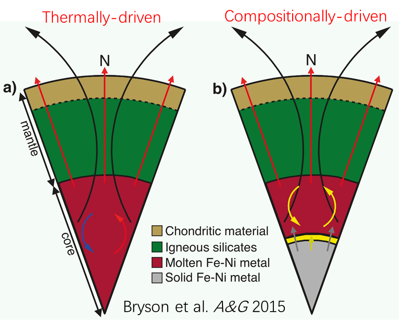
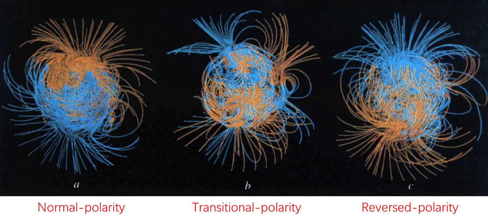
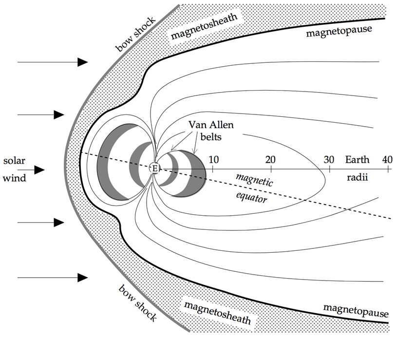
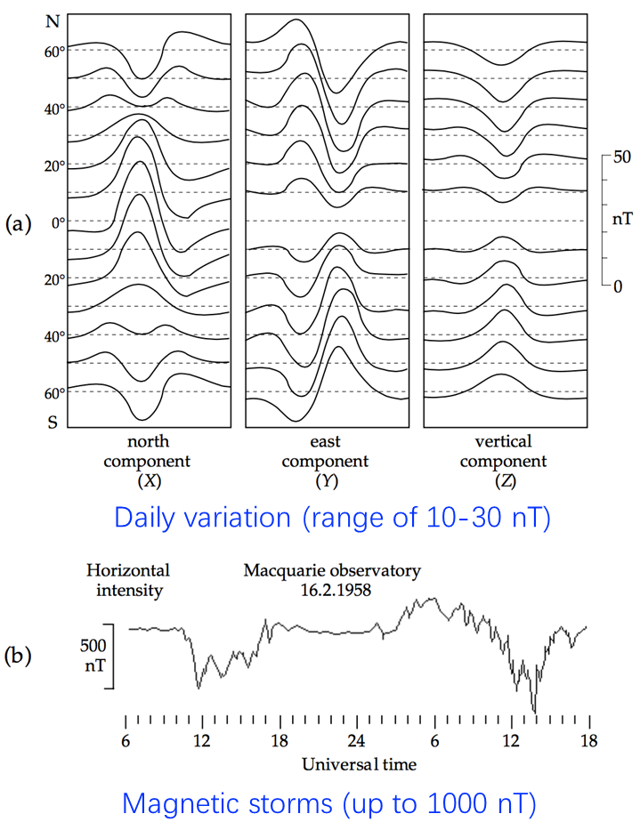

## 地磁的现代认知

### 一、地磁特性
**基础理论** 1600 年，威廉・吉尔伯特提出 **“地球是一个大磁体”**，地磁场是空间中随时间变化的矢量场，在地球表面任意点可通过局部三维坐标系定量描述。

**矢量属性** 地磁场为矢量场，其空间分布需同时描述方向与大小，数学上满足矢量叠加原理，可分解为正交分量进行分析。
    

### 二、地磁的数学描述方法

**笛卡尔坐标系（直角坐标系）**
以观测点为原点，定义：

- **X 分量**：指向地理北（North），水平向北为正；
- **Y 分量**：指向地理东（East），水平向东为正；
- **Z 分量**：指向垂直向下（Vertical Down），垂直向下为正。 三分量满足勾股定理：
  $\left(F = \sqrt{X^2 + Y^2 + Z^2}\right)$
  其中 F 为地磁场总强度。

**地磁极坐标系（球极坐标系）** 
以观测点为原点，定义：
- **总强度 F**：地磁场矢量的模长，单位为特斯拉（T）或纳特（nT），$(1\ \text{T} = 10^9\ \text{nT})$;
- **磁偏角 D**：地磁场水平分量与地理北的夹角（向东偏为正，范围 $[-180^\circ, 180^\circ]$）；
- **磁倾角 I**：地磁场矢量与水平面的夹角（向下为正，范围$[-90^\circ, 90^\circ]$）。 

**笛卡尔分量与球极坐标分量的转换关系**为：

$\begin{cases} X = F \cos I \cos D \\ Y = F \cos I \sin D \\ Z = F \sin I \end{cases}$

**磁偏角与磁倾角的计算公式**为：
$D = \arctan\left(\frac{Y}{X}\right), \quad I = \arctan\left(\frac{Z}{\sqrt{X^2 + Y^2}}\right)$

### 三、地磁强度的定量特征

#### **全局强度分布**
    
- **平均值**：地磁场整体强度较弱，平均约为 \(10^{-5}\ \text{T}\)（即 \(10^4\ \text{nT}\)）；
- **极值区域**：
	- 磁北极与磁南极附近强度最大，约 $6 \times 10^4\ \text{nT}$；
	- 赤道附近强度最小，约 $2 \sim 3 \times 10^4\ \text{nT}$。
#### 常见场景

- **磁屏蔽实验室**：内部地磁场经屏蔽后大多 $<50\ \text{nT}$，局部测量区域可低至几 $nT$；
- **现代测量仪器**：磁通门、质子旋进等磁强计灵敏度可达 $1\ \text{nT}$；
- **海洋磁异常**：海底岩石剩磁引发的局部异常场可达数百 $nT$（如 $200 \sim 500\ \text{nT}$）。
#### 地磁场的定量分解 

**拉普拉斯方程是地磁场位势理论的基础，通过求解该方程可描述地磁场的空间分布。**
引入球极坐标 $(r, \theta, \varphi)$，其中 $r$ 为半径，$\theta$ 为余纬度，$\varphi$ 为经度（或球上的方位角）。
对于指向中心点的自然力，其场的势 V 满足拉普拉斯方程：$\nabla^2 V = \nabla \cdot \nabla V = 0$
分别给出笛卡尔坐标与球极坐标下的拉普拉斯算子表达式：
- 笛卡尔坐标：$\nabla^2 = \nabla \cdot \nabla = \frac{\partial^2}{\partial x^2} + \frac{\partial^2}{\partial y^2} + \frac{\partial^2}{\partial z^2}$
- 球极坐标：$\nabla^2 T = \frac{1}{r^2} \frac{\partial}{\partial r}\left(r^2 \frac{\partial T}{\partial r}\right) + \frac{1}{r^2 \sin \theta} \frac{\partial}{\partial \theta}\left(\sin \theta \frac{\partial T}{\partial \theta}\right) + \frac{1}{r^2 \sin^2 \theta} \frac{\partial^2 T}{\partial \varphi^2}$

**拉普拉斯方程的解可通过球谐函数展开分解为内部场（源于地核）与外部场（源于电离层、太阳风等）**
使用变量分离法，设 $V(r, \theta, \varphi) = R(r)P(\theta)F(\varphi)$，代入拉普拉斯方程后，将偏微分方程分解为三个常微分方程：
1. 关于 r 的方程：$\frac{d}{dr}\left(r^2 \frac{dR(r)}{dr}\right) = BR(r)$
2. 关于 $\varphi$ 的方程：$\frac{1}{F(\varphi)} \frac{d^2 F(\varphi)}{d\varphi^2} = -m^2$  ;  解为 $F(\varphi) = e^{im\varphi}$（m 为整数）。
3. 关于 $\theta$ 的方程：$\frac{1}{\sin \theta} \frac{d}{d\theta}\left(\sin \theta \frac{dP(\theta)}{d\theta}\right) - \frac{m^2}{\sin^2 \theta} P(\theta) - BP(\theta) = 0$

最终得到势函数的形式：$V(r, \theta, \varphi) = c_{mn} P_n^m(\cos \theta) e^{im\varphi} R_n(r)$
其中 $P_n^m(\cos \theta)$ 为连带勒让德函数，$c_{mn}$ 为常数

**高斯表明，拉普拉斯方程的解与地球表面磁场可由势函数推导**：

$U_G = \sum_{n=0}^{\infty} \left( A_n r^n + \frac{B_n}{r^{n+1}} \right) \sum_{m=0}^{n} Y_n^m(\theta, \varphi)$ 

其中球谐函数 $Y_n^m(\theta, \varphi) = c_{mn} P_n^m(\cos \theta) e^{im\varphi}$

**球谐函数性质**：
- 当 $\theta$ 和 $\varphi$ 增加 $2\pi$ 的整数倍时，函数值不变，故称为球谐函数。
- 描述球面上势的变化，广泛用于地球物理（如重力势、地磁场势、大地水准面高度、全球热流等）。

**地磁场分离**：
- 势函数中，$A_n r^n$ 表示外部场贡献，$\frac{B_n}{r^{n+1}}$ 表示内部场贡献。
- 地磁场分量是磁势的方向导数，且 $A_n \ll B_n$（内部场占主导）

#### 地磁场的多极子场线几何

上图展示轴向截面的场线几何形状
- (a) 偶极子场（$n=1$）：地磁场的主要成分，类似条形磁铁的磁场。
- (b) 四极子场（$n=2$）：比偶极子更复杂的场结构。
- (c) 八极子场（$n=3$）：更高阶的场结构。
下方图示为 $n=1, 2, 3$ 的带谐函数（zonal harmonics），表示不同阶次球谐函数在球面上分布特征。

通过不同阶次的多极子场（偶极子、四极子、八极子等）叠加，可更精确地描述地磁场的复杂结构。高阶项（$n \geq 2$）表示地磁场的非偶极子部分，反映地球内部电流分布或磁性结构的复杂性。
### 四、IGRF简介

## 地磁偶极子场

### 一、偶极子的磁势
位于地球中心、磁矩为 $\mathbf{m}$ 的偶极子，在位置 $\mathbf{r}$ 处产生的磁势为：
$$V(\mathbf{r}) = \frac{1}{4\pi r^3} \mathbf{m} \cdot \mathbf{r}$$

在球极坐标 $(r, \theta, \phi)$ 中，若 $\mathbf{m}$ 沿 $-z$ 方向，则 
$$
\mathbf{m} \cdot \mathbf{r} = -mr \cos\theta
$$
代入得：
$$
V(\mathbf{r}) = -\frac{mr \cos\theta}{4\pi r^3} = -\frac{m \cos\theta}{4\pi r^2}
$$

### 二、偶极子的磁场
磁场 $\mathbf{B}(\mathbf{r})$ 与磁势 $V(\mathbf{r})$的关系为：
$$
\mathbf{B}(\mathbf{r}) = -\mu_0 \nabla V(\mathbf{r}) 
$$
在球极坐标下，梯度 $\nabla V$表示为：
$$
\mathbf{B}(r, \theta, \phi) = -\mu_0 \left[ \frac{\partial V}{\partial r} \hat{r} + \frac{1}{r} \frac{\partial V}{\partial \theta} \hat{\theta} + \frac{1}{r \sin\theta} \frac{\partial V}{\partial \phi} \hat{\phi} \right]
$$

代入 $V(\mathbf{r}) = -\frac{m \cos\theta}{4\pi r^2}$可以计算得各个分量
### 三、磁场分量的推导
- **径向分量 $B_r$**：
  $$B_r(r, \theta, \phi) = -\mu_0 \frac{\partial V}{\partial r} = -\mu_0 \frac{\partial}{\partial r} \left( -\frac{m \cos\theta}{4\pi r^2} \right) = \frac{\mu_0 m \cos\theta}{4\pi} \cdot \frac{2}{r^3} = \frac{2\mu_0 m \cos\theta}{4\pi r^3}$$
- **经向分量 $B_\theta$**：
  $$B_\theta(r, \theta, \phi) = -\mu_0 \frac{1}{r} \frac{\partial V}{\partial \theta} = -\mu_0 \frac{1}{r} \cdot \frac{m \sin\theta}{4\pi r^2} = -\frac{\mu_0 m \sin\theta}{4\pi r^3}$$
- **纬向分量 $B_\phi$**： 
  
  由于 V 与 $\phi$ 无关，$\frac{\partial V}{\partial \phi} = 0$，故 $B_\phi = 0$。
  
- **总场强 B**：
  $$B(r, \theta, \phi) = \sqrt{B_r^2 + B_\theta^2 + B_\phi^2} = \frac{\mu_0 m}{4\pi r^3} \sqrt{1 + 3\cos^2\theta}$$

### 四、 地心轴向偶极子场(GAD,The geocentric axial dipole field)
在地球表面 \(r = R\)，径向和切向分量为：
$$
\begin{cases} 
B_r = -\frac{2\mu_0 m \cos\theta}{4\pi R^3} \\ B_\theta = -\frac{\mu_0 m \sin\theta}{4\pi R^3} \\ B_\phi = 0 
\end{cases}
$$

**磁倾角 I**： 
定义 $\tan I = \frac{Z}{H}$其中 $Z = -B_r$（向下为正），$H = |B_\theta|$。

代入 $B_r$ 和 $B_\theta$的表达式：
$$
\tan I = \frac{\frac{2\mu_0 m \cos\theta}{4\pi R^3}}{\frac{\mu_0 m \sin\theta}{4\pi R^3}} = \frac{2\cos\theta}{\sin\theta} = 2\cot\theta
$$

因纬度 $\lambda = 90^\circ - \theta$，$\cot\theta = \tan\lambda$，故 $\tan I = 2\tan\lambda$。

**地磁偶极子场的分布**
- 垂直分量
  $$H_v = \frac{2M \sin\lambda}{r_e^3}$$
- 总水平分量
  $$H = \frac{M}{r_e^3} \sqrt{1 + 3\sin^2\lambda}$$

>地磁偶极子场的分布
>(1)轴向对称，与经度无关；(2)极地磁场强度是赤道的两倍；(3)磁倾角随纬度变化，赤道 I=0∘，极地 I=90∘（垂直）。

### 五、地磁场的分布

## 地磁发电机
### 1. Self - exciting disk dynamo（自激圆盘发电机）
**原理**：一个铜盘在导电轴上旋转，存在初始磁场 $\mathbf{B}$（垂直铜盘向上）。铜盘中电子通过磁场时受洛伦兹力 $\mathbf{F_L} = q\mathbf{v} \times \mathbf{B}$。该力使电子向轴移动，电流向盘外流动。电刷连接引出电流，电流通过线圈产生与原磁场同方向的磁场，形成正反馈系统，加强原磁场。此模型展示了通过机械运动和电磁相互作用实现磁场自激增强的过程。

### 2. Geodynamo: origin of the geomagnetic field（地球发电机：地磁场的起源）

- **相互作用**：地磁场起源于地核中导电的 $\text{Fe-Ni}$ 合金与地磁场的相互作用，需初始磁场。
- **地球自转影响**：地球自转引导流体运动方式，使其沿自旋轴排列。
- **磁场再生与形态**：流体运动再生磁场，泄漏使场保持简单形状（如偶极子）；非偶极子成分（如核 - 幔边界附近的涡流）也存在。
- **能量与损耗**：因电导率有限，磁场有损失，能量通过欧姆耗散损失。能源主要是地球核心逐渐冷却、外核冻结和内核生长。

### 3. Geodynamo of Earth and extraterrestrial bodies（地球与地外天体的地球发电机）

 

**驱动机制**：
- **热驱动（图 a）**：流体运动由热对流驱动。
- **成分驱动（图 b）**：地球缓慢冷却，核心固化，较轻元素上升，由密度梯度产生的浮力驱动流体运动。这些机制是地核中维持发电机效应的动力来源。

### 4. The geodynamo simulation（地球发电机模拟）

**磁流体动力学方程**：
$$
\frac{\partial \mathbf{B}}{\partial t} = \frac{1}{\mu_0 \sigma} \nabla^2 \mathbf{B} + \nabla \times (\mathbf{v} \times \mathbf{B})
$$
- **左边项**：$\frac{\partial \mathbf{B}}{\partial t}$ 表示核心中磁通量的变化率。
- **右边第一项（扩散项）**：$\frac{1}{\mu_0 \sigma} \nabla^2 \mathbf{B}$，描述磁场的空间梯度和衰减，与电导率 $\sigma$ 成反比（电导率越高，扩散越慢）。
- **右边第二项（发电机项）**：$\nabla \times (\mathbf{v} \times \mathbf{B})$，依赖洛伦兹力（由核心流体运动速度场 $\mathbf{v}$ 和磁场 $\mathbf{B}$ 相互作用产生），是驱动磁场再生的关键项。

此方程通过数学形式描述了地核中磁场随时间的演化，结合了扩散和动态再生过程。

### 5. Modelled weak dipole moment during geomagnetic reversal（地磁反转期间模拟的弱偶极矩）

>Modelled weak dipole moment during geomagnetic reversal,Glatzmaier & Roberts Nature 1995.

展示了地磁反转过程中偶极矩减弱及极性转变的模拟结果，反映了地磁场在长时间尺度上的复杂变化，这种反转是地球发电机过程的一种极端表现，涉及地核内流体运动和磁场相互作用的剧烈调整。

### 6. The magnetic field of external origin（外源磁场）

>范艾伦辐射带（Van Allen radiation belt）是一个高能带电粒子的区域，其中大部分粒子来自太阳风，被行星的磁层捕获并环绕在该行星周围。地球有两层这样的环带，有时可能建立临时环带。

- **太阳风**：太阳风是带电粒子流（电子、质子、氦核），属于等离子体（由几乎等量的正负离子组成的低粒子密度电离气体）。
- **相互作用**：太阳风与地球上层大气碰撞，形成激波（类似超音速飞机前的激波）。太阳风产生行星际磁场，白天加强并压缩地磁场，夜晚减弱并拉伸地磁场，塑造了地球磁层的形态（如磁鞘、磁层顶等结构）。

### 7. Daily variation and magnetic storms（日变化与磁暴）

- **外源磁场来源**：电离层中电离分子释放大量电子，形成强大的水平环形电流。白天地球向阳面电离强烈。
- **太阳活动影响**：太阳活动通过加热和引力作用，引起电离层大气潮汐。
- **变化幅度**：地磁场日变化范围约 $10 - 30\ \text{nT}$，磁暴时磁场变化可达 $1000\ \text{nT}$。这些变化反映了外部因素（如太阳活动）对地磁场的动态影响，是空间天气对地磁环境作用的体现。