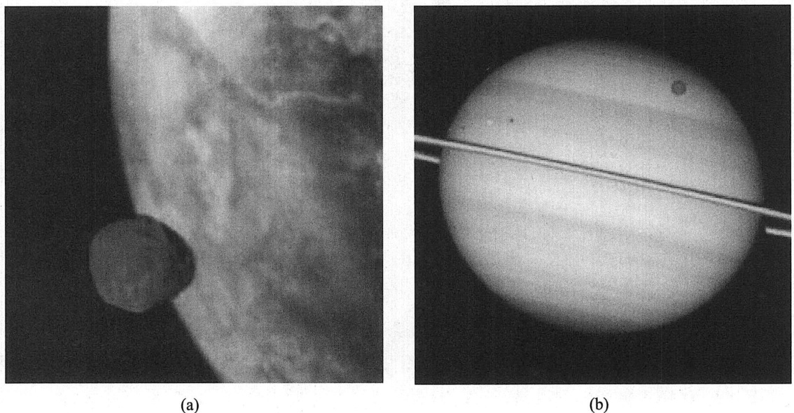

## 行星的属性  

我们对于太阳系天体（包括行星、卫星、彗星、小行星、环和行星际尘埃）具体特征的所有认知终归都来自于观测，无论是来自地面或地球轨道卫星的天文观测，还是来自行星际探测器获得的近距离探测（通常是原位探测）数据。人们可以或多或少地直接从观测中确定以下特征的数值：  

1）轨道；  
2）质量，质量分布；  
3）尺寸；  
4）自转和方向；  
5）形状；  
6）温度；  
7）磁场；  
8）表面成分；  
9）表面结构;  
10）大气结构和组成。  

在多种理论的帮助下，这些观测结果可用于限定行星的特性，例如整体组分和内部结构，这两个特性是建立太阳系形成模型的关键因素。  

## 1.轨道  

在17世纪早期，约翰内斯·开普勒直接从观测中推导出了行星运动的三大“定律”：  

1）所有行星围绕太阳运动的轨道都是以太阳为焦点的椭圆。  

2）对于给定的行星，行星和太阳的连线在单位时间内扫过的面积相等。  

3）行星绕太阳公转轨道周期 $P_{\mathrm{orb}}$ 的平方与其半长轴 $^{a}$ 的立方成正比，即 $P_{\mathrm{orb}}^{2}\propto a^{3}$  

开普勒轨道由6个轨道根数唯一指定， $a$ （半长轴）、 $e$ （偏心率）、 $i$ （倾角）、 $\omega$ （近点幅角，或用 $\varpi$ 表示近点经度）、 $\varOmega$ （升交点经度）和 $f$ （真近点角）。轨道根数在图2-1中以图形方式定义，并在2.1节中详细讨论。这些根数中，前面比后面更基本： ${a}$ 和 $e$ 完整定义了轨道的大小和形状， $i$ 给出了轨道平面相对于某个参考平面的倾斜角度，近点经度 $\varpi$ 和升交点经度Ω确定了轨道的方向， $f$ （或者 $t_{\varpi}$ ，过近点时间）给出了行星在给定时刻轨道中的位置。使用其他轨道根数也可以确定轨道，例如，如果已知太阳和行星的质量，则轨道完全由行星在给定时刻相对太阳的位置和速度（同样是6个独立的标量）确定。  

开普勒定律（或更准确的版本）可以从17世纪后期发现的牛顿运动定律和万有引力定律推导出来。相对论效应也会影响行星轨道，但与行星相互施加的引力摄动相比，它们很小。  

所有行星和小行星都按照与太阳自转相同的方向围绕太阳旋转。它们的轨道平面通常彼此相差几度，并靠近太阳赤道面。为便于观察，一般相对于地球的**公转轨道面（称为黄道面）** 测量轨道倾角。从动力学上讲，最好的选择是不变平面，它通过质心并垂直于太阳系的角动量矢量。太阳系的不变平面与木星轨道平面几乎重合，木星轨道平面相对于黄道面倾斜 $1.\,3^{\circ}$ 。本书遵循标准惯例，测量日心轨道相对于黄道面的倾角以及行星轨道相对于行星赤道面的倾角。太阳的赤道面相对于黄道面倾斜 $7^{\circ}$ 。在八大行星中，水星的轨道倾角最大， $i=7^{\circ}$ 。（然而，因为轨道倾角实际上是一个矢量，这两个倾角接近并不意味着水星轨道位于太阳赤道面内。实际上，水星轨道相对于太阳赤道面倾斜 $3.\ 4^{\circ}$ ）。与之相类似，大多数主要卫星的轨道都靠近行星赤道面。许多围绕太阳和行星运行的较小天体的轨道倾角要大得多。此外，一些彗星、小卫星和海王星的大卫星海卫一以逆行的方式（retrograde，与太阳/行星的自转方向相反）围绕太阳/行星运行。我们观测到行星系统的大部分是“平坦”的?，这可以通过行星形成模型来解释，该模型假设行星在围绕太阳运行的圆盘内演化而成。  

## 2.质量  

一个天体的质量可以从它施加在其他天体上的引力推导出来。  

**卫星轨道**：天然卫星的轨道周期和开普勒第三定律的牛顿广义形式结合，可用于求解质量。得到的结果实际上是行星和卫星质量的总和（再加上所考虑的轨道内侧所有卫星的质量)，但是除地球/月球和包含冥王星/冥卫一在内的各种微型行星以外，卫星的质量与行星相比通常非常小。该方法的不确定性主要源于半长轴的测量误差，时间误差可以忽略不计。  

如何测量没有卫星的行星质量呢？每颗行星的引力都会对所有其他行星的轨道产生摄动。由于距离较远，因此引力小得多，所以这种方法的精度不高。但需要注意的是，海王星正是由于它对天王星的轨道摄动而被发现的。这种技术仍然用来对一些大型小行星的质量进行最佳估计（尽管在某些情况下相当粗糙）。摄动法实际上可以分为两类：短期摄动和长期摄动。短期摄动的特例是小行星之间的单次近距离飞越。可以针对所考虑天体的各种假定质量计算轨道，并拟合观察到的另一天体的路径。长期摄动的最佳例证是根据锁定在稳定轨道共振中的卫星相对位置周期性变化，推导出质量（第2章）。  

探测器跟踪数据给出了确定访问过的行星和卫星质量的最佳方法，因为可以非常精确地测量传输的无线电信号的多普勒频移和周期。环绕任务提供的长时间基线比飞越任务具有更高的精度。一些外行星卫星质量的最佳估计方法是：把旅行者号图像的精确短期摄动测量，与旅行者号跟踪数据和/或来自长期地基观测的共振约束相结合。  

对土星的一些小型内卫星质量的最佳估计，来自它们在土星环中共振激发的螺旋密度波的振幅或它们在附近环物质中产生的密度尾流。  

通过估计由释放的气体和尘埃的不对称逃逸引起的非引力力，并将它们与观测到的轨道变化进行比较，可以粗略估计某些彗星质量。  

非球对称质量分布的引力场与相同质量点源产生的引力场不同。结合自转周期，这种偏差可用于估计旋转体中质量的中心集中程度。不对称天体引力场与质点引力场的偏差在离天体最近的地方最明显，也最容易测量。为了确定精确的引力场，可以利用探测器跟踪数据以及卫星和/或偏心的环的轨道。  

## 3.尺寸  

太阳系天体尺寸和形状的范围分布较广。天体的大小可以通过多种方式测量：  

* **张角测量**：天体的直径是它的张角（以弧度为单位）和它与观察者的距离的乘积。太阳系内天体的距离很容易通过轨道估计出来；然而，由于在地球上观测的分辨率有限，导致张角测量存在很大的不确定性。因此，对于没有被行星际探测器近距离成像的天体，通常通过其他技术给出最佳测量结果。 

* **恒星掩蔽**：太阳系天体的直径可以通过观测被这个天体遮掩的恒星来进行推算。恒星相对于遮掩天体的角速度可以通过轨道数据计算出来，包括地球公转和自转的影响。从一个特定位置观测掩星，将掩星的持续时间乘以它的角速度和距离，可以得到天体投影轮廓的弦长。三条相距较远的弦足以确定一个球形行星的尺寸。如果行星的形状不规则，则需要多条弦的信息，并且需要多个相距较远的望远镜对同一掩星事件进行观测。该技术对于尚未被探测器访问过的小天体特别有用。非常明亮的恒星的掩星并不常见，需要适当的预测以及大量的观测活动以获得足够的弦的信息（即使某些观测地点被阴云笼罩)；因此，掩星直径测量法仅适用于太阳系中极少数的已知小天体。  

* **雷达回波**：雷达信号可用于确定天体的半径和形状。由于雷达信号强度随着与天体的距离 $r$ 以 $1/r^{4}$ 衰减（信号从雷达天线到达天体以 $1/r^{2}$ 衰减，从天体返回雷达天线以$1/r^{2}$ 衰减)，因此雷达只能研究相对较近的天体。雷达对于研究固态行星、小行星和彗核特别有用。  

* **卫星探测**：一种测量天体半径的极佳方法是发送着陆器到天体表面，然后使用轨道器进行三角测量。这种方法以及雷达技术也适用于具有大量大气的类地行星和卫星。  

* **辐射测量**：可以结合可见光和红外波长的光度观测来估计天体的大小和反照率。在可见光波长下，可以测量从天体反射的太阳光；而在红外波长下，可以测量天体自身的热辐射（详见第3章和附录E.3)。  

一旦知道天体的质量和大小，就很容易确定天体的平均密度。通过天体的密度可以大概了解它的组成，然而必须要考虑行星和大卫星发生的高压造成的压缩，对小天体而言应考虑大量空隙的可能。例如，4颗巨行星的低密度（约 $1~\mathrm{{g}/\mathrm{{cm}^{3}}}$ ）表明其组成物质的平均分子量很小。类地行星的密度（ $(3.\,5{\sim}5.\,5 \, \mathrm{g/cm^{3}})$ ）表明其由岩石物质组成，并包括一些金属。巨行星周围大多数中卫星和大卫星的密度在 $1\!\sim\!2~\mathrm{g/cm^{3}}$ 之间，说明其为冰和岩石的组合。彗星的密度约为 $1~\mathrm{{g}/\mathrm{{cm}^{3}}}$ 或更低，说明其组成为相当松散的脏冰。  

除了密度之外，还可以利用天体的质量和大小来计算逃逸速度［式（2－21）］。逃逸速度与温度一起可用于估计行星保持大气的能力。  

## 4.旋转  

简单的自转是一个矢量，与自转角动量有关。行星本体的倾角（或轴倾角）是其自转角动量与其轨道角动量之间的夹角。倾角小于 ${90}^{\circ}$ 的天体被称为**顺行（prograde）** 自转，倾角大于 ${90}^{\circ}$ 的天体称为**逆行（retrograde）** 自转。可以使用多种技术确定天体的自转：  

* 确定行星本体自转轴和周期最直接的方法是观察表面的标记如何随圆盘的转动而运动。不幸的是，并非所有行星都具有这样的表面特征。此外，如果使用大气特征，风可能会导致推导的周期随纬度、高度和时间而变化。  

* 具有一定磁场的行星会将带电粒子捕获在行星的磁层中。这些带电粒子在电磁力的作用下加速并发射射电波。由于磁场在经度上不均匀，并且磁场随着行星（可能是大部分）共同自转，所以这些射电信号的周期就等于行星的自转周期。对于没有可探测固体表面的行星，通常认为磁场周期比云特征变化周期更为根本。  

* 天体的自转周期通常可以通过观测其光变曲线（lightcurve）的周期性来确定，光变曲线给出了总圆盘亮度随时间变化的函数。光变曲线的变化可能是反照率差异的结果，或者由天体不规则形状投影面积的差异造成。不规则形状的天体每自转一个周期产生的光变曲线有两个非常相似的最大值和两个非常相似的最小值，而反照率的变化则没有这种对称性。因此，在通过光变曲线分析确定的自转周期中，有时存在两倍的模糊性。大多数小行星都具有双峰光变曲线，表明主要变化是由形状造成的，但由于半球反照率和局部地形的微小变化，可以相互区分出这些峰。  

* 只要知道天体的半径，就可以通过测量行星圆盘上的多普勒频移，粗略估计出自转周期和自转轴。这可以在可见光下被动完成，也可以使用雷达主动完成。大多数围绕太阳运行的天体的自转周期在3小时到几天之间。水星和金星的自转几乎可以肯定都受到太阳的潮汐作用而减慢，从而产生了例外一一它们的自转周期分别为59天和243天。八大行星中的六颗以顺行方式自转，倾角为 ${30}^{\circ}$ 或更小。金星以逆行方式自转，倾角为 $177^{\circ}$ ，龙天王星的自转轴非常靠近天王星的轨道面。由于行星引起的潮汐，大多数行星卫星的自转与其公转周期相同。  

## 5.形状  

多种不同的力共同决定了天体的形状。天体自身的引力会让其形状趋于球体，因为球体是引力势能最小的形状。构成天体物质的强度可以保持天体形状的不规则性，这些不规则的形状可能是由吸积、撞击或内部地质过程产生的。天体自身引力的影响随着天体尺寸的增加而增加，较大的天体往往形状更圆。一般来说，平均半径大于 $200\ \mathrm{km}$ 的天体比较圆，较小的天体可能形状比较奇怪［图1-5（a）丁。  

行星的自转与其扁率之间存在一定的关系，因为自转产生了离心力，导致行星在赤道处凸出，在两极处扁平。一个理想的流体行星将被塑造成一个椭球体。对于密度低且自转速度快的行星，其极向**扁率（polarflattening）** 最大。扁率计算公式 $\epsilon{\equiv}\,(R_{\mathrm{~e~}}{-}R_{\mathrm{~p~}})/R_{\mathrm{~e~}}$ ,其中 $R$ e。和 $R_{\mathfrak{p}}$ 分别是赤道半径和极半径。以土星为例，它的扁率约为0.1，在一些图像上很容易辨别出极向扁率［图1-5（b）]。  

天体的形状可以通过以下方式确定：  

* 通过地面或探测器直接成像。  

* 利用在不同地点的恒星掩星试验观测到的弦长。  

* 雷达回波分析。  

* 光变曲线分析。为精确测量需要从不同视角获得多条光变曲线。  

* 中心闪光（centralflash）的形状，即有大气天体的中心经过被遮掩恒星前方时观测到的形状。中心闪光由大气折射的光线聚焦引起，只有在偶然的观测条件下才能看到。  

  
图1-5 （a）在近球形的火星边缘的背景下，形状不规则的小卫星火卫一的图像。相对于火星，火卫一看起来比实际大得多，因为苏联的探测器福布斯2号在拍摄这张照片时，距离火卫一比火星更近。（b）哈勃望远镜于2009年2月24日拍摄的土星图像，距土星春分点前不到5个月。以小倾角观察土星环，环的阴影投在土星上且恰好在环的上方。可以看到4颗卫星正在凌日（部分遮住照射到土星的太阳光)；从左到右分别是土卫二、土卫四、土卫六和土卫一；也可以看到土卫二和土卫四的影子。请注意这颗低密度、快速自转的行星呈明显的扁率。（图片来源：NASA/STSci/哈勃望远镜作品集）  

## 6.温度  

一颗行星的平衡温度可以通过太阳日照能量和向外再辐射能量之间的平衡来计算。然而，对于许多行星而言，内部热源起到了重要作用。此外，温度可能随着昼夜、纬度和季节而变化。**温室效应**是指由于大气对可见光辐射（太阳的主要输出）的透过率远大于来自行星的红外辐射的透过率，形成了所谓的热“毯”，这使某些行星表面的温升远高于平衡黑体值。例如，由于金星云层的高反照率，金星单位面积上吸收的太阳能实际上比地球少；因此（因为与太阳加热相比，金星和地球的内部热源可以忽略不计），金星的有效辐射温度低于地球。然而，由于温室效应，金星的表面温度升高至约 $730\,\mathrm{~K~}$ ，远高于地球表面温度。  

使用温度计直接进行原位测量，可以准确估计天体可到达（外部）位置的温度。天体辐射的热红外光谱也是其表面或云顶温度的良好指示。大多数固体和液体行星的物质都可以表征为近乎完美的黑体辐射体，其发射峰值位于近红外到中红外波长。对发射辐射的分析有时会在不同波长处得出不同的温度。这可能是由于天体表面不同位置的温度组合造成的，例如极地与赤道的差异、反照率变化或者火山热点（如木卫一上看到的情况）。此外，大气的不透明度随波长而变化，这使我们能够遥感探查行星大气中的不同高度。  

## 7.磁场  

移动的电荷可以产生磁场。流经固体介质的电流会迅速衰减（除非介质是超导体，然而行星内部为高温，所以其不可能是超导体）。因此，内部产生的行星磁场一定来自知之甚少的**发电机（dynamo）过程**，该过程只能在行星流体区域中运行；或者来自**剩磁（remanentferromagnetism）**，剩磁由锁定为整齐构型的固体原子上结合的电荷产生。人们认为剩磁不可能产生大的磁场，因为除了剩磁预计会在较短的时间尺度内衰减之外（与太阳系的年龄相比），还要求行星的大部分铁在冷却通过居里点的很长一段时间内受到一个（方向上）几乎恒定的磁场作用（当温度低于铁磁材料的居里点时，磁矩在磁畴内部分对齐）。磁场也可能由太阳风（主要由带电粒子组成）和行星内的导电区域或其电离层之间的相互作用而产生。  

可以使用原位磁强计直接测量磁场，或者通过测量加速电荷效应产生的辐射（射电发射）进而间接测量磁场。局部极光的出现（即由带电粒子进入行星高层大气中引起的发光现象）也表明行星存在磁场。行星的磁场可以近似等效为偶极子磁场，用扰动来解释行星磁场的不规则性。所有4颗巨行星，以及地球、水星和木卫三，其内部都产生了磁场。金星和彗星的磁场是由太阳风与其大气/电离层中带电粒子之间的相互作用产生的，而火星和月球则具有局部地壳磁场。木星磁场在木卫二和木卫四附近的扰动表明这些卫星内部存在咸海。土卫二上的间歇泉活动扰乱了土星的磁场。

## 8.表面组成  

天体表面的组成可以从以下方面得出：  

* 光谱反射率数据。从地球上可以观测到天体的光谱；然而，紫外波长的光谱只能在地球大气层以外观测到。  

* 热红外光谱和热射电数据。尽管难以分析解释，但这些测量值包含有关天体组成的信息。  

* 雷达反射率。此类观测可以通过在地球或行星附近的探测器开展。  

* X射线和射线荧光。如果天体没有厚厚的大气层，则可以通过环绕行星轨道的探测器（或者理论上，甚至可以是飞越的探测器）进行测量。详尽的测量需要探测器着陆到天体表面。  

* 表面样品的化学分析。可以对通过自然过程（陨石陨落）或探测器带到地球的样品  

进行分析，或者通过探测器进行原位分析。其他形式的原位分析包括质谱、电导率和热导率测量。  

行星、小行星和卫星的组成显示出其与日心距离的相关性，离太阳最近的天体具有最大浓度的致密物质（往往是难熔的，即具有高熔点和高沸点）和最小浓度的冰（更易挥发，即具有低得多的熔点和沸点）。  

## 9.表面结构  

不同的行星或卫星表面结构差异很大。有多种方法可以确定行星表面的结构：  

* 大尺度结构（例如，山脉）可以通过成像探测，或者使用可见光/红外/射电被动探测，或者使用雷达成像技术主动探测。最好在不同人射角条件下进行成像，以便将倾角（坡度）效应与反照率差异分开。  

* 小尺度结构（例如，晶粒尺寸）可以从雷达回波亮度和反射率随相位角的变化中推导出来，其中相位角定义为从天体看到的太阳和观察者之间的角度。尺寸远大于观测光波长的天体，它的亮度通常随着相位角的减小而缓慢增加。对于非常小的相位角，亮度增加更快，这种现象称为**冲效应（oppositioneffect）**。  

## 10.大气  

大多数行星和部分卫星都被明显的大气所包围。巨行星如木星、土星、天王星和海王星基本上都是巨大的流体球，它们的大气以 $\mathrm{H}_{2}$ 和$\mathrm{He}$为主。金星有一个非常浓厚的 $\mathrm{CO_{2}}$ 大气层，云层很厚以至于在可见光波长下无法看到金星表面；地球的大气层主要由 $78\%$ 的$\mathrm{N}_{2}$ 和 $21\%$ 的 $\mathrm{O}_{2}$ 组成，而火星的 $\mathrm{{CO}_{2}}$ 大气层更为稀薄。土星的卫星土卫六有一个浓密的富含氮的大气层，非常有趣的是它包含了多种有机分子。冥王星和海王星的卫星海卫一都有一个以 $\mathrm{N}_{2}$ 为主的稀薄大气；而木星的卫星中以火山活跃著称的木卫一，大气主要由$\mathrm{SO_{2}}$ 组成。水星和月球的大气层都非常稀薄（ ${\lesssim}10^{-12}$ bar）；水星的大气以原子$\mathrm{O}$、$\mathrm{Na}$和$\mathrm{He}$ 为主，而月球大气的主要成分是$\mathrm{He}$和 $\mathrm{Ar}$ 。彗星彗发的气体成分本质上是逃逸过程中的临时大气。  

大气的组成和结构（温度-压力剖面曲线）可以通过以下方式确定：可见光波长的光谱反射数据，红外和射电波长的热光谱和光度测量，恒星掩星剖面，原位质谱仪和通过大气/表面探测器发回到地球的无线电信号的衰减。  

## 11.内部  

行星的内部无法直接进行观测。然而，借助上述讨论的可观测参数，可以得出有关行星整体组成及其内部结构的信息。  

除了实际上可以拆解并进行分析的极小天体外（如陨石等），天体的**整体组成（bulkcomposition）** 不是一个可观察的属性。因此，必须从各种直接和间接的线索和约束中推导出整体组成。最基本的约束是基于行星的质量和尺寸。仅使用这些约束条件，再加上从实验室数据和量子力学计算得出的物质特性，就可以证明木星和土星主要由氢组成。这仅因为所有其他元素的密度太大，不符合约束条件（除非内部温度远高于在准稳态下观察到的有效温度）。然而，这种方法只能对主要由最轻元素组成的行星给出明确的结果。对于所有其他天体来说，估计整体组成最好根据模型以及对宇宙起源丰度的合理假设。模型包括质量、半径、表面和大气成分、天体的日心距离（位置信息非常有用，因为它让我们了解行星形成时期该区域的温度，从而知道哪些元素可能会凝结）等。  

行星的内部结构在一定程度上可以从它的引力场和自转速度推导出来。根据这些参数，可以估计出质量在行星中心处的集中程度。引力场可以通过探测器的跟踪以及卫星或环的轨道来确定。如果地震仪可以放置在具有固体表面的行星上，就可以获得其内部结构的详细信息，就像阿波罗宇航员在月球上所做的那样。地震波在行星内部传播的速度和衰减取决于密度、刚度和其他物理特性，而这些特性又取决于成分、压强、温度和时间。内部边界的反射和折射提供有关分层的信息。从理论上讲，气态行星的自由振荡周期也可以给出内部属性的线索，就像当前的日震学提供有关太阳内部的重要信息一样。火山活动和板块构造的证据约束了行星表面以下的热环境。能量输出提供了有关行星内部热结构的信息。  

对于受到显著的随时间变化的潮汐形变影响的卫星，其响应取决于它们的内部结构。对此类卫星的重复观测可以揭示其内部特性，包括在某些情况下存在地下流体层。将高度测量与卫星重力测量相结合，可以显示冰卫星表面下的横向不均匀性，从而指示火山源和构造结构。  

运动的电荷产生磁场。虽然如月球磁场这样微弱的磁场可能是剩磁磁性造成的，但人们认为极强的行星磁场需要在行星内部存在导电流体区域。中心偶极子磁场可能在行星核心内部或附近产生，而高度不规则的偏移磁场则可能在更靠近行星表面的区域产生。  
