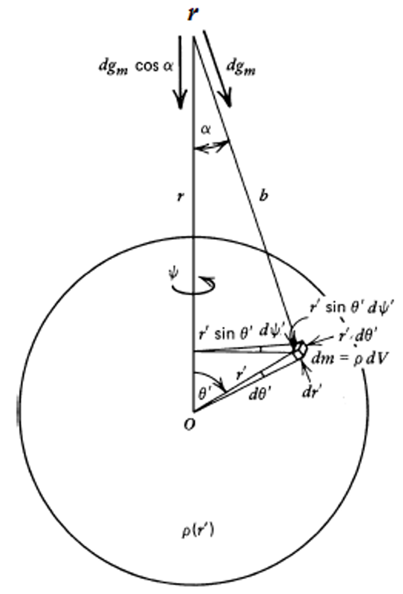

### 重力势
#### 1.行星重力势的一般形式
##### 引力势的定义
引力势$\Phi_\mathrm{g}(r)$定义为：
$$
\Phi_\mathrm{g}(r)\equiv-\int_{\infty}^{r}\frac{F_\mathrm{g}(r^{\prime})}{m}\mathrm{d}r^{\prime}
$$
引力加速度是引力势的梯度：
$$
\frac{\mathrm{d}^2r}{\mathrm{d}t^2}=-\nabla\Phi_\mathrm{g}(r)
$$
通常$\Phi_\mathrm{g}(r)$满足泊松方程：
$$
\nabla^2\Phi_\mathrm{g}=4\pi\rho G
$$
真空中$\rho$等于0，因此满足拉普拉斯方程：
$$
\nabla^2\Phi_\mathrm{g}=0
$$
##### 球体的引力势

定义距离球体球心$r$处收到球体$r^{'}$处引力势$\Phi_\mathrm{g}(r)$，将其展开得
$$
\begin{aligned}
 & \Phi(\mathbf{r})=-\frac{Gm^{\prime}}{|\mathbf{r}^{\prime}-\mathbf{r}|} \\
 & \Phi(\mathbf{r})=-G\int\frac{\rho(\mathbf{r}^{\prime})}{|\mathbf{r}^{\prime}-\mathbf{r}|}d^{3}\mathbf{r}^{\prime}.
\end{aligned}
$$
一般轴对称分布：
$$
\Phi(r,\phi,\theta)=-G\int_0^\infty\int_0^\pi\int_0^{2\pi}\frac{r^{\prime2}\rho(r^{\prime},\theta^{\prime})\sin\theta^{\prime}}{|\mathbf{r}-\mathbf{r}^{\prime}|}d\phi^{\prime}d\theta^{\prime}dr^{\prime}.
$$
因为$\Phi_\mathrm{g}(r)$在自由空间中满足拉普拉斯方程,行星外部的引力场可以展开成[[勒让德多项式]]的级数,而不是适用于任意形状的完全球谐函数展开。
$$
\Phi(r,\phi,\theta)=\sum_{n=0,\infty}\Phi_{n}(r)P_{n}(\cos\theta).
$$
#### 2.轴对称椭球体的重力势表达式
##### 椭圆度 $\epsilon$

$$
\Phi_\mathrm{g}\left(r,\phi,\theta\right)=-\frac{Gm}{r}\left[1-\sum_{n=2}^{\infty}J_{n}\mathrm{P}_{n}\left(\mathrm{cos}\theta\right)\left(\frac{R}{r}\right)^{n}\right]
$$
#### 3.行星旋转的离心势一般形式

### 转动惯量和分层模型
