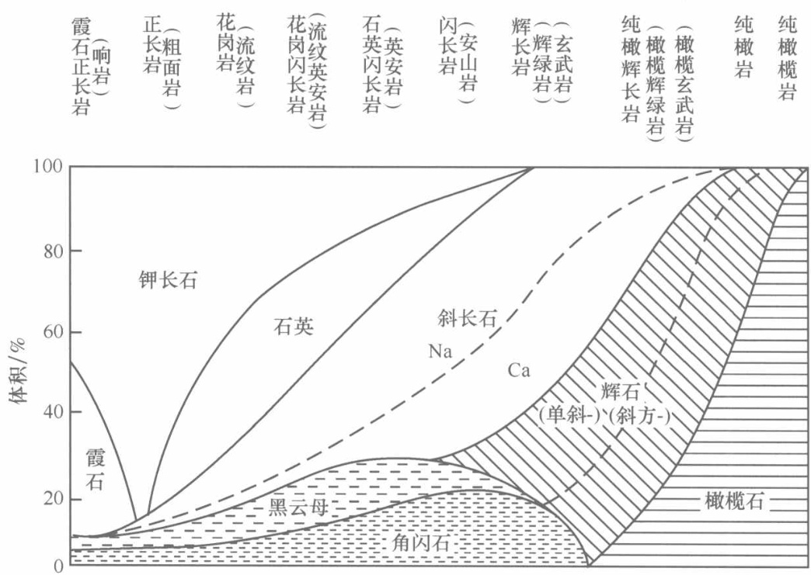
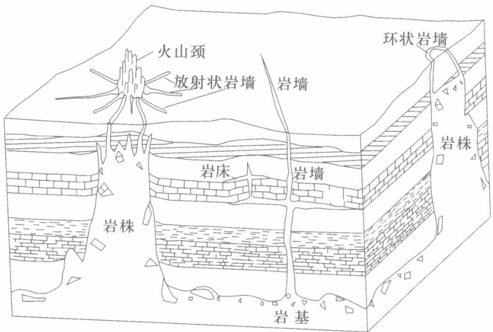
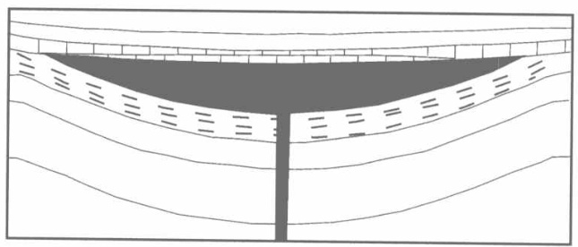
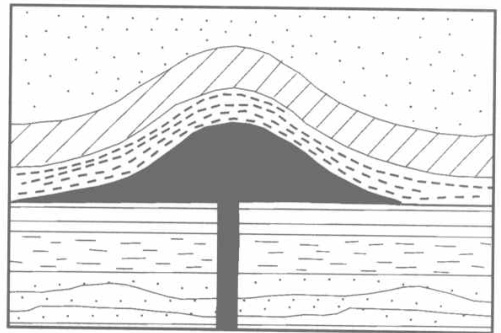
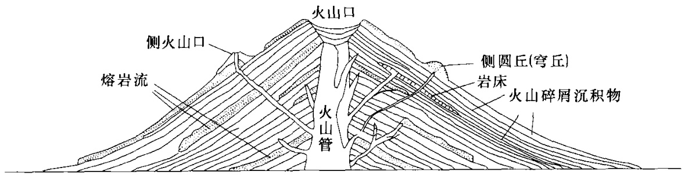

## 第一节 岩浆及其火成岩  

### 一、岩浆  

在地下深处，由上地幔或地壳部分熔融形成的、富含挥发分的高温黏稠的硅酸盐熔融体并常含有固体的混合物称为岩浆（magma）。其中的固体为鳗壳捕虏体和捕虏晶以及岩浆房中早晶出的矿物晶体。根据上述概念可以认为岩浆具有如下3个主要特点。  

（1）岩浆的成分主要是硅酸盐，以氧化物形式表示有： $\mathrm{SiO}_{2}$ 、 $\mathrm{Al}_{2}\mathrm{O}_{3}$ 、 $\mathrm{FeO}$ 、 $\mathrm{Fe_{2}O_{3}}$、 $\mathrm{MgO}$ 、 $\mathrm{CaO}$、 $\mathrm{Na}_{2}\mathrm{O}$ 、 $\mathrm{K}_{2}\mathrm{O}$ $\mathrm{H}_{2}\mathrm{O}$ 等，其中 $\mathrm{SiO}_{2}$ 质量分数最高，一般为 $40\%\sim75\%$ （碳酸盐岩浆除外)。  

此外，岩浆中含有丰富的挥发分和成矿金属元素，挥发分在岩浆中质量分数一般不超过$6\%$ ，其中 $70\%\sim90\%$ 为水蒸气，其次是 $\mathrm{CO}_{2}$ 、$\mathrm{CO}$、 $\mathrm{N}_{2}$ 、 ${\mathrm{SO}}_{2}$ 、 $\mathrm{S}_{4}$ 、 $\mathrm{H}_{2}\mathrm{S}$ 、 $\mathrm{HCl}$ 、 $\mathrm{H}_{2}$ 等。  

（2）岩浆的温度是“炽热的”，对现代火山喷发的熔岩流（岩浆）温度进行测量，得出其大致范围是 $800\sim1200\mathrm{{\Omega}}$ ，其中基性玄武岩浆温度最高（约为 $1020\sim1225\mathrm{{9C}}$ ）特别是拉斑玄武岩可达 $1150\sim1225\mathrm{{9}C}$ （Wright et al.，1968）。酸性流纹岩浆温度最低（约为780$\sim900\mathrm{{}C}$ )，中性安山岩浆温度中等，约为 $880\sim990\mathrm{\Omega}$ 。这种在地表直接测出的熔岩流温度仅为近似值，地下深处岩浆的温度，由于压力和水的作用，一般要比熔岩流温度略低。  

（3）岩浆的黏度总的说是“黏稠的”，但随着岩浆的成分、温度、压力、挥发分含量的变化，其黏度也有所变化。成分中 $\mathrm{SiO}_{2}$ 对岩浆黏度的影响最大，随 $\mathrm{SiO}_{2}$ 质量分数的增加，黏度增大，因此， $\mathrm{SiO}_{2}$ 质量分数较小的基性岩浆，其黏度较小，流速快，每小时可达十几千米；而富含 $\mathrm{SiO}_{2}$ 的酸性岩浆，黏度大，流速慢，有时1小时只流动几米，甚至不易察觉其流动。温度、压力对岩浆黏度的影响是，温度升高或压力降低黏度变小，反之，温度降低或压力升高黏度变大。此外，当岩浆中富含挥发分时，黏度变小。  

### 二、火成岩  

火成岩（igneous rock）是由岩浆在地下或喷出地表后，冷凝固结而成的岩石，又称岩浆岩，是组成地壳和上地慢的主要岩石类型。  

固结成火成岩的岩浆可以是原生的（即初始岩浆），也可以是派生的（亦称衍生岩浆）。原生岩浆（primary magma）是由上地慢物质部分熔融，或者是地壳物质全部或部分熔融而产生的初始岩浆。关于原生岩浆的种类，长期以来一直是一个争议的问题，但其数目是有限的，普遍公认的有玄武岩浆和花岗质岩浆。派生岩浆（derivative magma）则是原生岩浆通过各种作用，例如分离结晶作用、同化混染作用、混合作用等衍生出来的成分各异的岩浆，从而在地壳上人们看到了种类繁多的火成岩。  

根据产出的地质环境，火成岩一般分为火山岩和侵人岩两大类。  

（1）火山岩（volcanicrock）又称喷出岩（extrusiverock），是岩浆沿构造裂隙上升，经火山通道喷出地表而形成的岩石。其中由火山通道溢流出的熔浆（岩浆），冷却形成的岩石称火山熔岩（简称熔岩）；若从火山通道爆发出来的各种碎屑物堆积而成的岩石称火山碎屑岩。国际地科联火成岩分类委员会（以下简称IUGS）推荐的火成岩分类中，将火山碎屑岩另列一类，其分类中的火山岩仅指火山熔岩。本书采纳这种分类。  

（2）侵入岩（intrusiverock）是岩浆在地表以下不同深度的部位，冷凝而成的一种岩石。由于侵位深度不同，侵人岩又分为深成岩和浅成岩（详见第四节侵入岩的相）。一般人们认为岩浆在 $3~\mathrm{km}$ 以下，固结的岩石为深成岩，岩浆在 $3~\mathrm{km}$ 以上，又未达地表而固结的岩石为浅成岩。  

IUGS推荐的火成岩分类中，“深成岩”一词，被用来称谓“具显晶质结构的火成岩”；对那些比深成岩细的岩石（实际为浅成岩一笔者），则推荐在深成岩名称前加“微”，如微辉长岩（等于辉绿岩）。本书虽基本上采用IUGS 分类，但在侵人岩一章中，将主要的浅成岩类型列人，并按我国习惯用法命名。  

火成岩的如下特点，可区别于沉积岩和变质岩：  

（1）火成岩具某些特有的矿物如霞石、白榴石、方石等；（2）火成岩具一些特有的结构构造，如玻璃质和半晶质结构、熔蚀结构、暗化边结构以及气孔构造、杏仁构造等；（3）火成岩中不见任何化石；（4）火成岩体与围岩间的界线一般明显，多数情况下穿切围岩层理或片理（有时也见平行者)。岩体与围岩接触处，靠近岩体的一侧（内接触带）常见淬火（冷凝）边；而其围岩一侧（外接触带）常见烘拷边或遭受热变质。  

## 第二节 火成岩的物质成分  

### 一、火成岩的化学成分  

地球化学资料表明，火成岩中几乎含有地壳中所有的元素，但含量差别很大，一般包括主要元素和微量元素。其中主要元素含量最多，是构成火成岩的基本成分，称为造岩元素，它们是：O、Si、Al、Fe、 $\mathrm{Mg}$ 、Ca、Na、K、Ti等，其总和约占火成岩的 $99.25\%$ ；其次是 $\mathrm{P}$ 、 $\mathrm{H}$ 、 $\mathrm{Mn}$ 、$\mathrm{B}$等。氧含量最高，占火成岩的 $46.59\%$ ，因此，研究火成岩化学成分时，一般用氧化物的质量分数 ${\pmb w}_{\mathtt{B}}$ 表示。其中 $\mathrm{SiO}_{2}$ 、 $\mathrm{Al}_{2}\mathrm{O}_{3}$ 、 ${ F e}_{2}{ O}_{3}$ 、FeO、 $\mathrm{MgO}$ 、 $\mathrm{CaO}$ 、$\mathrm{K}_{2}\mathrm{O}$ 、 $\mathrm{Na}_{2}\mathrm{O}$ 、 $\mathrm{H}_{2}\mathrm{0}$ ，在各类岩石中均能出现，但不同的岩石，其含量存在差异（表1－1)。  

由表中可以看出， $\mathrm{SiO}_{2}$ 是最主要的氧化物，且变化范围大。因此，人们一般根据$\mathrm{SiO}_{2}$ 的质量分数将火成岩分为  

超基性岩 $w\left(\mathrm{SiO}_{2}\right)<45\%$ 基性岩 $w(\mathrm{SiO}_{2})45\%\sim52\%$ 中性岩 $w(\mathrm{SiO}_{2})52\%\sim63\%$ 酸性岩 $w\left(\mathrm{SiO}_{2}\right)>63\%$ （有人进一步分为：酸性岩 $63\%\sim75\%$ 超酸性岩 $>75\%$ ）  

表1－1火成岩中主要氧化物含量变化范围 $(w_{\mathtt{B}}/\%)$   

<html><body><table><tr><td></td><td>SiO2</td><td>Al, O3</td><td>MgO</td><td>CaO</td><td>∑FeO</td><td>Naz O</td><td>K20</td><td>H0</td><td>TiO2</td><td>MnO</td><td>Cr2 O3</td><td>Zr2 O3</td><td>P205</td></tr><tr><td>一般 范围</td><td>34~75 少数80</td><td>10~20</td><td>1~25</td><td>0~15</td><td>0.5~15</td><td>0~15</td><td><10</td><td>3~5</td><td>0~2 <5</td><td>0 ~0.3 <2</td><td>0~0.5</td><td>0 ~1 <5</td><td>0 ~0.5 <3</td></tr><tr><td>备注</td><td></td><td>纯橄榄 岩较低</td><td></td><td>某些辉 长岩达 23</td><td>一般 FeO > Fe2 O3</td><td>纯霞 石岩 19.48</td><td>白榴 石岩 17.98</td><td>火山玻 璃10</td><td></td><td></td><td>个别岩 石2~3</td><td></td><td></td></tr></table></body></html>

注：表中数据不包括碳酸岩。  

火成岩中各种氧化物含量随 ${\mathrm{SiO}}_{2}$ 质量分数的变化而有规律的变化。一般情况是，随 $\mathrm{Si}\mathrm{O}_{2}$ 质量分数的增加 $\mathrm{Mg0}$ 、$\mathrm{FeO}$ 质量分数逐渐减少，即基性岩-超基性岩中 $\mathrm{Mg}\mathrm{0}$ 、FeO含量高于酸性岩；反之， $\mathrm{K}_{2}\mathrm{O}$ 、 $\mathrm{Na}_{2}\mathrm{O}$ 随 $\mathrm{SiO}_{2}$ 质量分数的增加而增加，即对钙碱性岩来说，酸性岩中的 $\mathrm{K}_{2}\mathrm{O}$ 、$\mathrm{Na}_{2}\mathrm{O}$ 质量分数高于基性岩，而超基性岩中几乎无。 $\mathrm{CaO}$ 、 $\mathrm{Al}_{2}\mathrm{O}_{3}$ 则是从超基性岩到基性岩，随 $\mathrm{SiO}_{2}$ 质量分数的增加而增加，达最大值后，又随 $\mathrm{Si}\mathrm{O}_{2}$ 质量分数的增加而逐渐减少。  

火成岩中的微量元素有 $\mathrm{Li}$、$\mathrm{V}$、 $\mathrm{Gr}$ 、$\mathrm{Co}$、$\mathrm{Ni}$、$\mathrm{Yb}$、$\mathrm{Er}$ 等（地慢相容元素）和$\mathrm{Cs}$、$\mathrm{Rb}$、$\mathrm{Sr}$、$\mathrm{Y}$、$\mathrm{Zr}$、$\mathrm{K}$、$\mathrm{La}$、$\mathrm{Ba}$、$\mathrm{REE}$、 $\mathrm{Nb}$ 、$\mathrm{Ta}$、 $\mathrm{P}$ 、$\mathrm{Tb}$、$\mathrm{U}$、$\mathrm{Hf}$等（地鳗不相容元素）。微量元素质量分数很低，一般用 $10^{-6}$ 表示。火成岩中微量元素的研究，对探讨岩浆来源、构造环境以及岩石的成因等都起着重要作用。在研究中常采用微量元素比值（如 $\mathrm{Rb}/\mathrm{Sr}$ $\mathrm{N}\mathrm{a}/\mathrm{Ta}$ $\mathrm{K}\wedge\mathrm{B}\mathrm{a}$ 、 $\mathrm{La}/\mathrm{Tm}$ 、 $\mathrm{La}/\mathrm{Sm}$ 、 $\mathrm{Tb}/\mathrm{U}$ 等）、微量元素蛛网图、稀土配分图解等方式表示。  

此外，某些元素的同位素丰度，对研究岩浆的起源和演化很有意义。常被使用的放射性同位素有 $\mathrm{K}-\mathrm{Ar}$ $\mathrm{R}\mathrm{b}-\mathrm{S}\mathrm{r}$ $\mathrm{{Sm}-\mathrm{{Nd}}}$ 、$\mathrm{U}－\mathrm{Pb}$、$\mathrm{Tb}－\mathrm{Pb}$等，可用来确定岩石形成的年龄和探讨岩浆源区特征； ${^{87}}\mathsf{S r}/{^{86}}\mathsf{S r}$ 除确定岩石的年龄外，常用来判断花岗岩的成因（确定I型和 S 型)。稳定同位素常用的有 $^{18}0/{}^{16}0$ ${}^{34}\mathrm{S}/{}^{32}\mathrm{S}$ 等，可以判断岩浆冷却过程，也可指示某些岩石的成因类型（如花岗岩的I型和S型）。  

### 二、火成岩的矿物成分  

火成岩中常见的矿物约20余种，称为造岩矿物；而其中最主要的、对岩石分类起重要作用的矿物，不超过10种，称为主要造岩矿物，即橄榄石族、辉石族、角闪石族、云母族、长石族、石英和似长石·（霞石、白榴石等）。这些造岩矿物不但是火成岩分类和鉴定的基础，而且其组合及其变化，也是分析岩石成因的主要依据之一。  

在岩石鉴定工作中，人们常从不同的角度，将造岩矿物分成几种类型，如根据矿物的化学成分划分为铁镁矿物和硅铝矿物；根据矿物在火成岩中的含量及其在岩石分类中起的作用，分为主要矿物、次要矿物和副矿物；根据矿物在火成岩中的成因类型则分为原生矿物和次生矿物等。  

#### 1铁镁矿物和硅铝矿物  

铁镁矿物 $\mathrm{MgO}$ 、$\mathrm{FeO}$ 的质量分数较高，而 $\mathrm{SiO}_{2}$ 较低。其中包括橄榄石族、辉石族、角闪石族、黑云母等，其颜色较深，通常称暗色矿物。  

硅铝矿物 $\mathrm{SiO}_{2}$ 和 $\mathrm{Al}_{2}\mathrm{\mathrm{O}}_{3}$ 质量分数较高，不含镁、铁。其中包括石英、长石族（钾钠长石亚族、斜长石亚族）、似长石（霞石、白榴石等），这些矿物颜色浅，通常称浅色矿物。  

暗色矿物和浅色矿物在火成岩中的比例，是火成岩鉴定和分类的重要标志之一。暗色矿物在火成岩中的百分含量通常称“色率”或颜色指数（color index），用 $M^{\prime}$ 表示。在IUGS分类中根据 $M^{\prime}$ 可将岩石分为：浅色岩（0～35）、中色岩（35～65）、暗色岩（ $65\sim$ 90）和超镁铁质岩（ $(90\sim100)$ 。这里的 $M^{\prime}$ 是指上述的铁镁（暗色）矿物而不包括白云母、磷灰石、原生碳酸盐矿物、金属矿物等（详见IUGS 分类一节）。  

#### 2.主要矿物、次要矿物和副矿物  

主要矿物含量多，在岩石分类中起主要作用的矿物，如石英和碱性长石是花岗岩的主要矿物；又如橄榄石或辉石是超镁铁质岩的主要矿物。  

次要矿物含量次于主要矿物，对划分岩石大类不起主要作用，但对确定岩石种属起一定作用。如石英在闪长岩中可以出现，但量不多，为次要矿物，该岩石命名时称含石英闪长岩或石英闪长岩。  

副矿物含量很少，一般 $<1\%$ ，常见的如磷灰石、磁铁矿、石、锆石等。副矿物一般不参予命名。  

#### 3.原生矿物和次生矿物  

原生矿物岩浆冷凝过程中形成的矿物。根据生成环境，又进一步分为高温型（见于火山岩）和低温型。岩浆完全结晶后，由于物理化学条件（温度、压力）的变化，使原生矿物发生转变，新生成的矿物叫成岩矿物，如高温 $\beta$ -石英转变为低温 $\alpha$ -石英；透长石转变为正长石等；又如钾钠长石分解成条纹长石。其中的 $\alpha$ -石英、正长石、条纹长石称为成岩矿物。  

次生矿物为岩浆期后矿物，岩浆固结成岩后，由于残余挥发分和岩浆期后热液流体的作用（蚀变、交代作用）而形成的矿物。它往往交代原生矿物或充填于裂隙、孔洞中。次生矿物包括气成矿物（如电气石、萤石、黄玉）和蚀变矿物，如斜长石蚀变为钠长石、帘石集合体（称钠帘石化)；橄榄石蚀变为蛇纹石（蛇纹石化)；黑云母蚀变为绿泥石（绿泥石化）等。需注意次生矿物与表生矿物的区别，后者仅出现于风化带内。  

#### 4.矿物共生组合及其与化学成分的关系  

火成岩中的矿物共生有一定的规律性，此规律性除决定于矿物形成时的温度、压力条件外，主要决定于岩石的化学成分，其中最主要的是 $\mathrm{Si}0_{2}$ ，其次为 $\mathrm{K}_{2}\mathrm{O}$ $\mathrm{Na}_{2}\mathrm{0}$ 的质量分数。  

(1) ${\mathrm{SiO}}_{2}$ 的质量分数在火成岩中 $\mathrm{SiO}_{2}$ 与其他金属氧化物结合，可形成各类硅酸盐矿物，当 $\mathrm{SiO}_{2}$ 质量分数过剩时， $\mathrm{SiO}_{2}$ 就会在硅酸盐熔体中游离出来，并结晶成石英，因此，石英的出现表明该火成岩中的 $\mathrm{SiO}_{2}$ 过饱和。当 $\mathrm{SiO}_{2}$ 质量分数不足（不饱和）时，有两种情况，若熔浆成分富镁铁，岩石中就会出现镁橄榄石，它与石英不共生，因为镁橄榄石形成后，熔浆中有多余的 $\mathrm{SiO}_{2}$ 时，其二者会反应形成顽火辉石：  

$$
\mathrm{Mg}_{2}\mathrm{SiO}_{4}+\mathrm{SiO}_{2}\longrightarrow2\mathrm{MgSiO}_{3}
$$
因此，我们在薄片中常会见到橄榄石周围产生的斜方辉石反应边；若熔浆成分富钾钠，岩4  

石中就会生成霞石或白榴石，它们与石英不共生，因为霞石或白榴石形成后，熔浆中有多余的 $\mathrm{SiO}_{2}$ 时，其二者会与 ${\mathrm{SiO}}_{2}$ （液相）反应，分别形成钠长石和正长石：  

$\mathrm{NaAlSiO_{4}+2S i O_{2}\longrightarrow N a A l S i_{3}O_{8}}$ 霞石 (液相) 钠长石 KAlSiO4 + 2 SiO2 KAISi ${\mathrm{O}}_{8}$ 白榴石 (液相） 正长石  

霞石、白榴石等这些与石英不共生的、富K、Na的硅酸盐矿物统称似长石（IUGS分类中称副长石）。  

火成岩中凡可以与石英共生的矿物称 $\mathrm{SiO}_{2}$ 饱和矿物（或硅酸饱和矿物），如辉石族、角闪石族、长石族、云母族等；凡不与石英共生的矿物称 $\mathrm{SiO}_{2}$ 不饱和矿物（或硅酸不饱和矿物），如上述的似长石、镁橄榄石和黄长石、黑榴石等。  

正如上节所指出的，火成岩中各主要氧化物随 ${\mathrm{SiO}}_{2}$ 质量分数地变化而有规律地变化，因此，从超基性岩到酸性岩，随 $\mathrm{SiO}_{2}$ 质量分数的增加，暗色矿物由多到少，且种类由橄榄石、辉石到角闪石、黑云母；浅色矿物则由少（或无）到多，且种类由富Ca向富Na、K、Si的方向变化，如图1-1所示。  

  
图1-1 火成岩矿物变化简图（据AdamsLH，1956）  

（2）碱质含量主要为 $\mathrm{Na}_{2}\mathrm{O}$ $\mathrm{K}_{2}\mathrm{O}$ 的质量分数，根据二者与 $\mathrm{SiO}_{2}$ 之间的关系，里特曼（1957）曾提出一个表示岩石碱性程度的公式  

$$
\sigma=\frac{\{[w(\mathrm{Na}_{2}0)]_{\mathcal{H}}+[w(\mathrm{K}_{2}0)]_{\mathcal{H}}\}^{2}}{[w(\mathrm{SiO}_{2})]_{\mathcal{H}}-43},
$$  

称为里特曼指数（组合指数）。当 $\sigma<3,3$ 时，称钙碱性系列； $\sigma=3.3\sim9$ 时，称碱性系列； $\sigma>9$ 时，称过碱性系列。不同系列的岩石，其矿物组合特点不同：  

过碱性系列岩石中，常出现的浅色矿物为碱性长石（钠长石、歪长石、正长石、微  

斜长石等)、似长石而不含石英。常见的暗色矿物是碱性暗色矿物，如富钠的霓石、霓辉石、钠闪石、钠铁闪石、红钠闪石、棕闪石和富钛的辉石等，而不见斜方辉石。此外，黑榴石在该系列岩石中为常见矿物。  

碱性系列岩石中，经常见到的矿物为碱性长石和碱性暗色矿物，除钠长石外的其他斜长石以及石英或似长石（注意后二者不共生！）可以出现，但量不多，黑榴石较常见。  

钙碱性系列岩石中，不出现似长石、黑榴石，也不见碱性暗色矿物，辉石类矿物主要为普通辉石、透辉石和斜方辉石等，角闪石类矿物则以普通角闪石为主。  

## 第三节 火成岩的结构构造  

### 一、火成岩的结构  

结构一般是指岩石中矿物的结晶程度、矿物的形态、大小及矿物间的相互关系。  

#### （一）结晶程度  

根据岩石中结晶的部分和非晶质（玻璃质）部分的比例关系分为：  

全晶质结构（holocrystalline texture）岩石全由结晶的矿物组成，反映矿物结晶是在岩浆缓慢冷却条件下形成的，见于深成和部分浅成侵入体。  

半晶质结构（hypocrystalline texture） 岩石由部分晶体和部分玻璃质组成，见于火山熔岩和部分浅成侵人体。  

玻璃质结构（vitreous texture）岩石几乎全由火山玻璃组成，反映矿物结晶是在岩浆迅速冷却条件下形成，见于火山熔岩和部分浅成的、超浅成岩体边部（淬火边）。玻璃质不稳定，常见脱玻化现象，初期生成一些形态各异的雏晶（crystallite），如羽状、枝状、毛发状、针状、串珠状，进一步可发展为放射状球雏晶（沿着辉石等近等轴状矿物的结晶中心生长）或椭圆形分裂球雏晶，深海海底玄武岩、安山玄武岩中常见这两种球雏晶。雏晶是开始晶出的晶芽，还不具备结晶物质的特征，正交偏光间，无明显光性。雏晶进一步可形成微晶、骸晶，甚至发展为霏细结构、球粒结构，后二者可以是脱玻化形成，也可以是岩浆快速冷却形成。  

霏细结构（felsitictexture）由粒径 $<0.02\mathrm{mm}$ 的极细小的长英质纤维等结晶质及部分分散的玻璃质组成，颗粒无晶面和晶棱，显微镜下也难区分矿物界线，常见于酸性火山熔岩中。  

球粒结构（spherulitic texture）由长英质和火山玻璃组成的纤维放射状丛生的球状形成物，构成球粒结构，纤维大多数为负延性，正交偏光间常呈黑十字形消光。球粒形态随结晶温度的降低由扇状、束状变化到圆球状。球粒核心有时包含早期晶出的小晶体。由于球粒发育程度不同，其大小、内部结构也有所不同，发育初期仅由纤维放射状小球构成；球粒进一步发育明显出现分带性，最初内部以隐晶质团粒为核心，外部由放射状或同心圆状长英质连晶环绕；再发展球粒则由多层放射状纤维组成。根据结晶程度和大小，可将球粒分为微球粒（microspherolite）和隐球粒，前者纤维个体较清晰，后者不易分清。球粒成因有两种，一种为原生的，即岩浆由过冷却所形成的球粒，这些球粒本身可构成流纹构造，也可被流纹构造环绕，球粒之间和外围呈霏细结构或显微文象结构；另一种为次生的，由脱玻化所形成，常切割流纹构造，其球粒间多被玻璃质所充填。当长英质纤维体围绕一直线或曲线呈羽状、放射状生长时，构成轴粒结构（axiolithic texture），它是球粒结构的初期产物。上述两种结构常见于酸性火山熔岩和部分浅成岩中。由斜长石、辉石纤维放射状、束状集合体组成的球粒，称球颗结构（variolitic texture），产于较基性的火山熔岩中，部分石陨石中亦可见。  

#### （二）矿物的颗粒大小  

包括矿物的绝对大小和相对大小。  

##### 1.矿物的绝对大小  

根据矿物晶粒直径 $(d)$ 划分为：  

显晶质结构（phanerocrystalline texture） 是指肉眼或放大镜下可分辨矿物晶体晶粒的结构。又分为：  

粗粒结构（coarse grained texture） $d>5{\mathrm{~mm}}$ 中粒结构（medium grained texture） $d=2\sim5~\mathrm{mm}$ 细粒结构（fine grained texture） $d=0.2\sim2\mathrm{mm}$ 微粒结构（microgranular texture） $d<0.2\mathrm{mm}$  

粒度很大的矿物称巨晶、伟晶，一般认为其粒径 $(d){}>10\:\mathrm{mm},$  

隐晶质结构（cryptocrystalline texture）是指肉眼或放大镜下无法分辨矿物晶体晶粒的结构。又分为：  

显微晶质结构（microcrystalline texture） 只能在显微镜下鉴别矿物单晶颗粒。粒径一般在 $0.2\sim0.001\mathrm{mm}$ 区间。  

显微隐晶质结构（microcryptocrystalline texture） 在普通显微镜下无法分辨单晶颗粒。  

##### 2.矿物的相对大小  

根据主要矿物颗粒大小是否相等，分为：  

等粒结构（equigranular texture）岩石中几种主要矿物颗粒大小基本相等。  

不等粒结构（inequigranular texture）岩石中几种主要矿物（特别是同种矿物）颗粒大小不等。  

斑状和似斑状结构（porphyriticandporphyraceous texture）岩石中的矿物颗粒大小截然不同，明显分为两群，大者称斑晶，小者称基质，没有中间大小的颗粒，以此可与不等粒结构相区别。当基质矿物为微粒结构、隐晶质或玻璃质，即不超过细粒级（主要矿物粒径 $<0.2~\mathrm{mm}$ ）时，称斑状结构；若基质矿物为显晶质（通常为中-细粒，有时为粗粒），称似斑状结构。  

斑状结构在火山熔岩和浅成岩中常见，其斑晶和基质分属两个世代，在岩石形成过程中，由于物化条件的改变，斑晶常出现如下结构：  

熔蚀结构（resorption texture）斑晶被周围还未结晶的熔浆熔蚀而呈浑圆状、港湾状等各种形态。石英的熔蚀结构最常见。  

熔蚀麻点结构（resorption pitted texture）熔岩中一些斑晶如长石、辉石等晶体，受熔蚀后又急速冷却，形成许多玻璃质和黑色铁质的麻点，沿矿物的解理和裂纹杂乱分布。该结构在中、基性火山熔岩中常见o  

暗化边结构（opacite border texture）角闪石、黑云母等暗色矿物斑晶周围，环绕一圈由隐晶质的磁铁矿、橄榄石、辉石等颗粒的混合物组成的暗色反应边，该结构在中性火山熔岩，特别是安山岩中常见。  

似斑状结构的斑晶和基质的矿物成分基本相同，它们是在相同或儿乎相同的条件下形成。常见于中酸性侵人岩中。似斑状结构也可以是交代成因，一般称之为交代斑状结构，常见于混染岩或长石化的岩石中。  

#### （三）矿物的自形程度  

自形晶（euhedralcrystal）矿物晶粒具有完整的晶面，显微镜下呈规则的多边形。半自形晶（hypidiomorphic crystal）岩石中某些矿物晶粒的某些晶面、晶棱，发育较完整，而另一些晶面、晶棱则发育不完全。  

他形晶（xenomorphic crystal） 矿物晶粒无一完整的晶面，显微镜下形状不规则。  

#### （四）矿物颗粒间的相互关系  

文象结构（graphic texture）一种矿物呈一定的外形（楔形、象形文字状等），有规律地镶嵌在另一矿物中，其中的嵌晶在相当大的范围内同时消光（照片3－83，174）。肉眼可见者称文象结构；只有在显微镜下才可见到者称显微文象结构（micrographic tex-ture）。钾长石和石英构成的文象结构（包括显微文象结构，以下同）最常见，见于伟晶岩、部分花岗岩、花岗斑岩中（照片3－124，128，164，174）。此外，透辉石-镁橄榄石、橄榄石-尖晶石（照片3－23）、云母-石英、角闪石-石英（照片 $3-125\sim127)$ 、钛铁矿-透辉石（照片3－47）等，也可构成文象结构。  

蠕虫结构（myrmekite texture）一种矿物呈蠕虫状、乳滴状或花瓣状，穿插生长在另一矿物中（往往首先从边部开始）且它们多具同一消光位。最常见的是石英在长石（多为斜长石）中呈蠕虫状嵌晶，故有蠕英石之称（照片3－120，123，130）。其次，白云母中可见长石或石英的蠕虫交生；黑云母中见长石或其他矿物的蠕虫交生以及斜方辉石中磁铁矿的蠕虫交生（照片6－87）等。  

条纹长石和反条纹长石结构（perthitic and antiperthitic texture）指钾长石和斜长石（通常是钠长石）有规律的条纹交生。当主晶为钾长石而客晶条纹为斜长石（钠长石为主）时，称条纹长石结构。反之，当主晶为斜长石（钠长石为主)而客晶为钾长石时，称反条纹长石结构。条纹形态多种多样（常丽华，陈曼云等，2006），同一主晶中的条纹同时消光。在中-酸性和碱性火成岩（包括紫苏花岗岩类）中常见。  

反应边结构（reaction rim texture）早结晶的矿物与熔浆反应，当反应不彻底时，在早晶出的矿物外围有新生矿物出现，完全或部分包围了早生成的矿物。常见的是橄榄石外围的斜方辉石的反应边；单斜辉石外的角闪石反应边；甚至出现橄榄石外的辉石反应边，向外又见角闪石反应边。中-基性火成岩特别是辉长岩中常见。  

环带结构（zonal texture）具类质同象的同一类矿物，在单偏光镜下为一个晶体外形，由于晶体成长时物化条件的改变，其颜色（对有色矿物而言）、干涉色、消光呈现出环带状的特点。最常见的是斜长石的环带结构。霓石-透辉石、钾长石、角闪石、钙铁榴石-钛榴石等亦较常见。环带结构多见于浅成岩或火山熔岩中。  

包含结构（poikilitic texture）在一种较大的矿物晶体中包嵌了许多小的矿物颗粒。此结构表明，被包矿物的结晶早于包嵌它的矿物（照片3－4）。在橄榄岩、橄长岩等岩石中，可见橄榄石熔蚀呈浑圆状被包嵌在辉石、角闪石、斜长石大晶体中，称之为包橄结构(poikilitic olivine texture) 。  

以上所述仅是火成岩的一般结构，在以后的主要岩石类型描述中都有可能涉及其中的某些结构，对此，在以后的描述中一般不再一一加以解释（除个别需要说明者外）。而对那些不同类型的火成岩所特有的结构，将在各有关岩石类型中阐述。  

### 二、火成岩的构造  

构造是指岩石中不同矿物集合体之间或集合体与岩石其他组成部分之间的排列方式、充填方式及其表现形式等特征。  

块状构造（massive structure） 组成岩石的矿物和结构构造都显示均一性的特点，是分布最广的一种构造。  

斑杂构造（taxitic structure）岩石的不同部位，其矿物成分、结构构造差别很大,因此整个岩石呈现不均一性。这是由于同化混染作用或岩浆多次脉冲侵人造成的。常见于中-酸性侵人岩及其边缘带。  

流动构造（fluxion structure）岩浆在流动过程中所产生的构造，包括流面构造、流线构造。岩石中片状、板状矿物和扁平捕虏体的平行排列，构成流面构造；而柱状矿物、长捕虏体的定向排列，构成流线构造。流面与围岩接触面平行，流线与岩浆流动方向一致。它们往往发育于侵人岩体的顶部或边部。  

原生片麻状构造（primary igneous gneiss structure）在岩体的边部或岩体内某些部位，暗色矿物与浅色矿物断续定向相间排列，构成原生片麻状构造。该构造是流动的岩浆对围岩强烈挤压形成，比较少见，主要见于中-酸性侵人岩中。  

带状构造（banded structure）暗色和浅色矿物或粗粒和细粒矿物，各自相对聚集,排列成条带状，条带之间彼此平行。主要见于基性-超基性岩体中。  

球状构造（orbicular structure）岩体中分布有球状或椭球状体，每个球体中的矿物围绕中心呈同心层状或放射状分布，构成球状构造。仅见于辉长岩、花岗岩中。  

晶洞和晶簇构造（mlarolitic and druse structure）侵入岩中出现的原生含晶体的孔洞称晶洞构造；当孔洞壁上垂直生长着完好的晶体时，构成晶簇（或晶腺）构造。晶洞内的矿物生成温度低于岩体。  

气孔构造（vesicular structure）这是火山熔岩常见的构造。熔浆喷出地表快速冷凝时，由于压力突然降低，气体从中逸出，从而形成大小不等的孔洞，构成气孔构造。气孔多见于熔岩层顶部，并可指示熔岩流动方向。气孔的形态各异，以圆形、椭圆形为主也常见管状、不规则状、乳滴状等。气孔多时彼此相连，呈蜂窝状的可定为熔渣状构造（scoriaceous struc-ture)。  

杏仁构造（amygdaloidal structure）是火山熔岩更常见的构造。当气孔被次生矿物充填时称杏仁构造，常见的次生矿物有玉髓、蛋白石、石英、玛瑙、方解石、沸石类矿物、绿泥石、皂石、绿脱石和绿鳞石等。杏仁的形态各异，有圆形、椭圆形等和不规则状等。杏仁体内部呈同心圆状、皮壳状、犬牙状、放射状、钟乳状等，且常具分层性，它们或由不同的矿物组成不同的层，或为同种矿物结晶程度不同而出现分层，一般杏仁体中心结晶程度较好。  

流纹构造（rhyolitic structure）是酸性熔岩常见的一种构造。由不同颜色、不同成分（常为石英、长石）的条带、条纹相间构成；也可以是雏晶、球粒、拉长的气孔与上述条带、条纹相间构成等。流纹构造可指示熔浆流动方向。其条带、条纹具有较好的连续性且很自然地绕过斑晶，以此区别于熔结凝灰岩的假流动构造。流纹构造也见于粗面岩、英安岩中。在一些浅成、超浅成岩石中有时也可见到。  

柱状节理构造（columnar joint structure）由于熔浆均匀冷缩，产生张应力裂隙，将熔岩分割成多边形柱状体。柱状体垂直熔岩或岩墙脉壁的冷却面，其横断面以六边形为主，亦见五边形、四边形者。柱状节理多见于玄武岩，在中-酸性熔岩、熔结凝灰岩、次火山岩、基性岩脉中均可见到。  

枕状构造（pillow structure）是熔浆自海底溢出或从陆地流人海中时，由于淬冷而形成球状、椭球状、面包状等的枕状体，它们被火山碎屑或沉积物胶结，构成枕状构造（照片1－15）。枕状体常具玻璃质外壳（冷凝边），其内部可见呈同心层状或放射状分布的气孔。该构造常见于海相基性熔岩中，个别见于中-酸性熔岩。通常被认为是海相火山岩的标志，但有时在湖相、河相中也可见到。因此，说它是“水下火山岩的标志之一”更为确切。  

## 第四节 火成岩的产状和相  

由于火山岩和侵人岩产生的地质环境不同，其产状和相的特征有较大的差别，现分述如下。  

### 一、侵入岩的产状和相  

#### （一）侵入岩的产状  

是指岩体的形态大小、与围岩的关系及侵入时所处的构造环境。根据侵人岩与围岩的关系将其产状分为整合侵入体和不整合侵入体；根据侵入岩的形态、大小将其产状又可分为岩床、岩盆、岩盖、岩脉、岩墙、岩株、岩基等。  

##### 1.整合侵入体  

整合侵入体（concordance intrusivebody）的接触面与围岩层理或片理基本平行，表明岩浆是沿围岩层理或片理贯人形成的。包括：  

岩床（sill）又称岩席（sheet），岩浆沿围岩层面流动散开，构成厚度较均匀的、近水平的板状侵入体（图1－2，1－5）。岩床厚度小而面积大为其特征。基性-超基性侵人体常见该产状。  

  
图1－2侵人体某些产状立体示意图（据WinterJD.，2001）  

岩盆（lopolith）岩体在岩层间呈中央微下凹的盆状（图1－3），侵人于构造盆地中。岩盆大小不一，巨大的岩盆多为基性-超基性岩体。  

岩盖（laccolith）又称岩盘，是顶部凸起而底部平坦的穹状侵入体（图1－4）。中-酸性岩体称岩盖；对基性-超基性岩体人们常称之为岩盘。  

  
图1－3侵人于构造盆地中的岩盆（据WinterJD.，2001）  

  
图1-4上部凸起底部平坦的岩盖（据WinterJD.，2001）  

岩鞍（phacolith） 又称岩脊，产于强褶皱区，呈透镜状侵人于褶皱轴的核部。规模一般不大。  

##### 2.不整合侵入体  

不整合侵入体（discordance intrusive body）的接触面与围岩层理或片理近垂直或斜交。表明岩浆是沿斜交层理（或片理）的裂隙、断裂贯人的。  

岩墙（dike）是一种厚度较稳定，且近于直立的板状侵入体，其长、宽比，从几十倍到数千倍。规模大小不一。在一个地区，岩墙往往呈群产出（岩墙群），它们经常呈环状、放射状、弧形排列。如图1-2 火山颈周围分布的放射状岩墙群。  

岩株（stock）又称岩干，是一种平面上近圆形或不规则状、接触面陡立，呈树干状延伸的不整合侵入体（图1－2）。规模较大，但其出露面积 $<100~\mathrm{km}^{2}$ 。岩株的边部常有一些枝权状岩体插人围岩中称岩枝（apophysis）。若岩体呈镰刀状贯人围岩中称岩镰(harpolith) 。  

岩基（batholith）平面上多为长圆形，剖面上常呈穹窿状、漏斗状的巨大侵人体（图1-2），面积一般 $>100~\mathrm{km}^{2}$ 。主要分布于褶皱区的隆起带中，常受深大断裂控制，延伸方向多与褶皱轴一致。  

岩脉（vein）形态不规则的小侵人体，多呈脉络状。有人将岩墙、岩床窄而长的小侵人体统称为岩脉，可以是整合的也可以是不整体侵入体。  

#### （二）侵入岩的相  

是指不同的地质条件下岩体总的特征。根据岩体侵位时的深度可将岩体划分为3个相。  

浅成相（epizone）包括超浅成相，侵位深度为0（有人提出1.5） $\sim3\mathrm{km}$ 。多为小岩体，呈岩墙、岩床、岩盖、小岩株等产出，也可见隐爆角砾岩。由于侵位浅，冷却速度快，常见细粒结构、细斑状结构、隐晶质结构以及熔蚀结构、暗化边结构、环带结构，有时见晶洞构造、角砾构造等。此外，常见一些高温矿物如 $\beta$ -石英、透长石。金属矿物往往与浅成相小侵人体关系密切。  

中深成相（mesozone）侵位深度为 $3\sim10~\mathrm{km}$ 。多为较大侵人体，呈岩株、岩基或岩盖、岩盆、大岩墙。由于侵位较深，冷却速度慢，常见中-粗粒结构、似斑状结构，而环带结构少见。一般不见高温矿物。接触变质带较宽，常见矽卡岩带和一些高温热液金属矿床。  

深成相（catazone）侵位深度 $>10~\mathrm{km}$ 。岩体大，常呈大的岩基产出。主要分布于构造活动强烈地区，岩体走向与区域构造线方向一致。均为低温矿物，斜长石无环带，常见条纹长石、微斜长石。主要为花岗质岩石，可见片麻状构造。一般不存在冷凝边。  

上述的“深成相”有人认为属于花岗岩化范畴。因此，无论在岩石分类命名中，还是在具体工作中，经常将侵人岩实际上划分为两个相：浅成相和深成相，这里的“深成相”是指上述的中深成相（mesozone）。  

同一侵人体，特别是中深成（深成）侵入体，其岩体边部和内部的冷却条件、受混染程度是有所不同的，反映在矿物成分和结构上有一定的差异，往往环岩体呈带状表现。因此，人们将侵入体由外向内分为3个相：边缘相、过渡相和内部相。  

### 二、火山岩的产状和相  

#### （一）火山岩的产状  

火山岩的产状主要与岩浆上升到地表的喷发方式（即喷发类型）有关，方式不同，其产状有所不同。  

##### 1.火山岩的喷发类型  

常见的喷发类型有3种，即中心式喷发、裂隙式喷发（有时还见中心-裂隙式喷发)  

和蚀顶喷溢。  

蚀顶喷溢（deroofing eruption）又称区域喷溢，是一种古老的火山活动方式，现代火山活动已无此类型。戴利等认为，侵人上升的岩浆，由于过热和高化学能，将顶部围岩熔透，广泛溢出地表而形成，分布面积大，并提出美国黄石公园大面积分布的流纹岩属该类型，但以后被证实上述流纹岩并非此类。久野久（1978）则认为日本的纪伊半岛的花岗斑岩更类似这种喷发方式。总之这种喷发方式即使现代还存在，也很少见。因此目前多数学者认为火山喷发类型主要为裂隙式喷发和中心式喷发。  

裂隙式喷发（fissureeruptions）岩浆沿大断裂（裂隙）成线状喷发，火山口多呈串珠状排列。产状常为熔岩被、熔岩流、熔岩高原或熔岩台地等，分布面积大。以溢流为主，火山碎屑岩少见。我国河北汉诺坝玄武岩、峨眉山玄武岩以及黑龙江五大连池黑山的玄武质熔岩台地属此类型；东非埃塞俄比亚裂谷系两侧沿裂隙喷发形成玄武质熔岩高原，覆盖了埃塞俄比亚全部面积的2/3。在地球历史上这类喷发很常见，而现代火山喷发中，此类型只有冰岛还可见到。  

中心式喷发（central-vent eruptions）是指岩浆沿一定的颈状管道喷发，平面上表现为点状，故又称之为点状喷发，是现代火山活动的主要形式。其喷发的特点是形成火山锥。  

火山i锥(volcanic cone)  

火山锥是火山喷出物在火山口周围堆积成的山丘。根据火山喷发形式及其组成物质的不同，进一步分为3种类型，碎屑锥、熔岩锥和复合锥。碎屑锥（fragment cone）亦称火山渣锥（cinder cone），其喷发形式以爆发为主，主要由火山碎屑组成，其含量约为 $95\%$ 其成分多为玄武质和安山质，锥体较陡， $30^{\circ}$ 左右，如新疆于田由火山渣组成的碎屑锥；当以宁静式喷发为主时，形成熔岩锥（lava cone）或称熔岩穹丘，即主要由熔岩组成，而火山碎屑物则 $<10\%$ ，其形态受熔岩性质影响：易流动的基性熔岩流多形成坡度小的盾形火山；黏度大的酸性熔岩流多聚集于火山口，形成穹窿状火山丘。如云南腾冲可见由玄武质熔岩流组成的盾形熔岩锥；复合锥（mixedcone）又称混合锥，以爆发式和宁静式相间喷发为其特点，形成火山碎屑物与熔岩互层的混合锥，其成层性明显，又称层火山（图1$-5)$ ，日本富士山、我国吉林省长白山等属此类。  

  
图1-5层火山（混合锥）剖面图（据WinterJD.，2001）  

火山口（crater）是火山喷发时岩浆或火山碎屑物喷出地表的通道口，根据火山口分布特点，进一步分为3类：喷发火山口，位于圆锥状火山锥顶部的火山口，火山口直径一般为 $200\textrm{m}$ ，但不超过 $1000\textrm{m}$ ，位于火山锥侧面者，称为寄生火山口（侧火口)；爆炸火山口，为马尔式低平的小火山口，其底部可能为金伯利岩筒；破火山口，即沉降火山口，由于岩浆大量喷溢，或发生猛烈爆炸，使岩浆房萎缩，再加上上覆堆积物的重量，使火山口向下凹陷，形成一漏斗状或锅形洼地，故称破火山口（照片1－7)。其直径 $>3000$ mo  

火山口湖（crater lake）当火山口或破火山口内大量积水时，构成火山口湖（火口湖）。长白山主峰白头山是叠置在玄武岩盾状火山锥上的复式火山锥，其顶部有一巨大的破火山口湖一天池（面积约 $9.8~\mathrm{km}^{2}$ ），如照片1一8所示。  

##### 2.中心式喷发形成的主要火山类型  

中心式喷发形成的火山类型一般常见的有盾形火山、穹状火山、复合火山和马尔式火山  

盾形火山（shieldvolcano）火山表面平坦，坡度角小，不超过 $10^{\circ}$ 。火山外形似盾牌故得名。火山主要由易流动的玄武岩浆冷凝堆积而成。  

渣火山(pyroclastic volcano) 坡度角大，一般 $30^{\circ}$ 左右。主要由基性碎屑（火山渣、火山弹）组成。截面圆形。  

穹状火山（dome-shaped volcano）火山锥外形呈穹窿状，主要由黏度大的酸性熔岩构成，内部可见流动构造。  

层火山（stratovolcano）又称复合火山（compositevolcano）由复合火山锥形成的火山，其成层性明显，主要由中-基性少量酸性火山碎屑物和熔岩相互成层堆积而成。常形成大型火山。  

马尔式火山（maarvolcano）为蒸气岩浆喷发（phreatomagmatic eruption）产物，即指炽热的岩浆在上升过程中与地下水（或地表水）相遇发生爆炸而形成的火山。其典型标志是在地表形成圆形或近圆形低平火山口并有基浪堆积物环绕于周围。火山口底部常低于潜水面，往往形成火山口湖，被称之为马尔湖。近年来在北美、日本、西欧、韩国以及我国（吉林龙岗、广西洲）等地都有报导。对马尔湖成因机理的研究不仅为预防火山灾害提供了重要信息，而且其堆积物可反映高分辨率的古气候和古环境。  

##### 3.熔岩流及其在地表的常见形态  

熔岩流（lava flow）是岩浆从火山口或溢出口（裂隙）流出，沿地形流动、固结而成的熔岩。根据熔岩形成后的表面特征，熔岩流可分为两种主要类型，一为绳状熔岩，二为渣状熔岩。  

绳状熔岩（pahoehoe lava）有人译为结壳熔岩。熔岩具有淬火玻璃外壳，表面光滑，表明熔岩流表层未破碎，以此区别于渣状熔岩。常见的有绳状熔岩、波状熔岩（wavylava）和板状熔岩（slab lava）（照片1－17）等，其中绳状熔岩最常见，它是黏度小、流动性大的基性熔岩流，在地形平缓的地区流动所形成的熔岩，其形态类似绳索盘绕或呈波浪起伏状。在黑龙江五大连池可见较大面积的绳状熔岩（照片 $1-18\sim20)$ ，同时还可见这些流动性大的熔岩流遇到较陡的地形时，所形成的熔岩瀑布或象鼻状熔岩。  

渣状熔岩（aalava）巨厚的熔岩流在流动过程中，已冷凝的表层被破碎，造成表面凹凸不平，布满渣块、气孔等，这是近火山口处的熔浆和构造多次活动的结果，五大连池的翻花熔岩（flowerlava）和块状熔岩（blocklava）属此类型。二者区别是前者碎块不规则，呈翻花状（照片1－21），表明此时构造活动频繁；后者碎块较规则，呈块状（照片14  

1-22)。  

除此之外，根据熔岩形态还常见石龙熔岩、木排状熔岩（照片1－23）等，其中石龙熔岩（stone dragon lava）是五大连池火山区以形态命名的熔岩，熔岩呈长龙状分布，绳状熔岩和渣状熔岩均存在。以上所述为陆地常见熔岩类型。水下常见类型主要为枕状熔岩（pillowlava），具枕状构造，多呈椭球状、枕状外形（详见“枕状构造”描述，照片1-15)。  

火山活动晚期，熔岩流表面凝固，而其内部仍有熔浆活动，此时若它们遇到水体就会产生大量气体，当这些含大量气体的熔浆达一定压力时，就会沿裂隙喷出地表。经多次喷溢，形成熔岩喷气锥（fumarolic cone-in-cone）。一个锥常由几十层熔岩饼叠加，构成熔岩喷气叠锥。五大连池可见此现象（照片1－24）。  

#### （二）火山岩的相  

由于火山作用而产生的不同火山岩特征称火山岩相。火山岩相的研究对恢复古火山机构、提高填图质量、促进找矿等有实际意义。相的分类通常是按火山活动产物的产出形态及岩石特征划分。常见的火山岩相包括喷发（或喷出）相、火山通道相、次（潜）火山岩相和火山-沉积相。其中喷发（喷出）相又进一步分为溢流相、爆发相和侵出相。  

##### 1.火山喷发（喷出）相（volcanic eruption facies）  

溢流相（effusion facies）是岩相中最常见的一种。熔岩成分从超基性到酸性、碱性皆存在。形成于火山喷发的各个时期，以强烈爆发之后出现为主。常呈面状泛流的熔岩被、线状流动的熔岩流产出，其形态多种多样，大陆上可见绳状、波状、块状熔岩并常见柱状节理；水下可见枕状、球状熔岩。有的火山以熔岩喷发为主时，可形成坡度角 $<10^{\circ}$ 的盾形火山。  

爆发相（explosion facies）形成于火山作用不同阶段，以火山活动早期和高潮期最发育。主要产物为火山碎屑物：火山弹（照片1－25，26）、火山集块、火山砾、火山砂、火山灰等。堆积方式不同，其产物有所不同，常见堆积方式有4种。一为空落堆积，指从火山口喷向空中的所有产物，包括岩浆喷发物，同源岩浆早期的熔岩碎屑和围岩碎屑等的堆积。空落堆积物分布广是其重要的鉴别特征。二为碎屑流堆积，主要形成一套塑性一半塑性的熔结火山碎屑岩。较全的碎屑流层分三带，自下而上为：由未熔结的火山灰组成的基底涌流带；由熔结火山碎屑岩组成的火山碎屑流带和由未熔结的火山灰组成的火山云带。三为火山基浪堆积，是蒸气岩浆喷发的产物，以火山灰和角砾为主的火山碎屑。四为火山泥流堆积，即由火山成因的各种碎屑和水的混合体构成。其岩性在火山口附近以正常火山碎屑岩为主，远离火山口时，逐渐向火山碎屑沉积岩过渡，主要为沉凝灰岩、凝灰质砂岩和粉砂岩。  

侵出相（extrusion facies）黏度大、流动性差的中-酸性岩浆，从火山通道上部或火山口旁侧裂隙中，被机械地推挤出地表，形成陡峭的穹丘（岩穹）。常呈岩钟、岩针等产出。  

##### 2.火山通道相（conduit facies）  

堆积于火山通道的残余岩浆冷凝产物。产状陡，形态细而长，其横断面近圆形，因而又称岩颈、岩筒、岩管。产物为熔岩、碎屑岩、熔结火山碎屑岩、碎屑熔岩。碎屑可以是同源，也可以为异源甚至是深源产物。  

##### 3.次火山岩相(subvolanic intrusion facies）  

也称潜火山岩相，它是与火山岩同源的小侵入体（详见第五章第八节次火山岩），是岩浆内部压力小于上覆静压力，使岩浆未喷出地表而定位、固结形成。侵位深度一般为$0.5\sim3~\mathrm{km}$ 。在火山通道根部侵位时，岩体常呈岩株、岩枝；当岩浆沿放射状、环状裂隙侵位时，岩体常呈岩脉、岩墙。次火山岩以熔岩状岩石为主，但也可见到由于隐爆、震碎等原因形成的角砾状岩石及熔结火山碎屑岩。侵位较深的次（潜）火山岩，结晶程度较高，与浅成侵入体不易区别。  

##### 4.火山-沉积相(volcane-sedimentary facies）  

是火山作用过程中所伴有的沉积作用，在火山喷发的低潮期一间隙期最发育。由火山岩、沉积火山碎屑岩、火山碎屑沉积岩和沉积岩组成。层理发育，也可不发育，有时呈透镜状。  

除上述火山岩相划分外，有人还进行海相火山岩和陆相火山岩、新相火山岩和古相火山岩的划分。  