# 概述
搬运和沉积碎屑物质的流体主要是流水和大气，在高寒地区的冰川和干旱地区 的风也是搬运和沉积碎屑物质的营力。 作为碎屑物质搬运和沉积的流体，自然界存在两种基本类型，即牵引流和重力流
### 1.碎屑物质在流水中的搬运和沉积作用
碎屑颗粒在流水中的搬运和沉积，主要与 水的流动状态（是层流还紊流，是急流还缓 流）关系密切；还与碎屑颗粒的本身特点（大 小、相对密度和形状等）有关。
（1）搬运方式
- 推移搬运（滚动搬运、跳跃搬运）
- 悬浮搬运（悬移搬运）
（2）机械沉积作用
处于搬运状态的碎屑物质，在一定的条 件下，主要是当流水的动力不足以克服碎屑 的重力时，碎屑物质就会沉积下来。
（3）碎屑物质在流水搬运过程中的变化
- 成分：不稳定组分逐渐减少，稳定组分则相应 增加，同时其组分也就变得更加简单了。
- 粒度逐渐变小、圆度逐渐变好、球度逐渐变好

### 2.碎屑物质在海水、湖水中的搬运和沉积作用
陆地表面流水搬运的碎屑物 质，大部分都注入海洋，其次是湖泊。
海、湖是流水搬运碎屑物 质的最终场所。
![[images/image-20250428160049.png]]

当波浪运动的方向与海岸垂直，而海底又位于浪底之上时： 
- 远离海岸深水区：碎屑往返运 动、向海方向运动； 
- 近岸浅水区：碎屑作往返运动、 向岸方向运动； 
- 在二者之间的区域，碎屑只作往 返运动。
**==表面波向岸传递，总趋势是沉积物向海搬运。==**

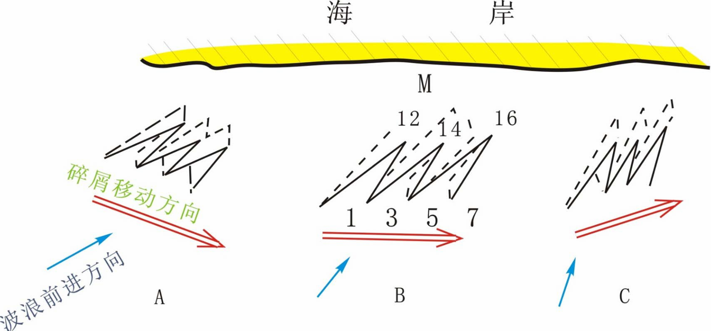
如果波浪不垂直海岸，而与海岸斜交，则海 底碎屑运动的路线呈更加复杂的“之”字形。其 最大特点是波浪作用力方向与重力沿岸分力作 用的方向不一致，而使物质沿着二者合力方向移动。

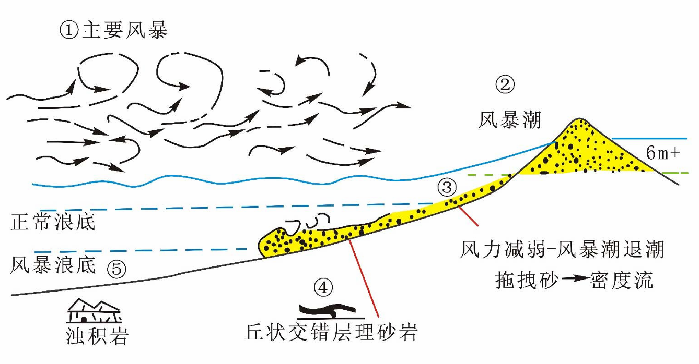
>阵发性的风暴浪将浅海沉积物卷起而重新 搬离或搬向海岸，形成风暴沉积物。

在波浪、潮汐的作用下，海水中碎屑物质长时间往复运动（海水对颗粒间的溶蚀、颗粒与海底间的碰撞与磨蚀、颗粒间的碰撞和磨蚀），**其成熟度（成分、粒度、圆度等）比陆相环境中的碎屑物质高得多**，**沉积分异也进行得较为彻底**。与海洋相比，湖泊面积小，缺乏潮汐作用，因此，波浪和湖流是湖泊中搬运和沉积碎 屑物质的主要营力

### 3.碎屑物质在空气中的搬运和沉积作用
在干旱地区，风的搬运和沉积作用是主要的 风是碎屑物质在空气中搬运和沉积的主要营力 空气只能搬运碎屑物质，而不能搬运溶解物质 空气可以把沉积物从高处搬到低处，也可以将 其从低处搬到高处.

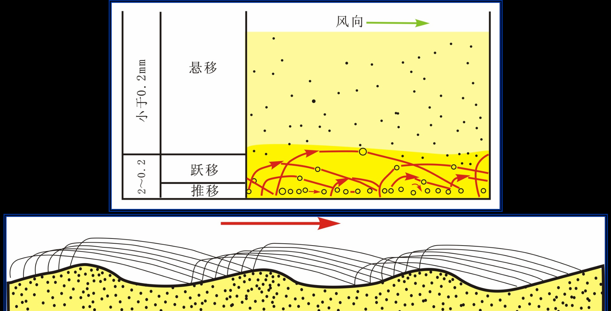
在正常地面条件下，搬运方式以跳跃为主 （70~80%），其次是蠕动（<20%），而悬浮极少 （<10%）。在一般情况下，搬运方式与粒度之间关系 相当稳定。风力搬运的最大特点是碎屑呈弓形弹道轨 迹前进。

**风的搬运及沉积作用特点**： 
- 搬运能力远比水小，同样的速度下，风的搬 运能力约为流水的1/300，因此，风一般只能搬 运较细粒的碎屑物质。 
- 风的搬运能力有限，选择性较强，因此风成 沉积的粒度分选性较好。 
- 空气密度小，颗粒碰撞磨蚀导致其圆度较好，常具霜状表面。

### 4. 碎屑物质在冰川中的搬运和沉积作用
# 搬运作用 

流体流，牵引流（Fluid flow） 
- 推移（滑动和滚动）Traction：grains rolling/sliding along substrate 
- 跳跃 Saltation：smaller grains hopping along substrate 
- 悬浮Suspension：very small grains carried along with water 
- 溶解Solution: some material is dissolved and carried downstream 
重力流（gravity flow ） 
- 颗粒流Grain flow : cohesionless sediment movement
- 泥石流Debris flow : viscous sediment movement 
- 液化流Liquefied flow : over-pressured interstitial fluid movement 
- 浊流Density flow (turbidity current) : slurry movement driven by differential density

# 一、流体流
## 1.流体
### 1.1 流体性质
- 密度
- 黏滞性
	- 抗拒流动
	- 粘滞系数更高，液体越难流动
### 1.2 牛顿流体
动力粘滞系数 Dynamic viscosity (μ) 
切应力(τ) ：液体单位面积上的内摩擦力，也称作粘滞切应力
- y: 流体内两滑动面之间的距离 
- u：流体流速 
- du/dy: 流速梯度（剪切变形率）
$$
\mu=\frac{\tau}{du/dy}
$$

服从牛顿内摩擦定律的流体（**温度不变的条件下，随流速梯度变化μ保持不变**）称作牛顿流体
### 1.3 雷诺数
自然界流体按流动特点分为层流和紊流 
- 层流：缓慢流动、质点做平行线状运动，不掺杂 
- 紊流：充满漩涡的急湍流动，质点运动轨迹不规则且互相掺杂 

**==雷诺数：惯性力和粘滞力的比值==**
$$
Re=\frac{\rho uL}{\mu}=\frac{\mu L}{\nu}
$$

### 1.4 惯性切应力 Eddy Viscosity
紊流中流体质点紊乱流动会引起附加的惯性 切应力，也叫作附加切应力
$$
\tau = \mu \frac{du}{dy} \quad \text{层流}
$$
$$
\tau = (\mu + \eta)\frac{du}{dy} \quad \text{紊流}
$$
==**层流比紊流更容易沉积，紊流比层流更容易搬运**==
## 2.搬运与沉积：固体边界效应

紊流水体与固体边界接触处（比如：河道底部和两壁）
- 由于切应力影响流速在界面处迅 速减小
- 流速梯度大，粘滞力起主导作用， 因此流体运动形态属于层流
- 层流底层对于沉积物的搬运和堆积起到重要作用

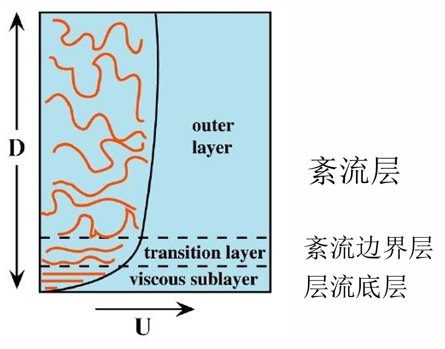
## 3.流态 Flow regimes
### 3.1 弗劳德数

**==惯性力和重力之间的比值==**,代表向上游或下游传播速度相对大小；
$$
Fr=\frac{惯性力}{重力}=\frac{u}{\sqrt{gD}}
$$
其中$u$是流速，

### 3.2 水跃（Hydraulic jump）
水跃发生在快速流动的浅水经过安静的深水时发生的现象；通常跟水体突然加深和流速突然降低有关

## 4.搬运的影响因素
### 4.1 底形和水体表面
#### 4.1.1底形
床沙表面可随水流强度变化而出现各种类型床沙形体，组成床沙的砂砾颗粒的滚动、滑 动或跳跃移动使床沙形体发生顺流或逆流移动，这种现象在水力学中称为沙波运动 。
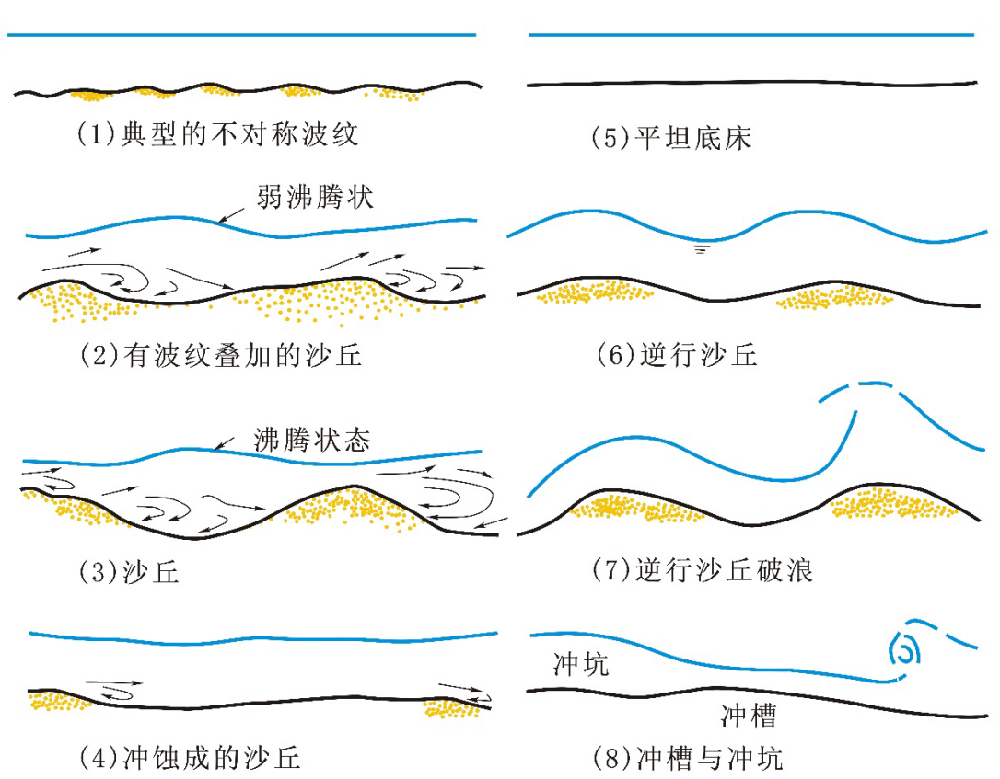
#### 4.1.2水体表面与浪基面
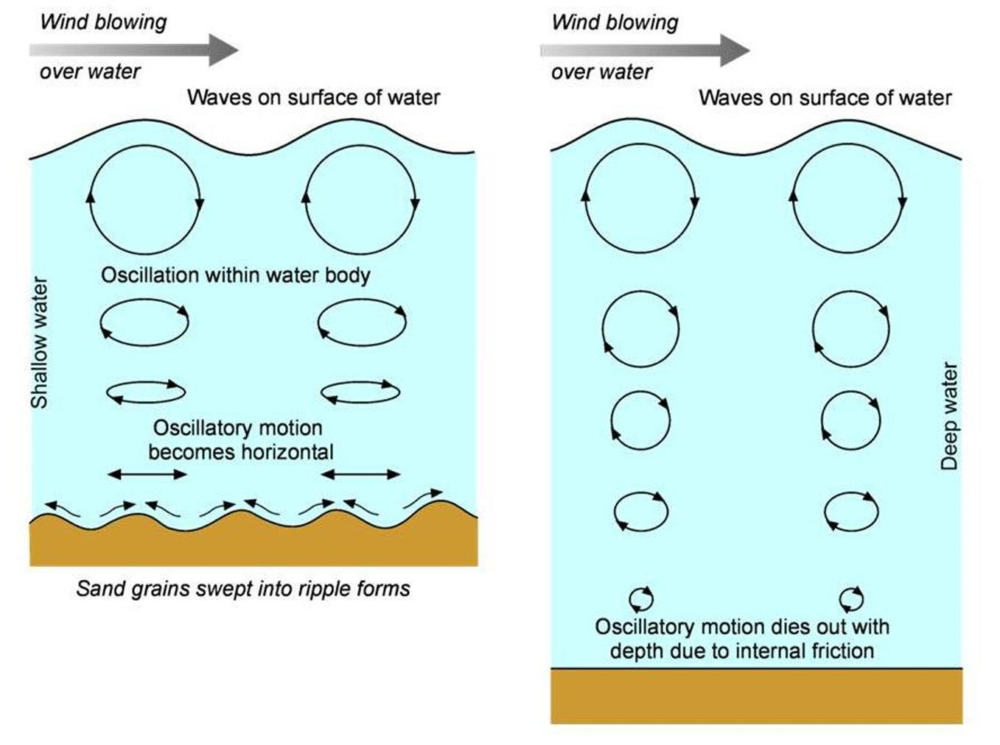
波基面（浪底）（wave base）——波浪作用的下限，即波浪所影响的最大深度。
FWWB：Fair Weather Wave Base 正常浪基面；
- Fair weather wave base refers to the depth beneath the average daily waves （10~30m）
SWB：Storm Wave Base 风暴浪基面
- Storm wave base refers to the depth beneath storm driven waves and is often much deeper. （30~125+m）

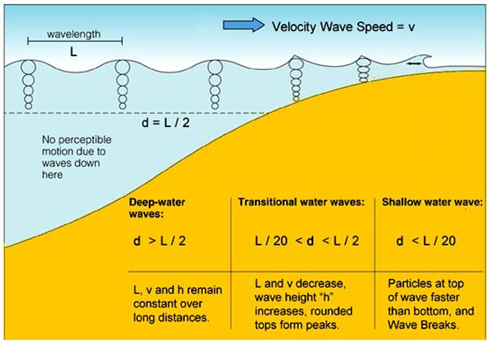
>不同的水波及其影响的水深

### 4.1.3底形与水体表面
底形与水面同相——缓流
底形与水面异相——急流
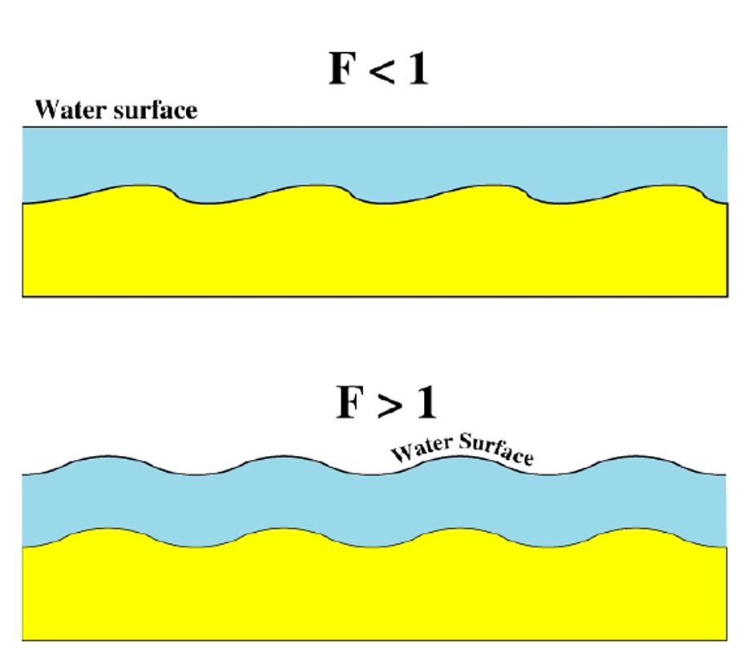
### 4.2 底形与流态
#### 4.2.1 水体流态
#### 4.2.2 底形的类型
##### 高流态平坦床砂
剥离线理结构
常见于浅冰相
细粒径

##### 低流态平坦床砂
低角度的叠瓦状构

#### 4.2.3 流态与底形
不同流态的水体环境下会形成不同的底形
- 急流——Antidunes （逆行沙丘） upper plane beds（高流态平坦床沙）
- 缓流——Ripples（波痕） dunes（沙丘） lower plane beds（低流态平坦床沙）
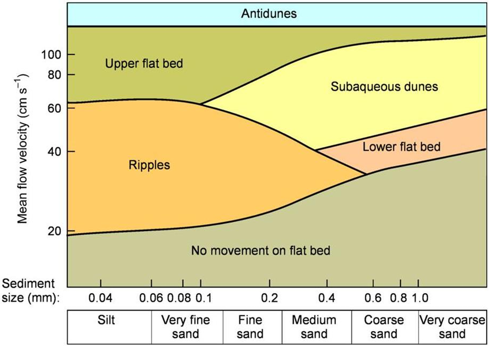
>水体流速与颗粒大小对应的底形类型

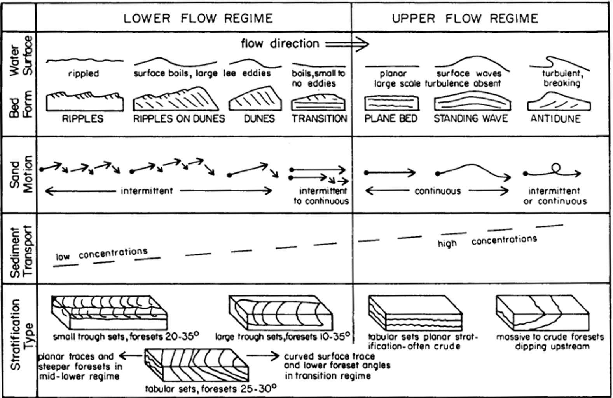
>流态影响碎屑物质的运动状态从而影响底形和层理的形成
### 4.3 底形和斜层理的关系
底形是活跃的、正在活动的地貌；而斜层理是底形迁移后 被埋藏并保存在沉积岩中的静态记录
- 底形：瞬时地貌活动，流体与沉积物相互作用直接塑造
- 斜层理：地质历史中底形迁移的化石记录

**==斜层理的类型反推底形的类型、底形的类型反推沉积时水动力环境==**
#### 板状交错层理反映的信息
纹层和层系底界的倾角和斜交特征可以反映水流强度 
➢急流型：纹层平直，倾角大，水流强 
➢缓流型：纹层略向上弯曲，向下收敛，倾角小 

判断古环境 
➢一般是河流、滨海、滨湖、三角洲；大型板状交错层理在河流沉积最典型

#### 鱼骨状交错层理反映的信息
➢相邻层系中细层倾向相反，呈羽状或人字形（鱼骨状），层系间夹有 泥质水平薄层的层理 
➢**沉积介质具有双向流动的情况下**产生的，如涨潮流形成的前积层与退潮流形成的前积层交互而成 
➢羽状交错层理多发育于(灰质)砂岩、 (灰质)粉砂岩等岩性中，**常见于河流入湖、海的三角洲地带**

## 5.纹层、单层、层组、层理面

Laminae 纹层：组成层理的最小宏观单位，具有相对一致的成分和结构；
Single bed 单层：层理的基本单元， 由成分和形态相对一致的纹层构成； 
Bedset 层组：形态一致且具有成因 联系的一组单层； 
Bedding surfaces 层理面：单层或 层组的分界面

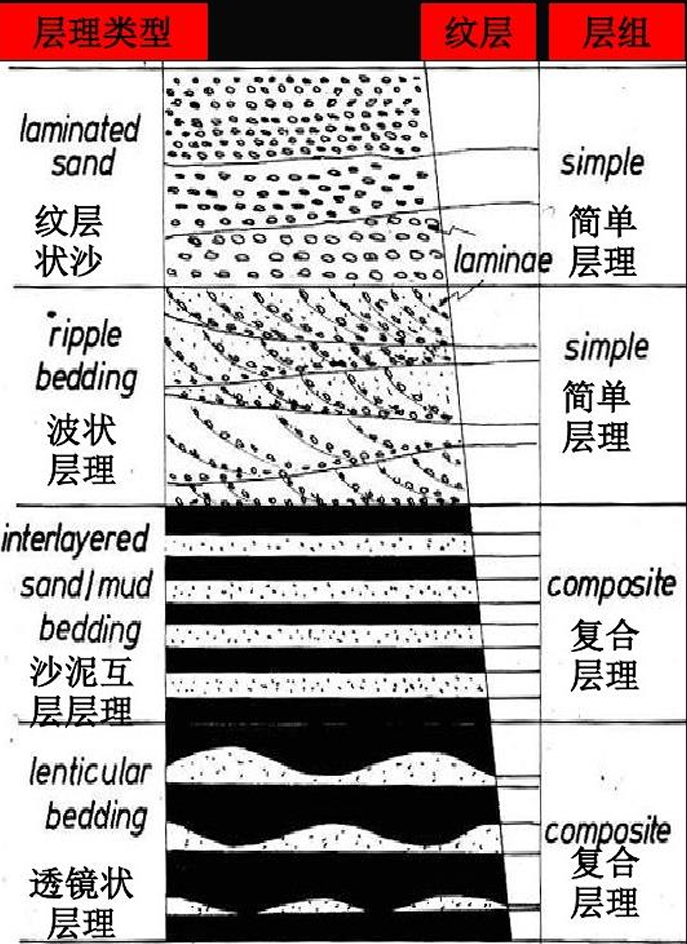

### 水平层理和平行层理
水平层理:层理中各纹层相互平行，成分以泥和粉砂颗粒为主。 形成于平静的水介质环境中，由平直且与层面平行的一系列细层组成，在比较稳定的水动力条件下，如河流的堤岸带、闭塞海湾、海和湖的深水带，从悬浮或溶液中缓慢沉积而成。

平行层理:各纹层相互平行，成分以砂质颗粒为主。形成于水动力条件较强的介质环境中，主要产于砂岩中。

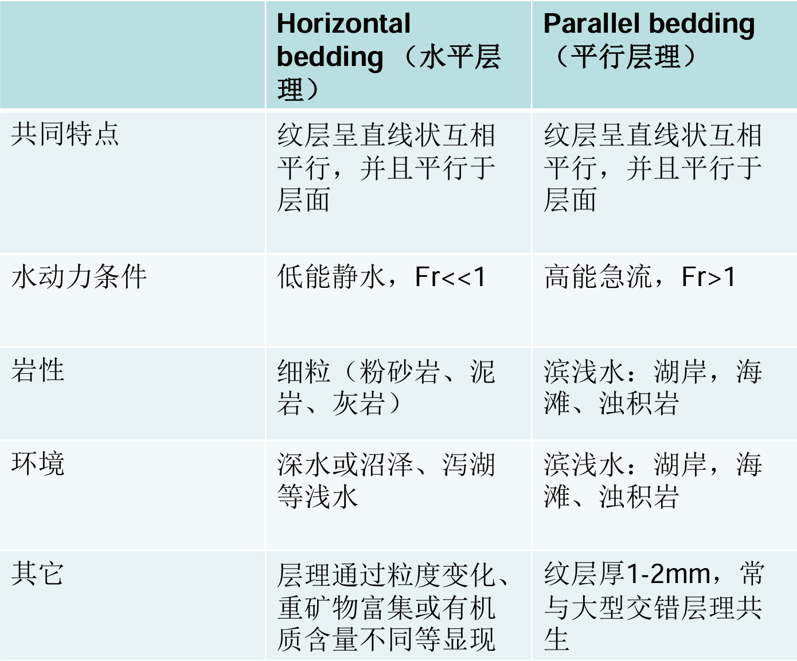

## 6.颗粒受力分析
### 尤尔斯特隆图解

## 7.沉积

### 不同沉积类型
流水动力不足以克服碎屑重力时，处于搬运状态的碎屑物质会沉积下来 
- 真沉积（true sedimentation）：悬浮物沉积下来 
- 冲积（ Accretion ）:流体牵引力或其他性质改变–横向堆积–流体扩张–流体变浅 
- 障碍物堆积 （encroachment）：遇到障碍物受阻，减速而沉积下来

### 斯托克斯公式

$$
u=\frac{1}{18}\frac{(\rho_g-\rho_f)gd^2}{\mu}
$$

只适用于净水或层流的条件
只适用于小于$200\mu m$
对水温、颗粒相对密度、表面状况等都有要求

# 二、重力流
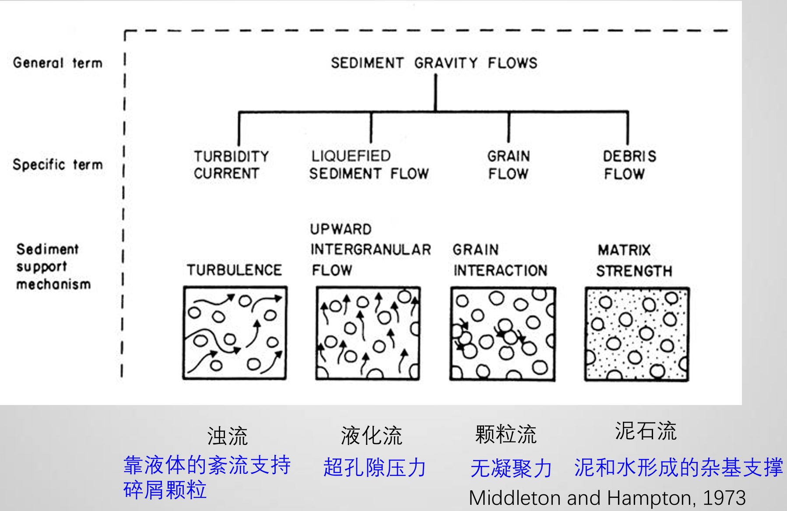
### 浊流
浊流=沉积物和海水的混合物=密度大于纯海水 
浊流中的悬浮物质是砾， 砂，粉砂，泥 
沉积物由紊流向上的分力支撑

浊流沉积是指在浊流中，**粗粒的物质集中到靠近底部的前锋**，流速可能继续增加。根据坡度的大小和坡的长短，浊流可以达到最高的流速。随着坡度变缓，流速逐渐减小，沉积物开始卸载，从而形成浊流沉积。

浊流沉积多**呈长条状或舌状展布**，在**陆坡外缘常成扇形**，其长轴方向垂直于岸线。现代海底所见的浊流沉积，其形成时代多在全新世之前，而后形成的频率相对减少。
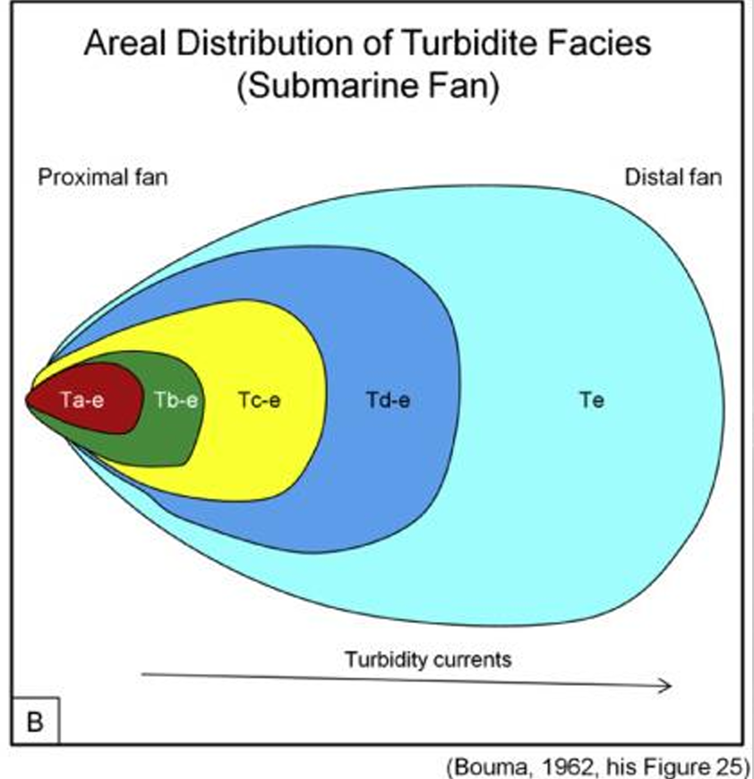
#### 鲍玛序列（Bouma sequence）
Bouma (1962) 提出==**一个完整的鲍玛层序是一次浊流事件的记录**==

**Bouma 层序**具体描述了由**低密度（即低沙浓度、细粒）浊流**沉积的结构的理想垂直连续。另一种分类方案通常称为 **Lowe 层序** ，用于**高密度流**沉积的结构的理想垂直层序。

Bouma 序列分为 5 个不同的层，标记为 A 到 E，其中 A 位于底部，E 位于顶部。Bouma 描述的每个层都有一组特定的沉积结构和特定的岩性 ，这些层==**总体上从下到上变得更加细粒度**== 。 

自然界中发现的==大多数浊积岩都有**不完整**的序列==，但完整的序列由以下层组成：
- E：块状、未分级的泥岩，有时有微量化石的证据（即生物扰动 ）。Bouma E 层经常缺失，或难以与下面的 Bouma D 层区分开来。
- D： 平行层状粉砂岩。
- C： 波纹层状细粒砂岩。波纹层通常变形为卷曲层(convolute laminations)和火焰结构(flame structures) 。
- B： 平面层状细粒至中粒砂岩。**Bouma B 的基底通常具有称为鞋底标记的特征，例如槽铸模(flute casts,)、凹槽铸模(groove casts)和分型线(parting lineation)。**  
- A：块状到正常等级 ，细粒到粗粒砂岩，底部附近通常有鹅卵石和/或撕裂的页岩碎屑 。可能存在培养皿结构 。A 以下的砂岩底部有时会被侵蚀成下层。
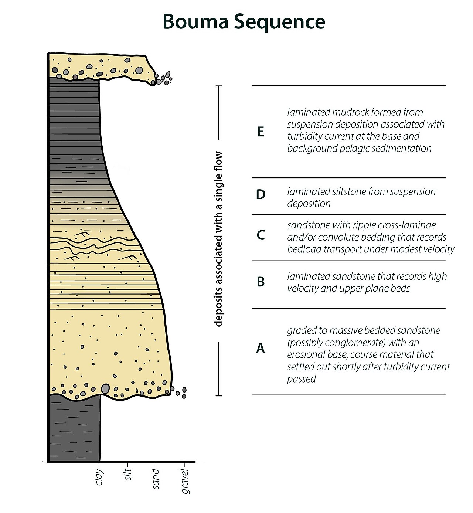

### 液化流（Liquified sediment flow）

### 泥石流（Debris flow）
### 颗粒流（Grain flow）
颗粒流中流体（空气或水），主要是提供润滑的作用，**颗粒在流体中能保持悬浮状态**，是由于**颗粒与颗粒之间的碰撞，从而产生分散压力**，而使颗粒不会沉淀。

最常见颗粒流是在风成环境中，颗粒因为顺沙丘斜面上下滑而形成。相比之下，颗粒流在水下环境中很少。通常颗粒在水中保持悬浮状态是依赖颗粒的牵引、跳跃、以及流体的湍流作用。在泥流中，颗粒对粘土基质的相对漂浮力，也让颗粒保持悬浮状态。

在高密度浊流中，底部沙子浓度较高，颗粒间的碰撞能使沙颗粒保持悬浮状态。较小的颗粒，因为没有碰撞反而先沉淀在沙颗粒之下， 造成反向粒级层理。

