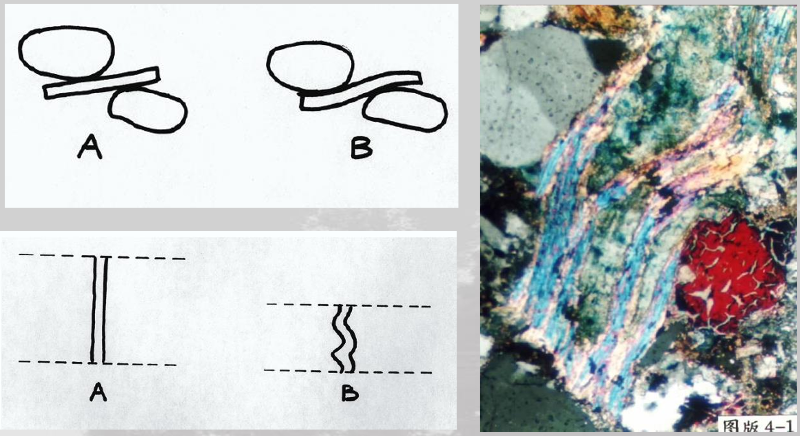
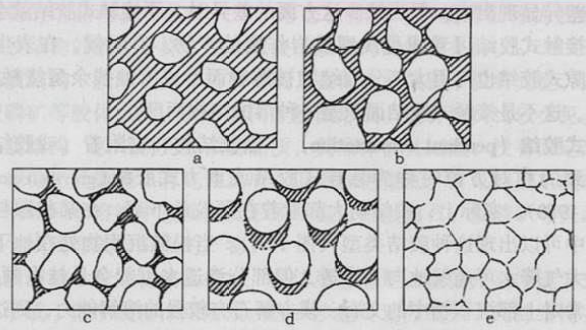
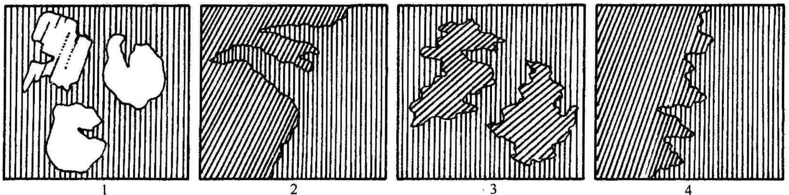
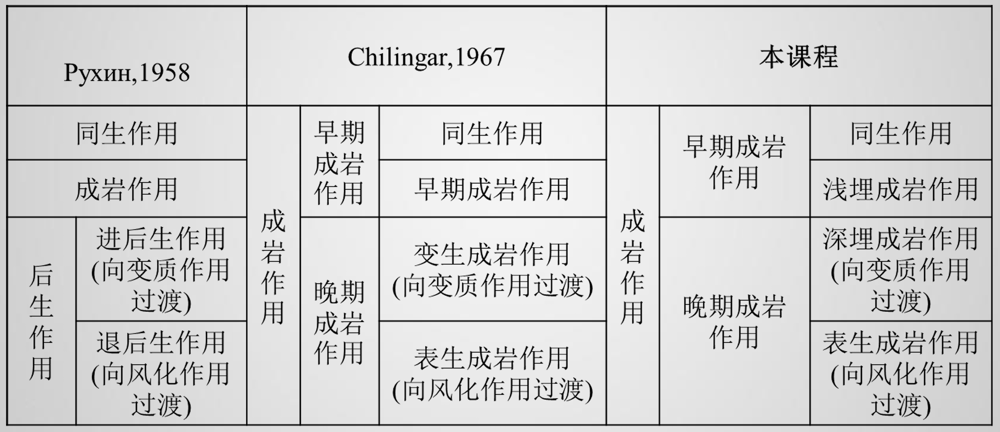

## 成岩作用
成岩作用是指沉积物从沉积后到变质作用之前这样漫长地史 阶段中发生的各种物理作用、化学作用、生物作用等。
➢ 压实和压溶作用 
➢ 胶结作用 
➢ 溶蚀和交代 
➢ 重结晶
### 压实作用（compaction）
沉积物沉积后在其上覆盖层的重荷下，或在构造形变应力下，发生**水分排出、孔隙度降低，体积缩小**的作用并逐渐固结。这种**单纯机械压缩—固化作用**称为压实作用

压实作用过程中可以引起可以引起岩石中矿物的形变

**压溶作用**（pressure solution）指由于压力的作用，岩石中的一些矿物（通常是**方解石或石英**）在高压应力区发生溶解，通过流体迁移，而在低压应力区沉淀，从而造成塑性变形

### 胶结作用（cementation）
#### 胶结作用的定义
彼此分离的颗粒被胶结物焊结在一起的作用称为胶结作用。松散 的碎屑沉积物通过胶结作用变成固结的岩石。 

胶结物是指在成岩过程中，从粒间水溶液中沉积出来、对分离颗粒起焊接作用化学沉淀物。通常与沉积物的化学组成和孔隙流体的组成，Eh，pH等性质有关 

胶结作用通过**填充颗粒之间的孔隙**减少孔隙度

**==胶结作用主要还是化学作用，过程中形成了新的物质==**

#### 胶结作用类型
碎屑和填隙物（基质+严格意义胶结物）之间的关系称胶结类型。划分为以下几种：
① 基底式胶结 ② 接触式胶结 ③ 孔隙式胶结 ④ 悬挂式胶结 ⑤ 镶嵌式胶结

- **基底式胶结(Basal cement-ation)**：**填隙物含量较多**，碎屑颗粒彼此不相接触呈飘浮状或游离状分散在填隙物内，其支撑类型为基质支撑。起胶结作用的实际是基质（黏土或泥晶），通常是**高密度流(如浊流、泥石流)快速堆积产物**
- **孔隙式胶结(Porous cementation)**：颗粒搭成支架状，**颗粒之间多呈点状接触**。胶结物（基质）含量少，只充填在碎屑颗粒之间的孔隙中，这是**最常见的颗粒支撑结构**。
- **接触式胶结(Contact cementation)**：颗粒之间彼此接触，胶结物含量很少,只分布在颗粒之间的接触点附近，颗粒之间的孔隙较发育。是孔隙式胶结的一种特殊方式，多数是胶结物或杂基被淋滤所至。
- **悬挂式胶结(Pendant cementation)**：当胶结物和它附着(或胶结)的颗粒**具有相对一致的方位性**时称悬挂式胶结。它是**孔隙水附着在颗粒下方导致胶结物向下生长**的结果。
- **镶嵌式胶结(Mosaic cementation)**：出现在**砂级陆源碎屑沉积物**特别是**沉积石英岩**中，颗粒之间因压溶而多呈面接触、凸凹接触或缝合线接触。也称**无胶结物式胶结**，通常为深埋成岩作用产物。

### 溶解(dissolution)和交代(replacement)作用
==溶解作用几乎是与胶结作用相反的：**增加孔隙度** 。==

溶解作用通常可分为两类：一是**固相均匀溶解**，使未溶解固相的新鲜面成分不变；另一种溶解为**选择性溶解**；岩石组分的不一致溶解，所形成新矿物的化学组成与被溶解矿物相近，如长石高岭石化。

交代作用一种矿物直接置换另一种矿物，同时可能**保持被置换部分的大小和形态**的化学过程称为交代作用。反应最主要的形式为晶格中阳离子的取代，使晶体在不熔解、不改变其晶格结构下，改变化学组成

#### 如何判断矿物的溶解交代关系

1.颗粒(如陆源碎屑)被画竖线的矿物(如胶结物)交代； 
2.画竖线的矿物呈脉状伸进到画斜线矿物内部，则斜线矿物被交代； 
3.如果两个弧岛状斜线矿物属于同一个矿物晶体(可同时消光)，则它通常是被交代矿物； 
4.竖线和斜线矿物之间虽有蚕食状分界面，但一般无法判别交代关系。

### 重结晶作用（Recrystalization）

狭义的重结晶作用无新矿物形成，指矿物在不改变基本成分的同时为减少表面能而增大粒度的变化

## 矿物与空隙
自身矿物vs他生矿物——Authigenic vs Allogenic
原生空隙vs次生空隙——Primary vs Secondary

自生矿物——胶结物（从原生空隙中析出）和交代产物（发生在次生空隙）
通过空隙的不同判断矿物的自生他生

原生空隙——本来就存在的空隙
次生空隙——后面溶解形成的空隙

## 重结晶作用
重结晶作用是指固结的岩石中发生的结晶作用 
- 狭义的重结晶作用无新矿物生成，指矿物在不改变基本成分的同 时为减少表面能而自然增大粒度的过程 
- 广义的重结晶包括新矿物的生成（eg. 蛋白石---玉髓---石英）

## 成岩作用

• **早期成岩作用(Early diagenesis)**--指沉积物固结之前的成岩作用，作用结果是沉积物的固结。分为同 生成岩作用和浅埋成岩作用。 
• **同生（成岩）作用(Syndiagenesis)**--指沉积物刚刚沉积、还暴露在沉积环境底层水中、在沉积物-水界面及其 以下的一薄层内（几毫米到几十厘 米）所发生的一切物理、化学或生物作用。作用条件与沉积条件基本相 同。 
• **浅埋成岩作用(Shallow buried diagenesis)**--指同生作用之后一直到沉积物固结为止发生在沉积物内部的一切 物理、化学和生物作用。伴随上覆沉积物厚度的增大，浅埋成岩作用条件的总体变化趋势是温压升高、Eh值 降低，而pH值则受沉积物成分和孔隙水之间化学作用的控制。在整个作用过程中，孔隙水通常都可通畅而缓 慢地移动。浅埋成岩作用的底界一般不小于几米到几百米。
• **晚期成岩作用(Late diagenesis)**--指沉积物固结之后的成岩作用,作用结果是已固结沉积岩的成分、结 构和构造等的进一步变化。又分为深埋成岩作用和表生成岩作用。 
• **深埋成岩作用(Deep buried diagenesis)**--指已固结的沉积岩在上覆沉积物厚度进一步加大、温压进一步升高 直到变质作用之前所经历的所有作用，这时沉积物的埋深相对较大。 
• **表生成岩作用(Epidiagenesis)**--指坚固沉积岩因盆地回返而逐渐上升到潜水面附近时受渗流和潜流大气降水影 响所发生的作用，作用条件接近地表的常温常压，Eh值较高，盐度很低，pH值则在渗流水中较低(中偏弱酸 性)，在潜流水中较高(中偏弱碱性)。表生成岩作用也是对已固结沉积岩的成分和结构等的改造，对它之前的 沉积或成岩特征也有覆盖或破坏作用，但对最终产出的沉积岩而言，它仍具有一定建设性意义，由此可将它 与风化作用区别开来。