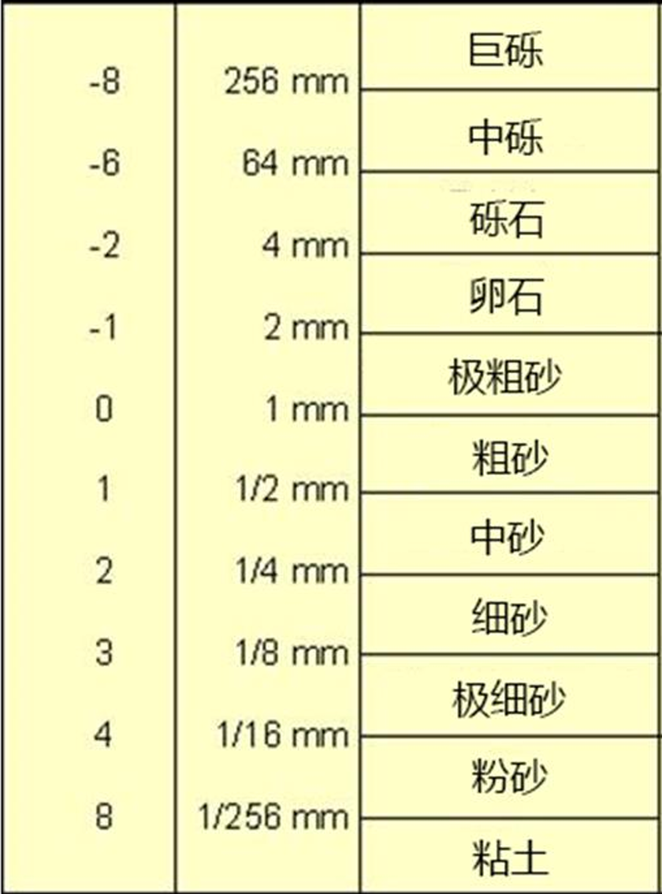

## 碎屑岩的分类
==**颗粒的大小**==

## 一、泥岩页岩
### 粘土矿物
#### 四种基本的粘土矿物

#### 粘土矿物的相互转化
高岭石和蒙脱石都是不太稳定的，容易转变成伊利石和绿泥石

## 二、砾岩
颗粒2mm以上的沉积岩

砾岩——conglomerate
角砾岩——breccia、

观察砾石形状推断搬运 距离 
观察砾石排放特点指示 水流方向

叠瓦状构造（clast imbrication）

## 三、砂岩
### 3.1 颗粒
- **矿物颗粒**
	- 石英、长石、云母、重矿物
- **岩屑**
	- 岩浆岩、变质岩、沉积岩
#### （1）石英
#### （2）长石
表面比较脏
#### （3）云母
### 3.2 杂基
如何区分杂基和胶结物——杂基大多数来自破碎的颗粒

### 砂岩的分类
75%长石石英砂岩
90%石英砂岩
95%纯石英砂岩

最重要的一点——石英含量超过75%才能叫做石英砂岩，不是50%

杂砂岩和净砂岩
杂基比例超过15%

长石砂岩—岩屑砂岩—净砂岩—杂砂岩

### 砂岩成熟度
#### 成分成熟度
长石/（长石+岩屑）
#### 结构成熟度
碎屑的分选度、磨圆度

### 砂岩成因的构造环境
用石英、长石、岩屑三端元的成分比例反演不同的构造环境
- 成熟度降低、稳定性变差
- 海相组分增高、陆相成分减少

### 砂岩中的矿物
锆石定量
重矿物

## 碎屑岩与沉积环境
**砂岩代表是陆相还是海相？页岩代表是陆相还是海相？**
砂岩和页岩不能直接判断沉积岩环境
**物源是什么？**
碎屑岩中的颗粒来源，通过重矿物进行分析
**沉积环境用什么岩性来看？沉积地球化学条件呢**
沉积环境通过颗粒大小反应的水动力环境来看；沉积地球化学环境通过胶结物的成分来判断