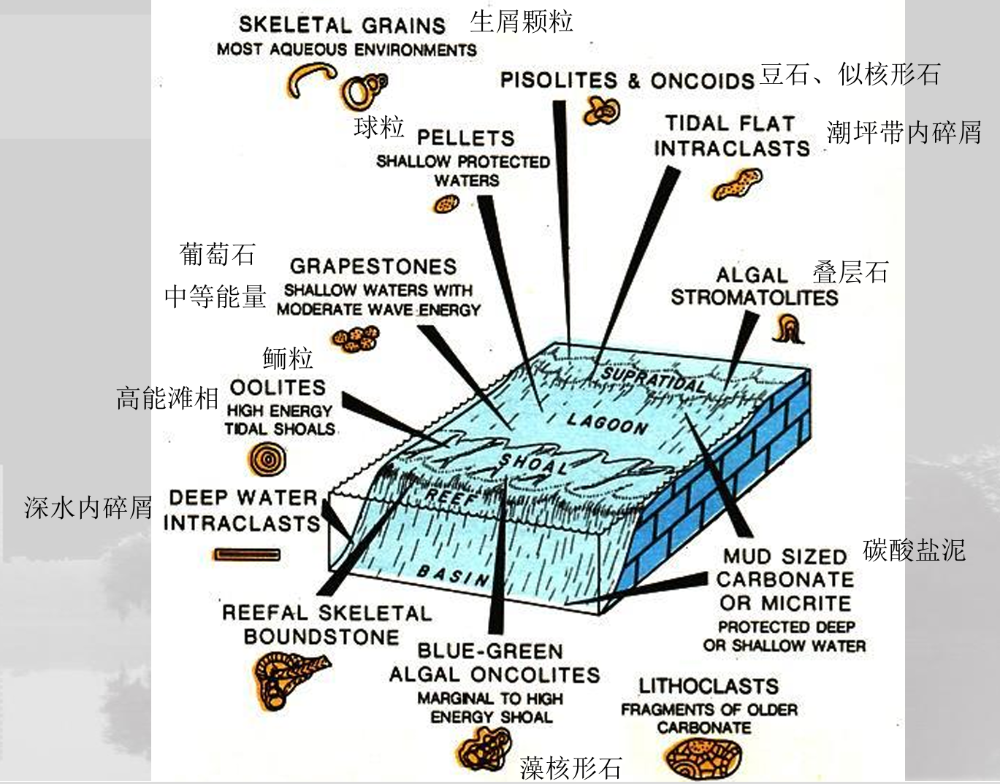
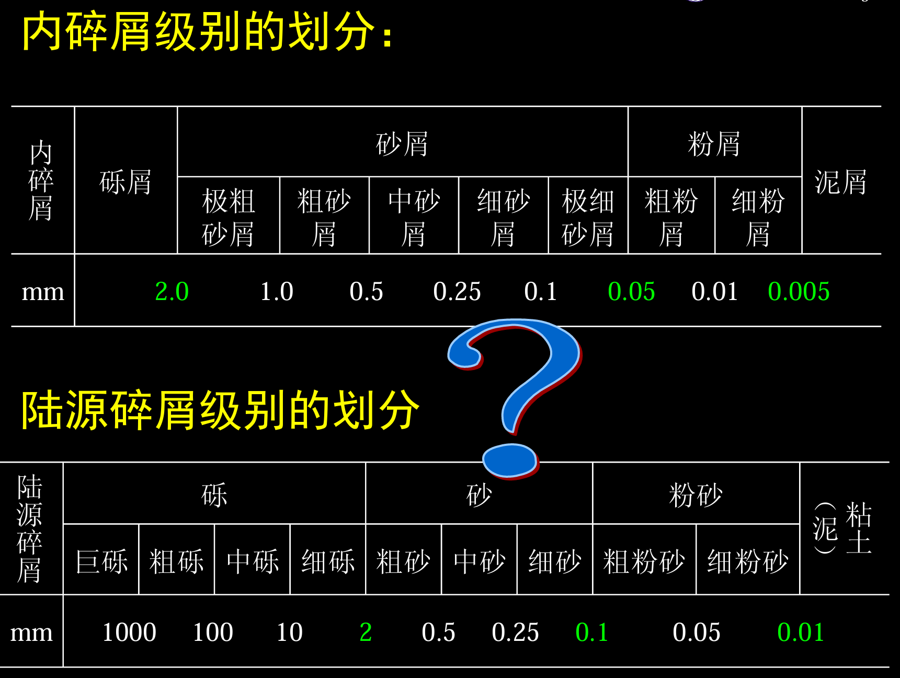
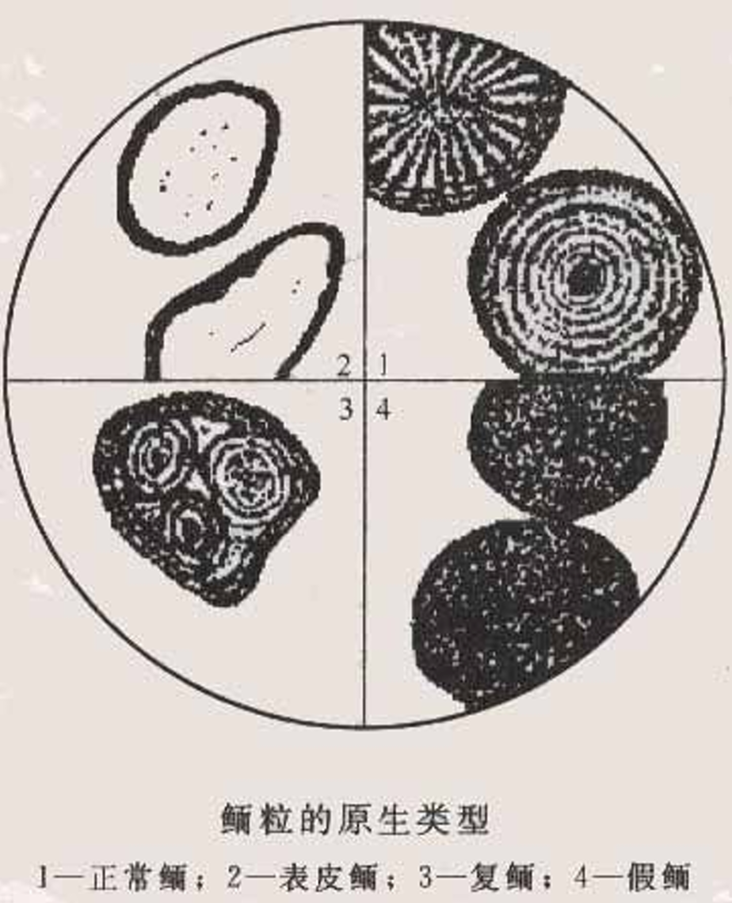
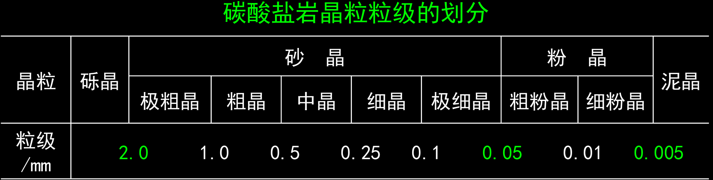
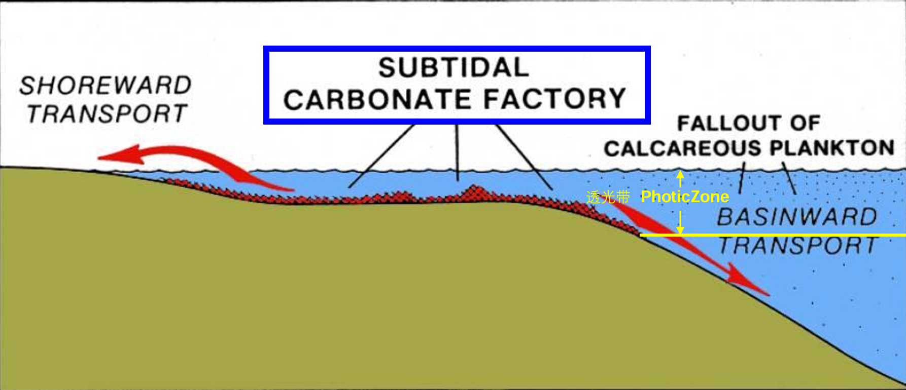
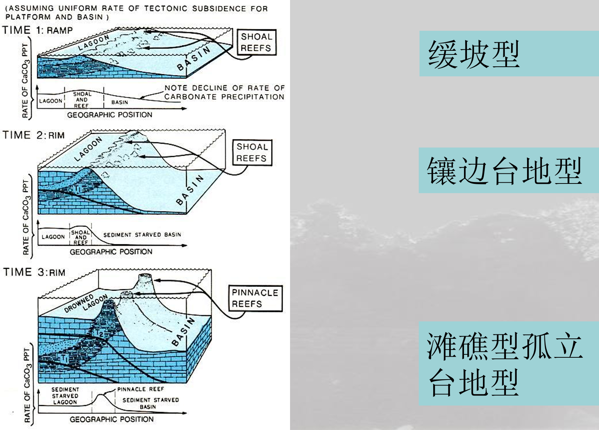

## 一、矿物组分
- 主要的碳酸盐矿物
	- 方解石矿物体系： 方解石、文石、高镁 方解石、低镁方解石
	- 白云石矿物体系： 白云石、原白云石
- 次要的碳酸盐矿物 铁白云石、菱铁矿、菱镁矿等。
- 非碳酸盐的自生矿物 石膏、天青石、重晶石、萤石、石盐等
- 陆源矿物 粘土矿物、石英、长石、云母、绿泥石、重 矿物等
### （1）方解石
主要成分为CaCO3 、三方晶系 
透明无色或白色，玻璃光泽 ，硬度为3 
常含Mn、Fe、Mg等类质同象替代物 
-  高镁方解石（易溶，性质上更接近文石） 
- 低镁方解石（溶解性较文石差）
### （2）文石
主要成分为CaCO3 、 斜方/正交晶系 
白色，黄白色 •、易溶解 
在自然界中不稳定，常转变为方 解石（同质多像）
稳定性：高镁方解石<文石<低镁方解石
### （3）白云石
主要成分为CaMg(CO3)2 、 三方晶系
三组菱面体解理完全 • 白色，黄白色，玻璃光泽、硬度为3.5-4 
常含Mn、Fe、Mg等类质同象替代物 
溶解性差于方解石和文石 
理想白云石（最有序晶体状态）少见，白云 石通常是富钙的，有向更稳定白云石转变的 趋势
主要成分碳酸钙镁$\mathrm{CaMg}(\mathrm{CO_3})_2$

### 如何区分方解石、白云石、菱镁矿

**鉴别要点**
- **与酸反应**：方解石反应最剧烈，白云石次之，菱镁矿需加热。
- **硬度**：菱镁矿最硬，白云石次之，方解石最软。
- **颜色与光泽**：颜色多样，光泽均为玻璃光泽，但白云石可能带珍珠光泽。
- **风化特征**：白云石更容易呈现出黄色，有刀砍状溶沟

通过这些特征，可以在野外有效区分这三种矿物。
- 方解石
	- 遇到稀盐酸剧烈起泡
	- 常见于石灰岩和大理岩中
- 白云石
	- 遇稀盐酸反应较弱，粉末反应明显
	- 常见于白云岩中
- 菱镁矿
	- 遇热稀盐酸起泡
	- 常见于超基性岩和变质岩中

## 二、结构组分
==**颗粒结构**：由颗粒(生物/非生物)、泥晶基质、亮晶胶结物、孔隙等构成。==
**生物骨架结构**：由造架的生物和粘结的生物与填隙的颗粒或泥晶基质及亮晶胶结物构成
**泥晶或微晶结构**：出现在低能环境下由化 学沉淀或生物化学作用而形成的碳酸盐岩中。 
**晶粒结构/残余结构**：碳酸盐岩经过重结晶 或者发生白云化后的结构

### （1）颗粒clasts
泛指沉积盆地内由化学、 生物化学成因的碳酸沉积物，在波浪、潮汐 等水流作用下就地或经短距离搬运而形成的一系列碳酸盐岩颗粒，简称“颗粒”。

分类：**内碎屑**、**鲕粒**、**藻粒**、**球粒**、**生物颗粒**

#### 1.内碎屑Intraclasts
主要是沉积盆地中沉积不久的、 **半固结**或固结的碳酸盐沉积物，受波浪、潮 汐、风暴等的冲刷、破碎、磨蚀、搬运、**再沉积**而成的盆内颗粒，也可以是其他作用形成的。

==**内碎屑的分类类似于陆源碎屑**==

内碎屑主要形成于潮坪或泻湖
	也可以形成于深水环境

内碎屑**砾石排列方位的古地理意义**： 
- **就地堆积**：大体平行于岩层层面排列
- **单向水流搬运堆积**：单向倾斜排列（叠瓦状） 
- **潮汐或波浪搬运堆积**：双向倾斜排列 
- **强风暴流堆积**：放射状、倒小字状、菊花状、 杂乱状
#### 2.鲕粒ooid

一种由**核心**和**包壳**组成的**粒径0.25-2mm**的球形或椭球形颗粒。（也会有大于2mm）
- **核心**：陆源碎屑、内碎 屑、生物碳酸盐颗粒等
- **包壳**：化学沉淀形成的同心状或放射状微晶碳酸盐矿物（泥晶方解石）。

**现代沉积中未经变化的鲕粒同心壳层**由隐晶质文石组成： 
- 文石针呈放射状：缓慢沉淀与弱搅动 
- 文石针呈切线方向排列：快速沉淀与强烈搅动

原生鲕粒的基本类型： 正常鲕、表皮鲕、复鲕
其他名称及分类： 假鲕、单晶鲕、多晶鲕、负鲕、放射鲕、偏心鲕（低能）、同心鲕 （高能）

==**复鲕vs负鲕**：复杂的鲕粒；中心没有核心的鲕粒==

鲕粒成因——高能动荡的环境
- 有机成因说：与藻类及细菌作用有关。 
- 无机成因说：在碳酸盐过饱和且扰动的环境 中，溶液中析出的钙（文石）围绕被搅起的质 点而沉淀。

**鲕粒形成机制及影响因素**
卡洛兹（Carozzi，1960）认为：鲕粒的形 成受控于两个因素：**搅动强度（a）** 与**水流强度（c）**

#### 3.球粒pellets与似球粒peloids
- **球粒**（pellet）：通常把较细粒的（粗粉砂级或砂级）、由**灰泥组成**的、**不具特殊内部结构的**、球形或卵形的、分选较好的颗粒。 
- **粪球粒**（Fecal pellet ）：**生物粪便形式**排出的、富含有机质（薄片中呈暗色）、大小均匀的颗粒。
- **似球粒（Peloids）**：**不确定来源**的颗粒；**次棱角状**的，通常<1 mm；**无内部结构**

**局限浅海环境** ；粪球粒如被保留下来 ，说明是在**准同生期**被胶结的 ；**大多数灰泥可能来自 于被破坏的软的粪球**

通过蓝绿藻粘液捕捉碳酸盐沉积物而形成的具有同心层的颗粒； • 是指直径大于2mm的具有核心和包壳的颗粒，其同心层通常不规则。

#### 4.藻粒oncoid和豆粒pisoid
**核形粒**：也称藻灰结核，为球状叠层石， 粒径小者为0.2~0.3mm，大者2~5mm或更大。
核心和包壳不规则的颗粒——==**核形石核心是亮晶、鲕粒的核心是泥晶**==——核形石反映更加高能环境

**豆粒**
比核形石更加不规则；形成于亚热带干燥气候下土壤渗流带，

#### 5.生物颗粒
- 藻类(algae):
	- 文石质的
- 节肢动物(arthropods)：
	- Trilobite 三叶虫– wavy extinction(波状消光)-hook form （钩状）
	- Crustacean(甲壳类)– fine laminated(细纹层) with pores (stained)
	- Ostracod(介形类)–radial fibrous strucure（放射纤维状）
- 蜓类()
- 珊瑚(Corals)
- 棘皮类(Echinoderms)
- 软体动物(Mollusk)
	- Complex fibrous  aragonite structure
	- Gastropods become recrystallized or replaced（交代）by calcite
- 叠层石(stromatoporoids)
	- 横切层状、纵切柱状
- 腕足类(Brachiopods)
	- Low Mg cc.（低镁方解石） 
	- Fibrous structure（纤维状结构）
- 海绵(Sponges)
	- Sponge spicules （海绵骨针） 
	- calcite or amorphous silica （无定形硅）
### 名词辨析
Terminologies——同生作用
penecomtem ——准同生作用

### （2）基质+胶结物
泥晶和晶粒指示较为松散的

#### 2.1）灰泥 lime mud
碳酸盐泥：指泥级的碳酸盐质点，“微晶碳酸盐 泥”、“微晶”、“泥晶”、“泥屑”。

分类
- 灰泥——方解石成分的泥，“微晶方解石泥“
- 云泥——白云石成分的泥

成因： 
- （1）海水化学沉淀作用生成的—针状文石 
- （2）机械破碎磨蚀 
- （3）生物作用生成的：在活的钙质藻中含大量针 状文石，死后分离出文石针泥 
- （4）生物磨蚀：吃下碳酸盐颗粒并消化磨碎

#### 2.2）泥晶 Micrite
晶粒是晶粒碳酸盐岩（结晶碳酸盐岩）的 主要结构组分。
- 按晶形特征：自形晶、半自形晶、他形晶
- 按相对大小：斑晶、包含晶

#### 2.3）胶结物 cements
亮晶
 沉积于颗粒之间的结晶方解石或者其他自生矿物，可以起到胶结物的作用
 于碎屑岩中胶结物类似，
 可以来源自泥晶的重结晶

真亮晶vs假亮晶
- 真亮晶更加纯净
- 真亮晶没有残余
- 真亮晶有世代结构

亮晶在空的孔隙中结晶——较为动荡的环境

亮晶的命名回归到原始的成份上

### （3）晶粒
### （4）生物格架
## 三、化学过程
### 碳酸盐岩形成条件
$$\text{CaCO}_3+\rm{CO}_2+\rm{H}_2\rm{O}=\rm{Ca}^{2+}+2\rm{HCO}_3^{-}$$
==**碳酸盐岩再高温低压下容易发生沉积——>温暖浅水沉积环境**==

### 碳酸盐岩工厂
碎屑岩石路远碎屑从高处被搬运到沉积盆地中，
碳酸盐岩石在沉积盆地内部产生，并且主要集中再透光带内，再经过短距离的搬运作用重新分布

### 碳酸盐补偿深度(Carbonate Compensation Depth)
海洋中碳酸钙输入海底的不及速率与溶解速率相等的等深面
因为具体海洋环境变化而变化
- 水域的沉积环境

### 碳酸盐岩形成机制
- 化学
	- ✓ 溶解态离子在温暖的水体中饱和析出； 
	- ✓ 浅水中CaCO3 达到饱和 
- 生物化学 
	- ✓ 壳体和骨骼 
		- ✓ 生物新陈代谢产物
### 碳酸盐岩形成环境
开阔的温暖浅水环境
形成地形：
- 缓坡型
- 镶边台地型
- 滩礁型孤立台地型

ecological>physical

粉末地球化学——不能直接代表
根据现在地球环境进行模拟——有选择的进行挑选组分

> ==**碳酸盐岩和碎屑岩的沉积环境有什么不同？**==
> 碳酸盐在温暖浅水、开阔、纯净的环境中沉积
> 碎屑输入过多影响碳酸盐岩的沉积

## 四、灰泥丘（Mound）；礁灰岩（Reef）
### 障积碳酸盐岩Bafflestone
直立分支的颗粒
垂直于层面的切面可以看到垂直分支的hand
平行于层面的切面可以看到一个一个“茎切面”
### 黏结碳酸盐岩Bindstone
叠层石
颗粒之间依赖于基质的粘结
### 格架碳酸盐岩Framestone
框架十分大
泥晶基质填充其中

### 漂浮颗粒Floatstone
大于2mm的颗粒占比到达了10%以上
支撑主要依赖于灰泥基质
### 集粒碳酸盐岩Rudstone
颗粒比上面的更大，依赖于颗粒之间的彼此支撑

## 五、碳酸盐岩的分类
### 多哈姆分类（Dunham）

- 异地沉积
- mud spp （大于2mm的颗粒是否大于10%）
	- Mudstone
	- Wacketsone
- grain spp 
	- Packstone
	- grainstone颗粒比PS更多、几乎没有泥晶
- 原地沉积（5种MoundReef）
- 
### 杜克分类（）
泥晶——》亮晶
分选差——》好
异化程度低——高

## 六、碳酸盐岩的命名
颗粒结构、分类，基质的胶结类型

## 小结

碳酸盐岩&碎屑岩的区别
- 碳酸盐岩通常是有机过程驱动的；碎屑岩通常是无极过程驱动的
- 碳酸盐岩经常是盆地内的、原位沉积的；碎屑岩通常是来自于盆地外
- 碳酸盐岩通常是湖水相或海相的；碎屑岩通常是湖水相或陆相的
- 碳酸盐岩经常形成于温暖的浅水环境，但不一定；碎屑岩也可以形成于浅水环境
- 颗粒大小不指示沉积环境水动力条件；碎屑岩可以
- 碳酸盐岩通常是海底快速胶结从而更快的固结；碎屑岩可以在海底长时间保持未固结
- 碳酸盐岩一般更活泼；碎屑岩相对惰性一点
