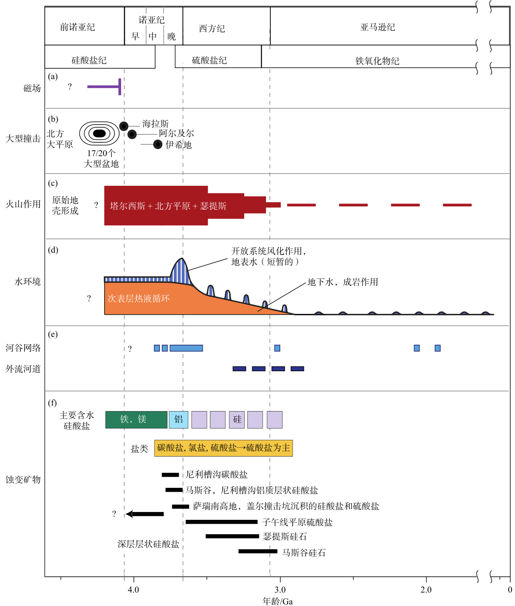
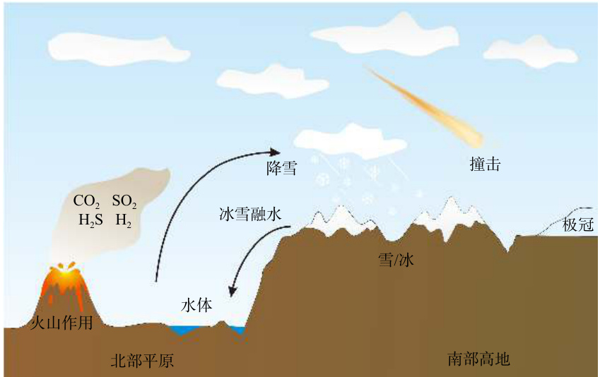
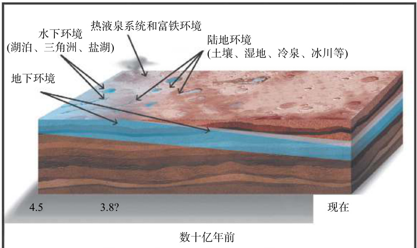

## 火星地质历史概况  
为什们公式渲染不出来, $\mathrm{CO}_ {2}$ $^{13}\mathrm{C}$

根据撞击坑定年法和地层叠置交错关系将火星地质年代分为四个阶段：前诺亚纪（Pre-Noachian）、诺亚纪（Noachian）、西方纪（Hesperian）和亚马逊纪（Amazonian）（图 10）.  前诺亚纪距今约 $4.1 {\sim} 4.6\mathrm{Ga}$ ，撞击与火山事件使早期地表不复存在，因而将最早的数亿年归为前诺亚纪. 该时期形成了包括北部低地、乌托邦平原等地质单元，具有全球性磁层，但当时的大气性质、地表挥发分组成仍然是未解之谜.  

  
图 10 火星地质历史主要事件时间线（修改自 Ehlmann et al., 2011）  

诺亚纪距今 $3.7 {\sim} 4.1\ \mathrm{Ga}$ ，该时期以海拉斯盆地的形成为底界，分为早、中、晚诺亚世. 诺亚纪的显著特征为高频率的撞击、侵蚀和广泛沟谷地貌的形成，也包括塔尔西斯火山省主体部分的聚集以及大量风化产物（如层状硅酸盐）的形成. 诺亚纪大多数火山活动都集中在塔尔西斯区域. 大型撞击盆地和北部盆地也可能分布有大量埋藏在较年轻沉积物中的诺亚纪火山岩. 撞击高地中暴露的大多数物质可能是原生火山岩或受撞击改造的火山岩，它 们主要是富含低钙辉石的玄武岩，以及不同含量的橄榄石. 在诺亚纪大部分区域（Bibring et al., 2006）探测到的原生火成岩矿物（特别是橄榄石）表明当时的风化作用十分有限.  

西方纪距今 $3.0 {\sim} 3.7\ \mathrm{Ga}$ ，大致与地球的太古代早期处于同一时期. 西方纪的主要特征是持续（可能短暂）的火山作用，形成了广泛的熔岩平原. 与诺亚纪相比，山谷形成率较低，但有大量的外流河道、湖泊或海洋形成. 此外，西方纪侵蚀率极低，形成层状硅酸盐的蚀变作用急剧减弱或停止，并在局部区域富集硫酸盐矿物. 火星表面的侵蚀率、风化率和山谷形成率的急剧下降强烈表明西方纪期间气候可能由暖湿向干冷转变，地表和气候条件不利于侵蚀和风化作用的发生. 西方纪的火山作用主要表现在脊状平原和一些低矮盾状火山的形成，与脊状平原形成相关的火山喷发的 $\mathrm{SO}_ {2}$ 排放可能导致了显著的温室效应，造成早期西方纪火星气候间歇性变暖，随后随着火山作用的减退， $\mathrm{SO}_{2}$ 迅速从大气中消失，地表温度下降. 在西半球，熔岩平原主要分布在塔尔西斯火山东部外围区域. 在东半球，熔岩平原形成了西方平原、大瑟提斯平原和海拉斯盆地大部分的底部区域. 西方纪广泛存在的火山活动使火星约 $30\%$ 的区域发生了地表重塑，同时这也可能是该时期硫酸盐大量沉积的原因（Head andKreslavsky, 2002）.  

亚马逊纪距今约 $3\ \mathrm{Ga}$ ，并一直持续到现在，其覆盖了火星地质历史的三分之二. 尽管亚马逊纪持续的时间相当长，但由撞击作用、构造作用和火山活动造成的地貌变化较小. 此外，还持续了晚西方纪极低的侵蚀率和风化率特点. 与火星早期相比，亚马逊纪冰川和风的作用对地表的改造更为明显.亚马逊纪最显著的特征是冰川的活动，且在中高纬度地区冰川活动更为明显. 火星轨道倾角的变化对冰川的活动与分布会产生强烈的影响，当倾角较大时冰川将会从极区转移到较低纬度并聚集积累. 亚马逊纪的火山作用主要集中于塔尔西斯和埃律西昂地区，火星表面的大型盾形火山最终形成，它们附近会形成较大面积的熔岩平原. 亚马逊纪也存在地表水的活动，如在塔尔西斯和埃律西昂区域盾状火山的附近形成了外流河道. 这一时期最为普遍出现的水流地貌为撞击坑内壁上广泛发育的冲沟，它们可能是由地下冰层融化释放的液态水形成.  

## 火星早期气候假说争议  

火星早期气候如何一直是个开放性问题. 古老的地形保存了与河流、湖泊盆地甚至海洋相关的地貌，因此推断 $4.0\ \mathrm{Ga}$ 前火星表面存在着流动的液态水. 尽管有充足的地质证据，但确定支持液态水存在多久的气候条件仍十分困难（Ramirez andCraddock, 2018）. 火星在其最初的数亿年中接收到的太阳辐射通量很低，结合 $\mathrm{CO}_{2}$ 等温室气体的低增温效率，这可能意味着火星早期的大部分时间里气候是寒冷的. 但是，层状硅酸盐矿物在诺亚纪高原的广泛分布意味着在诺亚纪至少曾经存在着温暖湿润的气候. 针对火星早期气候主要有以下两种假说：  

第一种，火星早期气候温暖潮湿，有充足的温室大气. 火星表面存在河谷网络、湖泊、退化的撞击 坑 、 冲 积 扇 和 三 角 洲 （ Howard  et  al.,  2005;Fassett  and  Head,  2008b;  Irwin  et  al.,  2011）， 甚 至可能存在古代海岸线（Parker et al., 1993），这些地貌的形成通常需要持续的温暖潮湿气候. 与地球上许多区域一样，火星河谷网络也是呈树枝状的，其支流开始于地形分水岭的最高点处，其形态和排水密度与地表径流一致，暗示河谷网络是由降水（如雨或雪）驱动的水循环所致（Matsubara et al.,2013），而非地下水的涌出（Squyres and Kasting,1994）或厚冰盖基底融化（Carr and Head, 2003）造成. 火星表面广泛存在的黏土矿物的形成与水的蚀变密切相关. 这些证据有力地支持了火星上存在持久水的观点（Villanueva et al., 2015）. 诺亚纪时期撞击坑的退化特征也被认为是早期气候温暖潮湿的重要证据，该时期撞击坑边缘已经退化且没有可见的喷射物沉积（例如，Jones, 1974），这些特征可能是与雨滴溅击相关的侵蚀作用相关（Craddockand Howard, 2002）. 此外，古海洋的海岸线表明早期海洋可能覆盖了北半球的大部分区域，大约三分之一的火星表面被水淹没，水量大约相当于一个 $550\ \mathrm{m}$ 深的覆盖火星全球的水层（Di Achille andHynek, 2010），古海洋的存在也被认为是推动早期火星水文循环的重要因素（Luo et al., 2017）.  

温度升高可能是由于频繁的陨石撞击或长期存在 的 温 室 效 应 造 成 的 （ Ramirez  and  Craddock,2018）. 温室气体可以使温度升高，但仅依靠二氧化碳要产生温暖气候很困难，研究表明除了 $\mathrm{CO}_ {2}$外，火山释放出来的 $\mathrm{H}_ {2}$ 也可以导致温度升高（Ramirez et al., 2014）. 此外，蛇纹石化会周期性地产生 $\mathrm{CH}{4}$ 或  
 $\mathrm{H}_ {2}$ ，使火星早期的气候变暖（Chassefiere et al., 2013）. 然而，没有证据表明这个过程曾经大规模地发生过，以产生足够的 $\mathrm{CH}_ {4}$ 或 
 $\mathrm{H}_{2}$ 使得地表变得足够温暖，而且这个过程是如何反复发生的也不清楚. 但火星地形地貌和火星化学证据表明，北部海洋的暖湿状态是不合理的. 由于冰的反射，它也很容易过渡到寒冷潮湿的状态（Wordsworth, 2016）. 因此，学者们又提出了以下假说.  

第二种，火星早期气候寒冷干燥，存在间断性的水文循环. 在寒冷干燥的气候状态下火星表面基本上是冰原地貌，结合冰的间歇融化可以解释火星大部分地质记录（Wordsworth, 2016）. 根据冰原假说火星一直干燥寒冷，水被稳定储存在高海拔的冰川冰层中，火山活动的爆发或陨石的撞击均可造成短暂的变暖现象，融化部分冰雪沉积物，出现液态水流形成短暂活跃的水循环（Taylor Redd, 2020）.融化的水流向地势较低区域，可以切断山谷，形成湖泊、海洋等，出现河流侵蚀地貌. 在诺亚纪南部高地发现封闭盆地火山口湖泊的数量远远超过开放盆地火山口湖泊，开放盆地火山口湖泊是在潮湿的环境中或由周期性的灾难性洪水所造成的（Barnhart et al., 2009），轨道观测到开放盆地火山口湖泊内的大多数矿物缺乏强烈的原地化学蚀变现象（Tosca and Knoll, 2009），表明该时代火星表面的水流是相对短暂的. 火星表面存在大量原生的火成岩矿物，缺乏碳酸盐，表明可能不存在大量的液态水（Malin and Edgett, 2003）.  

Wordsworth 等（2021）最新研究发现，火星在其早期历史中可能在还原（富氢）和氧化（富氧）大气条件之间反复转变. 他们的模型预测火星初期是寒冷的，其年平均气温低于 $240~\mathrm{K}$ . 在峰值还原气体释放速率和背景水平 $\mathrm{CO}_{2}$ 足够高的条件下，模型表现出间歇性暖湿气候足以使陨石坑壁退化，形成河谷网络和其他河流/湖相特征. 间歇性变暖和氧化还原的波动意味着河流/湖相特征（如山谷网络）是遭受多次侵蚀形成的，而不是在单一、长时间的变暖间隔期间形成的. 除此之外，他们的模型还预测了大气中氧气的瞬时积累，可以帮助解释盖尔火山口中氧化性矿物质（如氧化锰）的形成，锰的氧化需要液态水和强氧化剂的同时存在（Howard et al., 2005）才可以发生.  

近年来，Ramirez 等（2020）回顾了地质和气候学证据，认为最符合现有限制条件的火星早期气候是温暖和半干旱的，其研究表明，要形成横跨火星北半球低洼的平原地貌，需要一个巨大的古海洋存在. 但在诺亚纪晚期和早期的西方纪早期，北部低地海洋的存在并不一定会导致非常潮湿和温暖的“类地球”气候，而是可能代表早期火星气候是半干旱或干旱的. 并且这样一个北部低地海洋必须足够大，以维持温暖早期气候下的水文循环. Kamada等（2020）使用三维气候模拟研究表明，早期火星表面环境可能是“凉爽的”（介于“暖”和“冷”之间），表面温度可能在夏季足够高（ ${>}273\ \mathrm{K}\,,$ ），允许雪和冰的季节性融化，而在冬季足够低（ $<273\,\mathrm{K}$），以产生大量的降雪和积雪. 研究结果还表明，“潮湿”地表环境的特征应该是降水和冰雪季节性融化，在相对较短的时间（不到数千万年）内，中低纬度地区可能发生足够的河流活动和泥沙输送，形成火星河谷网络.  

目前，火星早期的气候模式仍然没有定论，但可以确定的是在早期火星至少是存在着温暖时期的，短暂变暖导致冰雪的融化和暂时活跃的水文循环，引起山谷网络和其他河流侵蚀地貌的出现（图 11）.但偶发性变暖事件背后的驱动机制仍不清楚，如撞击、火山活动和轨道驱使都可能起到了重要作用.但以往关于二氧化碳云、火山作用释放的硫化气体和撞击引起的蒸汽环境的增温理论都存在严重的问题.  

## 可能的宜居区域  

宜居环境一般需要四个条件：原始元素（如碳、氢、氮、氧、磷、硫）、合适的溶剂（液态水）、持续的能量来源和适宜的气候（Hoehler, 2007）. 2016年，“火星模拟环境生物标记保存和探测大会”系统总结了火星潜在的宜居环境，认为热液泉系统、水下环境、陆地环境、地下环境和富铁环境等五种环境  

  
图 11      诺亚纪和早期西方纪时期火星上主要气候过程示意图. 这幅漫画假设了早期气候的一种偶发温暖的情景，雪被偶发的融化事件打断，长期运输到南部高地  

Fig. 11    Schematic  of  the  major  climate  processes  on  Mars  in  the  Noachian  and  early  Hesperian  periods.  This  cartoon  assumes  an episodically warm scenario for the early climate with long-term transport of snow to the southern highlands interrupted by episodic melting events  

具有良好的宜居性和生物标志保存潜力（图 12）.  

### 热液泉系统  

热液活动指星体内部的水被热源（如火山、大碰撞产生的局部热源等）加热，产生对流传输的现象. 水是一种稳定广泛分布的液体，对流传热比传导更加高效，因此，热液活动也可能广泛存在于固体行星体中.  

热液泉系统为宜居性提供了丰富的有利条件：（1）提高了水的可用性，如融化局部的碎冰、出露泉水使干旱环境成为绿洲等；（2）提供生命所必需的基本元素和营养物质，如碳、氢、氧、氮、硫、磷、镁、铁、钾等元素；（3）增加微生物从阳光或产能的氧化还原化学反应中获取能量的机会，为深部壳层的还原物和表面的氧化物提供了接触、反应的界面. 但是，热液泉系统在地质尺度上维持的时间较短，可能无法提供生命演化所需的漫长稳定环境；其次，局部高温和/或酸性环境对生物的生存有很强的约束性，如最嗜热的蓝细菌最高生长温度也仅为 $73\ ^{\circ}\mathrm{C}$ （ Peary  and  Castenholz,  1964），这几乎是光合作用的上限.  

火星古谢夫陨石坑内存在热液成因的矿床，亚得里亚山口（Hadriaca Patera）两侧的巨大的泉水凹坑和沟渠以及阿波利纳里斯山口（ApollinarisPatera）顶部火山口边缘的缺口所产生的河流通道也被认为是热液系统. 但总体上已知的火星热液泉系统非常少，通过轨道观测数据来识别热液系统仍是一项重大挑战.  

### 水下环境  

水体及其沉积环境是承载生命所需的水和代谢物的绝佳环境，这里讨论的水下环境主要包括三角洲、湖泊系统及浅海环境. 三角洲形成于河流入湖口或入海口，其沉积速度快于侵蚀速度. 三角洲有许多形态特征，如通道、堤坝、斜坡和土丘，研究形 态 特 征 可 以 重 建 盆 地 历 史 （ Posamentier  andKolla, 2003）. 边缘海洋环境（如泻湖）可能存在于火星北部平原的边缘甚至更大的撞击坑中.  

火星湖泊通常分为开放系统湖泊和封闭系统湖泊. 在地球上，开放湖泊系统通常是营养贫乏的，但水底的氧含量高，往往不能保存高丰度的有机物 $(0.2{\sim}8~\mathrm{g/cm/year})$ . 封闭湖泊系统通常永久成层，属中营养或富营养湖泊，通常比开放湖泊系统有更丰富的有机物 $\mathrm{(14 {\sim} 1\,000 \; g/c m/y e a r)}$ . 目前，已在火星南部识别出数百个古湖泊.  

三角洲水体深度较浅，光照充足，为微生物群落的繁殖提供了丰富的营养条件. 海洋三角洲位于淡水和咸水交汇处，具有更加丰富的生物多样性.大部分地球湖泊系统都有丰富的微生物，湖泊还可以形成微生物岩——微生物席包裹矿物碎屑而形成的特殊沉积结构（Noffke et al., 2001），如叠层石.深海开放湖泊可以靠热液喷口等来维持微生物生态系统. 水下环境的关键营养物质和沉积物来源于河流输入，但是河流的流入受到温度波动、化学波动和气候变化的影响，其生产力是不稳定的. 在类似于火星表面这样近乎无菌的环境中，较小的湖泊系统是否能够提供足够的营养来支持一个孤立的生态群落，也是未知的.  

### 陆地环境  

此处陆地环境指所有地表、近地表没有被水体长期覆盖的环境，包括土壤、湿地、温泉、冷泉、冰川等. 这些环境中的水分直接来自于降水、冰川融水或地下水.  

  
图 12      五种可能具有宜居性的火星古环境（修改自 Hoehler, 2007） Fig. 12    Five possible habitable ancient martian environments (modified from Hoehler, 2007)  

陆地环境宜居性的有利条件包括：（1）支持多样的微生物群落，充足的阳光支持光养微生物群落，丰富的界面反应和物理化学过程支持了化学营养微生物群落；（2）陆地环境广泛分布，且在某一区域内环境类型丰富，尤其土壤代表了地球上最广泛的非海洋宜居环境，即使是严寒条件也会形成土壤；（3）冰下环境也可持续存在微生物群落（如雪藻），冰川甚至可以保护微生物免受极端气候变化的影响.  

然而，陆地环境的宜居性高度依赖于气候，具有难以预估的不稳定性. 在火星上，近陆地环境的宜居性会受到气候变化的强烈影响. 在诺亚纪火星湿润的气候下，持续或季节性湿润的地面环境可能普遍存在（Carter et al., 2015）；从西方纪到亚马逊纪，火星大气变得稀薄，地表水变得稀少，这会极大地降低陆地环境的多样性和生产力. 在现代火星气候条件下，大部分火星表面的液态水和冰都不稳定（Fassett et al., 2010）；极端的辐射通量、低压大气和剧烈的温差都会限制陆地环境的宜居性.轨道光谱法可以识别出火星表面古土壤的矿物成分，从而推断区域的古环境. 但是，大多数发育完好的土壤剖面面积很小，现有的轨道光谱仪无法精确识别.  

### 地下环境  

地下环境指风化层之下，除直接受热液循环影响之外的所有环境. 火星当前的表面条件不适合生命生存，但是地下环境可能存在液态水、营养元素、可用能源、孔隙及适宜的温度等宜居环境特征.  

与表面环境相比，地下环境可以提供独有的宜居条件：（1）地下环境可在很长一段时间内（数百万年或更久）提供生物演化的稳定环境；（2）可提供多种支持生物活动的能源，如放射性元素形成的分子、蛇纹石化过程产生的氢分子（ $\mathrm{H}_ {2}$ ）和甲烷（ $\mathrm{CH}_ {4}$ ）、可能存在深处气体等；（3）相对独立的环境，可以免受地表恶劣环境的影响. 然而，地下环境需要和地表进行能量交换，其分布范围受到关键因素的限制（如孔隙分布、温度），还需要更多的研究来论证其宜居性.  

### 富铁环境  

含铁（ $+2$ 价）量高、缺氧的地下水在渗透性岩石中循环时，会形成地下富铁环境. 铁的存在可以保护微生物，促进酸性、环中性环境及有氧、厌氧条件下的微生物代谢. 紫外线辐射可能会延迟或阻止有机物分解，铁被证明对紫外线辐射有一定的屏蔽作用（Cockell, 1998），可以保护微生物细胞免受紫外线诱导的 DNA 突变和致命的细胞损伤（Olson and Pierson, 1986; Pierson et al., 1993）. 在火星表面发现了大量的铁镁质矿物，其分布环境可能有利于早期火星潜在微生物的生存. 但是，铁的氧化会破坏富铁环境的稳定性，因此，富铁环境可能无法为生物提供稳定的生存和演化环境.  

## 未来探测方向  

未来的研究要深入探测火星次表层，重点聚焦创造宜居环境的关键过程和重大事件，并探究火星物理化学演变过程与地球的差异性. 对于火星次表层的探测有助于解决以下备受关注的问题（Stamenkovic et al., 2019）：（1）寻找生命存在的证据. 由于早期大气消失，地表温度下降，低温层和液态水的界限向更深处移动. 若曾有生命存在，它们也很可能随地下水的减少而下移，且次表层的环境更适合生命维持，因此该地有可能发现生命活动痕迹. （2）重建火星的气候和演化历史. 湖泊或火山沉积物的地下岩芯将提供长时期的地球化学条件和大气成分记录，可以追溯到数亿甚至数十亿年前. （3）获取原位资源. 火星提供了更多冰、含水矿物、二氧化碳形式的原位资源，使人类能够持续生存，而不必依赖地球的频繁运输.  

除了火星次表层之外，对于未来的地貌和地表活动探测，通常需要获取更多关于具体环境驱动因素的信息，以便了解其形成和演化. 通过收集观测数 据 ， 可 解 决 以 下 问 题 （ Diniega  et  al.,  2021）：（1）对已存在或活跃的地貌与不活跃地貌的制图；（2）地形活动性的测量；（3）地质活动的时序特征（如季节、时期、活动持续时间、年际变化等）；（4）确定活动发生时，地表和大气环境的特征. 此外，通过实验室和地面模拟以及物理建模研究，能够识别可能的环境驱动因素，并调查时间尺度关系、时间演化速率和物质之间的相互作用.  

要获取与制图、时序有关的观测数据，关键在于获得持续的高分辨率遥感影像. 用类似 HiRISE的亚米级分辨率对地表进行重复成像，可以识别更多的表面变化. 此外，原位观测还可以对传感器所在地进行持续的高分辨率、高频率观测. 将不同航天器获得的观测数据相关联，能够有效地汇集区域或全球范围内的高时间、空间分辨率图像（Diniegaet al., 2021）.  

轨道探测器时空分辨率的提升，将会提高我们对含水矿物分布和地层序列的认识，帮助我们在较长的地质时间尺度上评估火星环境的宜居性. 未来，轨道飞行器和着陆器都需要精准识别具有高生物标记保存潜力的水相沉积物、检测和表征微量有机化合物.  
