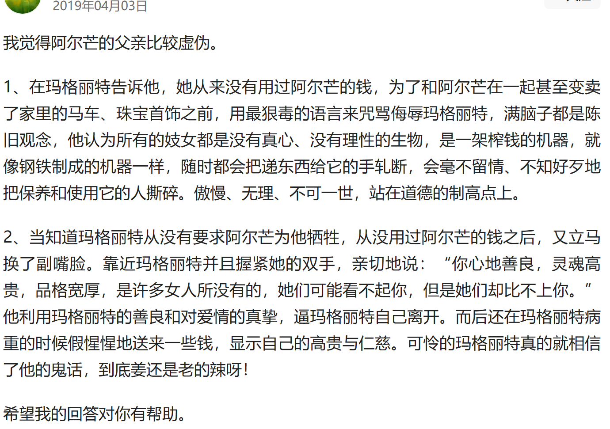

to be continued
## 引言

先前一直对《茶花女》略有耳闻，但对其故事内容和创作背景一直一无所知，在两位正在上《文学中爱情》这门课的同学的影响下，我一口气将这本书读完了，感触颇多。在阅读的过程中，我一直认为其中的人物都是作者经过巧妙构思精心设计过的，在现实中不会有这样的人，后来发现这些人物在现实中确有原型，经过了一些改动，看来真的是"艺术来源于生活而高于生活"。看完小说之后，我也在网上阅读了很多别人的分析与评价，了解了故事的创作背景，因此也打算顺便谈一谈自己的感受。鉴于前人对玛格丽特悲惨命运的分析已经十分详实了，我就只谈一谈我对小说写作方法和其他角色的看法。

## 一、茶花女的叙述方法

我所观看的版本是王振孙先生的译本，但最初《茶花女》传入中国时是林纾翻译的《巴黎茶花女遗事》，在清末民初的中国社会产生了非常大的反响。《茶花女》在叙事结构和叙述方式上给中国带来了诸多改变，例如大团圆结局的打破、嵌套结构的运用、章回体结构的破除、日记体的运用等。这些写作上的改变对当时中国文学界的冲击肯定还是很大的，但是对于现在的我而言还是觉得习以为常了，不过文中四个第一人称交织的叙述方法还是让我觉得有点十分有趣。

最近读过大多数小说都是对位式复调或者主题并置的形式，我本人也比较喜欢看这种多线叙事的故事，上次读到通过分层叙事将多个第一人称叙事视角交织在一起的小说还是在黑塞的《荒原狼》（当时读这本小说着实让我感到新奇）。作品中，第一人称的叙事视角共发生了以下的转变：“亚历山大·仲马”（小说体）——“阿尔芒”（小说体）——“玛格丽特”（日记体）——“普吕当丝”（日记体）。

首先我们跟着亚历山大·仲马的视角，作为一个局外人闯入一位巴黎名妓的生活圈，接触到了阿尔芒，逐步了解了这位女子生前的故事。接着，病榻上阿尔芒以第一人称的视角叙述，让我们十分有代入感地跟随他的视角走进其爱情世界。我们仿佛成为了他爱情的见证者，感受着他初见玛格丽特时的惊艳，陷入爱情时的炽热，遭受打击后的迷茫以及因爱生恨报复玛格丽特时的盲目。这种叙事视角让我们能够深入地理解阿尔芒这个人物的性格特点，他的稚嫩、单纯以及在爱情面前的不知所措。

玛格丽特的日记则让我们窥见了这位身处风尘却内心纯洁的女子真实的内心世界。在日记里，她不再是那个在社交场合中周旋于男人之间的交际花形象，而是一个饱受疾病、偏见、忧郁折磨，渴望真爱、渴望尊重、渴望关心的女人。她的日记充满了无奈、悲伤和对爱情的执着，让我们对她产生了深深的同情和怜悯。

最后普吕当丝在日记中以旁观者的视角讲述玛格丽特去世后发生过的故事，让我们看到了整个事件在社会层面上的余波。她的叙述像是一把手术刀，解剖出那些所谓的上流人士在玛格丽特死后虚伪的表现。他们在生前或许与玛格丽特有过各种纠葛，但在她死后却迅速地将其遗忘或者诋毁，这更加凸显了这个社会的冷酷无情。普吕当丝的视角也补充了很多关于玛格丽特生前社交圈的信息，让我们对故事背后的社会环境有了更全面的认识。

这种多视角的第一人称叙事方式注定让影视作品无法很好地还原小说，但是也让一些只观看了影视作品的读者在阅读小说时有更多彩的感受。

## 二、部分角色的分析

### 杜瓦尔

杜瓦尔先生是男主阿尔芒的父亲，因为阿尔芒与妓女一同生活的事情传到家族里，影响了家族的声誉以及妹妹的婚姻，他为了维护家族的声誉，劝阿尔芒迷途知返无果，便背着阿尔芒找玛格丽特谈判，企图让玛格丽特离开阿尔芒。

在百度百科上，对这位父亲的评价是这样的

> 阿尔芒的父亲，自私伪善，满腹偏见。他用谎言强迫玛格丽特离开阿尔芒，使玛格丽特的生活理想彻底破灭，是玛格丽特悲剧的直接制造者。

同时，我也看到很多人对他的看法是满腹偏见、卑鄙自私、道貌岸然……

​

但是在阅读《茶花女》原著的时候，我发现杜瓦尔先生是一个很典型的父亲形象，他拥有天下父母心的共同特点，也因阶级局限性显得思想顽固而保守。尽管他在处理儿子的婚姻上显得蛮横和强硬，他对阿尔芒的柔情和对玛格丽特的理解和尊重也让对这位“老绅士”生出几分敬重。

#### 劝导阿尔芒

尽管有关儿子的流言蜚语已经传回外省的老家，杜瓦尔先生前往巴黎后并没有一见面就盲目、暴怒地劈头盖脸式批评阿尔芒，而以正式交谈的方式向儿子进一步了解事实。

> “亲爱的阿尔芒，我有些严肃的事情要跟你谈谈。”  
> “我听着，爸爸。”  
> “你答应我说老实话吗？”  
> “我从来不说假话。”  
> “你在跟一个叫做玛格丽特·戈蒂埃的女人同居，这是真的吗？”  
> “真的。”  
> “你知道这是一个什么样的女人吗？”  
> “一个妓女。”  
> “就是为了她，你今年才忘了来看你妹妹和我两个人吗？”  
> “是的，爸爸，我承认。”

然后，他表示对儿子一定的理解

> 我马上跟你解释。你有一个情妇，这很好，你像一个时髦人那样养着一个妓女，这也无可非议；

但是作为一位父亲，他从自身的立场给出几个常人可以理解的理由来劝说阿尔芒分手。

- 与妓女相好有辱门风
    
    > 你像做丈夫似的跟一个和大家都睡过的姑娘同居，难道不觉得羞耻吗？
    
    杜瓦尔先生是税务局局长，他自身的社会地位和传统的思想观念让他尽管知道"圣玛格丽特岛已经没有了"，也无法做到放任儿子与一位风尘女子相好。这样的想法是可以体谅的，我们不能因为他的思想不够开放就过分苛责他。
    
- 年轻人爱情的狂热
    
    > 你不可能永远爱这个女人，她也不会永远爱你的。你们两个把你们的爱情都夸大了。
    
    父亲也曾年轻，他或许自己也有过体会过爱情的疯狂，明白年轻人恋爱时的失智乃至盲目，所以他希望儿子可以冷静理智地审视自己的爱情。
    
- 世俗的经验
    
    > 如果你父亲过去也跟你一样想法，听任他的一生被这类爱情冲动所摆布，而不是以荣誉和忠诚的思想去成家立业的话，你现在又是怎么样的一个人呢？
    
    就像《哪吒2》里敖光作为一个父亲所言"父王只是想用自己的经验为你某个幸福"，杜瓦尔先生曾经通过奋斗成家立业，获取安稳的生活,现在也想用自己的经验为阿尔芒某一个幸福。
    

杜瓦尔先生向阿尔芒发出恳求,又搬出"圣洁的母亲"希望阿尔芒回心转意,但是都无果,于是他只能动用父亲的权威来威胁阿尔芒 。

> "你把从母亲那儿得到的六万法郎全都给了她。这六万法郎是你仅有的财产，你要好好记住我对你讲的话。"  
> "你母亲在临死的时候给你留下的这笔钱是让你规规矩矩地过日子，而不是让你在情妇面前摆阔气的。"

最开始杜瓦尔并不知道公证人话语后的真相。在父亲眼中,妓女从自己儿子中他母亲的遗产固然可气,但更让人他生气的是儿子在这段爱情中他接受妓女的牺牲,用母亲的遗产而不是自己努力工作获取的钱财来支撑二人的生活.

> 而你接受这种牺牲吗？那么你算是什么人啊，先生，你竟同意一位玛格丽特小姐为你牺牲什么东西吗？好了，够了。

我最开始阅读到普吕当丝提及阿尔芒七千法郎左右的年收入时还是认为阿尔芒有一定实力的,后来才发现他的收入完全由母亲的遗产和父亲的生活费组成,实在令人汗颜.后续阿尔芒明白自己的收入实在无法支撑开销,他选择赚取钱财的方式居然是赌博()更令人无语了,幸亏在小说里他赌博较为节制,能有所收获.

#### 游说玛格丽特

这位苦口婆心的父亲没能成功地劝导自己儿子，但是并没有因此放弃,转而积极地展开了另外的行动，亲自登门拜访玛格丽特。为了顺利地见到玛格丽特，他先颇具心思地写了一封很得体的书信给她，并叮嘱她不要向阿尔芒透露这次见面的情况,将其调离阿尔芒的身边。有的读者可能认为这样的做法太过卑鄙无耻,但相比现实中官场上的勾心斗角与不择手段,甚至比起于肥皂剧里的剧情,这样的操作并不过分.

但与玛格丽特一见面,他就“盛气凌人，傲慢无礼，甚至还带着威胁的口吻”，指责玛格丽特害他儿子倾家荡产,让玛格丽特也对杜瓦尔产生了不好的想法:

> 你父亲满脑子都是旧观念，他认为凡是妓女都是一些没有心肝、没有理性的生物，她们是一架榨钱的机器，就像钢铁铸成的机器一样，随时随地都会把递东西给它的手压断，毫不留情、不分好歹地粉碎保养它和驱使它的人。

事实上,玛格丽特在妓女之中也算是万里挑一的.杜瓦尔先生先前对于这一群体的印象都是建立于其他妓女和世俗的偏见上,在面对一位素未蒙面,纠缠自己儿子的妓女时摆出这样傲慢威胁的姿态,也是希望以不好惹的形象来驱赶麻烦.眼观当下,在互联上很多网友面对为国争光的女运动员都恶意满满,肆意造谣,更不用细想他们是如何对待其他女性群体的.

尽管杜瓦尔对妓女群体持有刻板印象,但是他并没有完全失去理智,在玛格丽特拿出当票,收条,钞票并作完解释后,他平静下来并称玛格丽特为"夫人",握着她的双手以请求的预期亲切地陈述她必须做出更大牺牲的理由.

> 夫人，这样的话我就不是用指责和威胁，而是用请求来请你作出一种牺牲，这种牺牲比你已经为我儿子所作的牺牲还要大。

杜瓦尔明白自己的请求强人所难,这样的牺牲比玛格丽特之前所作的牺牲更大,但是鉴于生活的残酷他不得不说出来

- 未来的前途与幸福
    
    > 一个人除了情妇之外还有家庭；除了爱情之外还有责任；要想到一个人在生活中经过了充满激情的阶段以后就到了需要受人尊敬的阶段，这就需要有一个稳固的靠得住的地位。我儿子没有财产，然而他准备把他从母亲那里继承来的财产过户给你。
    
    24岁的阿尔芒现在依然没有稳定的工作，他所有稳定的收入几乎都来自父母，如果他继续将唯一的从母亲那里继承来的财产过户给玛格丽特，他将失去所有的地位。其实从后续的故事也可以看出收入和财产的重要性，当债务人得知了玛格丽特失去了稳定的收入和没有可靠的资产以后，一切因金钱而起的困难都随着破窗效应扑了上来。阿尔芒现在不思进取缺乏地位，未来玛格丽特容颜逝去后也会失去相应的地位，这对恋人在父亲眼中很难过上"幸福"的生活
    
- 家族的声誉
    
    > 但是你的这种牺牲他不能接受，因为社会不了解你，人们会以为同意接受你的牺牲可能出自于一个不光彩的原因，以致玷辱我家的门楣。人们可不管阿尔芒是不是爱你，你是不是爱他；人们可不管这种相互之间的爱情对他是不是一种幸福，对你是不是说明在重新做人；人们只看到一件事，就是阿尔芒·迪瓦尔竟然能容忍一个妓女。
    
    杜瓦尔经过与玛格丽特的接触，或许能够理解她的牺牲，但是外界的人不会理解。
    
    我看到很多人评论说"干嘛管别人的看法""在意别人的看法，活在别人的想法中，那自己究竟要的是什么样的生活"。我认为他们没有考量到时代不同，在当今这个时代你确实可以不用在意别人眼光去自由地生活，那是因为你的生活并不会受周围人的影响，哪怕有所影响你或许也可以通过换一个城市生活的方式来过上正常的生活。
    
    而在当时那个年代，商品的获取并不是那么容易，更换城市生活也不是那么容易。在小小的城镇里，所有人可能都互相认识，你可能因为别人的偏见而买不到货物，搭不上交通，生活都受到很大影响。回归故事，在他人的眼中，一个小有地位的公务员之家依然需要依靠风尘女子的牺牲来换取生活，这个公务员是不是有问题，这一家人是不是都有问题。哪怕杜瓦尔展现出大度的胸怀，接受玛格丽特和阿尔芒的爱情，但杜瓦尔无法确定自己是否能够保住自己的工作，是否能够抗住日后持续不断的流言蜚语过上安稳的生活。
    
- 对儿子的了解
    
    > 阿尔芒是那么爱你，不管你怎样下决心今后不再像过去那样生活，他也决不会因他的景况不佳而让你过苦日子的，而清苦生活跟你的美貌是不相称的。到那时候，谁知道他会干出些什么事来！我知道他已经在赌钱了
    
    父亲明白玛格丽特或许能够下定决心过上失去地位的生活，但是出于对儿子的了解他明白固执的儿子可能会让清贫的幸福生活变成倾家荡产的穷苦日子。而一旦沾染上赌钱，或许还会影响一整个家族的生活。
    
- 迫在眉睫的影响
    
    > “现在我的女儿快要结婚了，她要嫁给她心爱的男人，她要走进一个体面的家庭，这个家庭希望能门当户对。我未来的女婿家庭知道了阿尔芒在巴黎的行为，向我宣称，如果阿尔芒继续这样生活下去，他们将收回前言。”  
    > “你有权利去破坏她未来的美好生活吗？你下得了手吗？既然你爱阿尔芒，既然你痛悔前非，玛格丽特，把我女儿的幸福给我吧。”
    
    杜瓦尔知道玛格丽特不是一个无情的妓女，他用他人的幸福来质询玛格丽特的善良，让这位心灵如山茶花般纯洁善良的女子不得以地放弃自己的爱情，她只能任由苦涩在心中翻涌，话不敢言：
    
    > 我只不过是一个妓女，不管我讲得多么有理，这种关系看起来总是像一种自私的打算；我过去的生活已经使我没有权利来梦想这样的未来，那么我必须对我的习惯和名誉所造成的后果承担责任。
    

#### 杜瓦尔与玛格丽特的相互理解

最终，玛格丽特接受了杜瓦尔的游说，对他的看法也有所改观，认为他是一个"正直的老人" ，有着一颗"高贵的心"。她理解了这位父亲的苦衷，并愿意自己来承受更大的痛苦来赢得杜瓦尔的尊敬以及他人的幸福，这也让她产生了"圣洁的自豪感"。杜瓦尔也饱含泪水地吻别玛格丽特，这是他无能的宽慰。

> 迪瓦尔先生对我像父亲般的态度，我对他产生了纯洁的感情，我就要赢得的这个正直的老人对我的尊敬，我相信以后也必定会得到的你对我的尊敬，所有这一切都在我心里激起了一个崇高的思想，这些思想使我在自己心目中变得有了价值，并使我产生了一种从未有过的圣洁的自豪感。

她或许明白自己无私可能有点狂热，也在病倒在床上后询问自己"我做的对吗？"，但这个悲惨决定终究已成定然，是人性本质的卑劣的结果，是她无可奈克的自愿。

#### 杜瓦尔的慰问

在玛格丽特彻底病倒的期间，N伯爵与阿尔芒的新欢在一起，G伯爵也已有新的情妇，老公爵失去了耐心，除了要钱心切的债主们，全巴黎的人都忘了这位名盛一时的女人，玛格丽特只能一人孤苦伶仃地在家里度日，痴心妄想地期盼着阿尔芒的来信。

这个时候，却是杜瓦尔最先寄来信件关心玛格丽特，而且在这封信件上也同样体现了他待人接物的智慧。杜瓦尔先生知道现在玛格丽特生活拮据，想寄一点钱接济她一下，但他又理解这位可怜女士的自尊会让她不愿意接受施舍，所以在信件里只字未提钱的事，只是说"我一位好朋友H先生要到你家里去，请接待他。我请他代我办一件事，我正焦急地等待着这件事的结果。"，最后玛格丽特也欣然受下帮助。

> 但是昨天我收到了一封信，这封信使我感到舒服了些，这封信所表达的感情要比它给我带来的物质援助更让我高兴。因此我今天可以给你写信了。

> 这就是我接到的那封信，你父亲有一颗高贵的心，你要好好爱他，我的朋友，因为世界上值得爱的人不多，这张签着他姓名的信纸比我们最著名的医生开出的所有的药方要有效得多。

#### 补充

以上针对人物的分析都是基于我阅读的译本内容，没有仔细研究原文的初始表达，也没有结合现实中的人物原型。现实中人物的原型可能没有这么理想，但是不妨碍我小小地赞扬一下这个文学人物形象。

### 普吕当丝

### 琵琶女

## 三、创作背景的了解

## 结语

## 参考资料

以上是我针对《茶花女》中男主阿尔芒的父亲杜瓦尔先生所作的人物分析，请你参考我的所作的人物分析来写关于女主玛格丽特的好朋友普吕当丝的人物分析